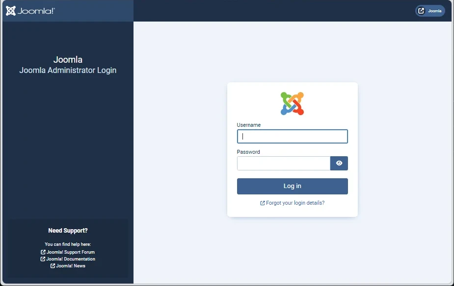

<TLDR>
This is a minimal, no-frills guide to launching Joomla with Docker: copy the official `compose.yaml` snippet from Docker Hub, run `docker compose up --detach`, and log into `http://127.0.0.1:8080/administrator` with the default `joomla`/`joomla@secured` credentials defined in that file.
</TLDR>

Yesterday at lunchtime, while chatting with a friend, he challenged me with a simple request: explain the easiest way in the world to start a Joomla project with Docker.

The aim is to hop, hop, copy/paste a file, hop, Joomla is launched and you can start playing with the site.

*Three things you'll want soon after: a <Link to="/blog/docker-volume">volume</Link> so the site survives a `docker compose down`, <Link to="/blog/docker-adminer-pgadmin-phpmyadmin">Adminer or phpmyadmin</Link> to look inside the database, and <Link to="/blog/docker-php-ini">Update php.ini when using a Docker image</Link> the day Joomla refuses your file upload as being too large.*

Let's take a look; not in detail, but right to the point.

<!-- truncate -->

<StepsCard
  title="Here are the very few steps to follow to start your Joomla website using Docker:"
  variant="steps"
  steps={[
    'Surf to <a href="https://hub.docker.com/_/joomla">https://hub.docker.com/_/joomla</a>',
    'Scroll down until you can see the `yaml` content and click on the `Copy` button. That button appears when the mouse pointer is over the text (hidden otherwise)',
    'On your computer, create a new file called `compose.yaml` and paste the content there',
    'The most difficult part is now: please start a new console, go to the folder where you\'ve just created the file (in my case, I\'ve created the file in my `/tmp/joomla` folder so I jump in it using `cd /tmp/joomla`)',
    'Still in your console, please run `docker compose up --detach`.'
  ]}
/>

From now, Docker will download (just the first time) the Joomla CMS, PHP, Apache and MySQL. Then Docker will start the downloaded images (called containers).

Surf to `http://127.0.0.1:8080/administrator` and enjoy!

<AlertBox variant="caution">
The admin account to use is `joomla` and its password is `joomla@secured` (as defined in the yaml file you've just copied earlier).

</AlertBox>

<AlertBox variant="info">
This article is deliberately simple; please follow the <Link to="/blog/tags/joomla">Joomla</Link> tag if you want more than this introduction.

</AlertBox>
