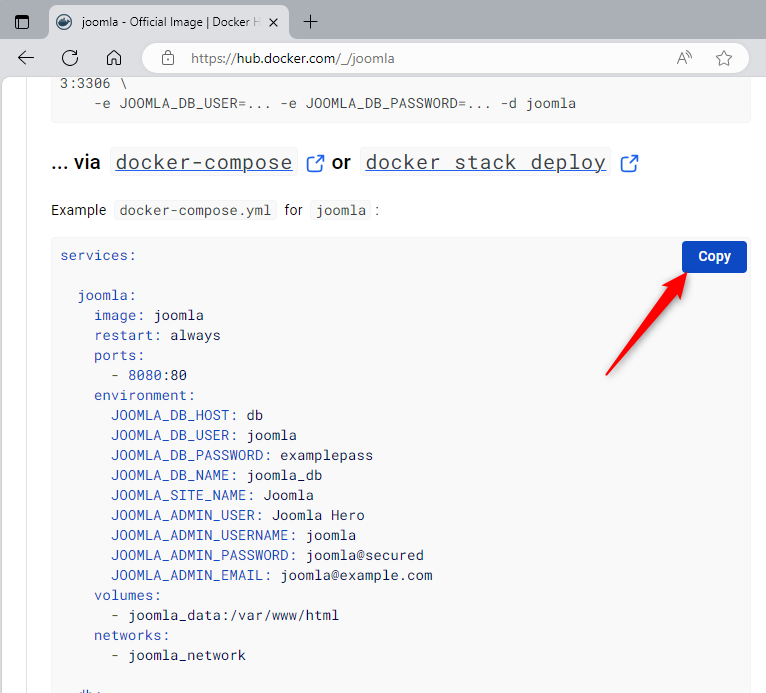
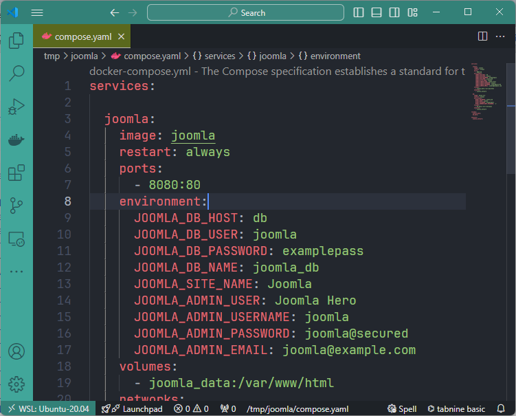

Yesterday lunchtime, while chatting with a friend, he highlighted a simple fact: explain the easiest way in the world to start a Joomla project with Docker.

The aim is to hop, hop, copy/paste a file, hop, Joomla is launched and you can start playing with the site.

Let's take a look; not in detail, but right to the point.

<!-- truncate -->

Here are the very few steps to follow to start your Joomla website using Docker:

1. Surf to [https://hub.docker.com/_/joomla](https://hub.docker.com/_/joomla)
2. Scroll down until you can the `yaml` content and click on the `Copy` button. That button appears when the mouse point is over the text (hidden otherwise)

    

3. On your computer, create a new file called `compose.yaml` and paste the content there

    

4. The most difficult part is now: please start a new console, go to the folder where you've just created the file (in my case, I've created the file in my `/tmp/joomla` folder so I jump in it using `cd /tmp/joomla`)

5. Still in your console, please run `docker compose up --detach`.

From now, Docker will download (just the first time) the Joomla CMS, PHP, Apache and MySQL. Then Docker will start the downloaded images (called containers).

Surf to `http://127.0.0.1:8080/administrator` and enjoy!

:::important
The admin account to use is `joomla` and his password is `joomla@secured` (as defined in the yaml file you've just copied earlier).
:::

:::tip
This article is deliberately simple; please follow the <Link to="/blog/tags/joomla">Joomla</Link> tag if you want more than this introduction.
:::
