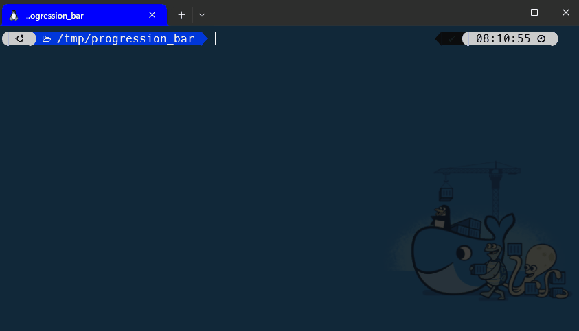

<!-- cspell:ignore bashpid, pids, nproc -->
<!-- markdownlint-disable MD022,MD025 -->


In my previous article; <Link to="/blog/bash-parallel-task">Linux - Take advantage of the number of CPUs you have; start concurrent jobs</Link>, we've seen how to start jobs in parallel.

The next cool thing is to show a progression bar in your console. This has a number of advantages, including a clear view of what's been done and what's still to be done, as well as an attractive interface.

Months ago, I've found this french blog post in my RSS feeds: [https://xieme-art.org/post/bash-avance-barre-de-progression/](https://xieme-art.org/post/bash-avance-barre-de-progression/) and, just, **wow!!!**

Let's play with it.

<!-- truncate -->

First, please create a new folder on your disk and jump it that folder: `mkdir /tmp/progress && cd $_`.

Then, create a `demo.sh` file in the folder and copy/paste the bash script below:

<Snippet filename="demo.sh">

```bash
#!/bin/bash

function demo {
    echo "Progress=$1"
    sleep 0.1
    return 0
}

function main {
    for i in {1..50}; do
        demo $i
    done
}

source "progress_bar.sh"

main > >(progress_bar::process "Doing some stuff" 50)
```

</Snippet>

Make the script executable by running `chmod +x ./demo.sh`.

As you can see, we'll run a function 50 times. There are three things we need to do:

1. We need to source the `progress_bar.sh` script ([credits to ephase](https://xieme-art.org/post/bash-avance-barre-de-progression/));
2. We need to run our `main` function in a specific way; not just `main` but `main > >(progress_bar::process "Doing some stuff" 50)`. The figure `50` should be set to our number of occurrences; in our example, we'll run our function 50 times so...
3. and finally, we should just output one thing to the console using `echo` and that thing should be `Progress=` followed by a number (from 1 till 50). In our example, we'll simply pass our `i` variable as a function parameter to achieve this need.

Not so difficult, right?

## Let's create the progress_bar.sh script

Please click on the accordion below to reveal the content you'll need to copy/paste in a file called `progress_bar.sh` that you need to create in the same folder than the `demo.sh` one.

Please create a new file on your hard disk; name it `progress_bar.sh` and copy/paste the content below in it.

<Snippet filename="progress_bar.sh">

```bash
#!/usr/bin/env bash

# region - Intro block -----------------------------------------------
#
# Progress bar
#
# ## How to use this script?
#
# Just include this script in your own Bash like this `source progress_bar.sh`
#
# Now, you can use any public functions defined here like `progress_bar::draw``.
#
# ## Example
#
# The example below will just loop for 1 till 50 and the most important part is the "Progress=${i}"
# echo statement. The progression of the bar depends on a regex defined in the progress_bar::process() function.
#
# ```bash
# function main() {
#     for i in {1..50}
#     do
#         echo "Progress=${i}"
#         sleep 0.1
#     done
# }
#
# main > >(progress_bar::process "Doing some stuff" 50)
# ```
#
# ## Namespace
#
# `progress_bar::`
#
# cspell:ignore endregion
#
# shellcheck disable=SC1090,SC1091
#
# ## Source
#
# The source comes from a French blog post:
# https://xieme-art.org/post/bash-avance-barre-de-progression/
#
# shellcheck disable=SC2059
#
# endregion - Intro block --------------------------------------------

# let script exit if an unset variable is used or if a command fails
set -o nounset
set -o errexit

# The different bar to display (done)
PROGRESS_BAR_CHAR=(█ ▒)

# Show or not the introduction text (f.i. "Doing some stuff")
PROGRESS_BAR_DISPLAY_INFO=1

PROGRESS_BAR_DISPLAY_COMP=1

# Display template
PROGRESS_BAR_INFO_TEMPLATE=' %s [ %3d/%3d ] '
PROGRESS_BAR_COMP_TEMPLATE=' %3d%% '
PROGRESS_BAR_TEMPLATE='\033[1m%s%s\033[0m%s%s\r'

# region - private function progress_bar::__change_column_size
#
# ## Description
#
# This function will capture de WINCH signal. That one is fired by Linux when
# the size of the window (i.e. the console) is updated so allow us to retrieve the
# max. number of columns that can fit in the window.
#
# endregion
function progress_bar::__change_column_size() {
    printf >&2 "%${COLUMNS}s" ""
    printf >&2 "\033[0K\r"
    COLUMNS=$(tput cols)
}

# region - private function progress_bar::__draw
#
# ## Description
#
# Draw the progress bar / progression
#
# endregion
function progress_bar::__draw() {
    # function parameters
    local -r progress=${1?"progress is mandatory"}
    local -r total=${2?"total elements is mandatory"}
    local -r info=${3:-"In progress"}

    # function local variables
    local progress_segment
    local todo_segment
    local info_segment=""
    local comp_segment=""

    if [[ ${PROGRESS_BAR_DISPLAY_INFO:-1} -eq 1 ]]; then
        printf -v info_segment "${PROGRESS_BAR_INFO_TEMPLATE}" \
            "$info" "$progress" "$total"
    fi

    local -r progress_ratio=$((progress * 100 / total))
    if [[ ${PROGRESS_BAR_DISPLAY_COMP:-0} -eq 1 ]]; then
        printf -v comp_segment "${PROGRESS_BAR_COMP_TEMPLATE}" \
            "$progress_ratio"
    fi

    # progress bar construction
    # calculate each element sizes, bar must fit in ou screen
    local -r bar_size=$((COLUMNS - ${#info_segment} - ${#comp_segment}))
    local -r progress_segment_size=$((bar_size * progress_ratio / 100))
    local -r todo_segment_size=$((bar_size - progress_segment_size))
    printf -v progress_segment "%${progress_segment_size}s" ""
    printf -v todo_segment "%${todo_segment_size}s" ""

    printf >&2 "$PROGRESS_BAR_TEMPLATE" \
        "$info_segment" \
        "${progress_segment// /${PROGRESS_BAR_CHAR[0]}}" \
        "${todo_segment// /${PROGRESS_BAR_CHAR[1]}}" \
        "$comp_segment"
}

# region - public function progress_bar::process
#
# ## Description
#
# Display a progress bar
#
# ## Example
#
# ```bash
# function main() {
#     for i in {1..50}
#     do
#         echo "Progress=${i}"
#         sleep 0.1
#     done
# }
#
# main > >(progress_bar::process "Doing some stuff" 50)
# ```
#
# ## Parameters
#
# * @arg $1 The text to display like "Upload in progress"
# * @arg $2 The number of positions in the bar (f.i. if there are 4 rows to proceed, it has to be initialize to 4)
#
# endregion
function progress_bar::process() {
    local -r action="${1:-Upload in progress}"
    local -r max=${2:-100}

    # Capture the resize of the window so the progress bar becomes responsive
    trap progress_bar::__change_column_size WINCH

    while read -r line; do
        # Each line with "Progress=(digit)" will increase the progress bar
        if [[ $line =~ Progress=([[:digit:]]{1,}) ]]; then
            progress_bar::__draw "${BASH_REMATCH[1]}" "${max}" "${action}"
        fi
    done
}

# This script didn't contains executable code; only helpers.
sourced=0
(return 0 2> /dev/null) && sourced=1 || sourced=0
if [ "${sourced}" -eq "0" ]; then
    printf "\033[1;31m%s\033[0m\n" "ERROR, the $0 script is meant to be sourced. Try 'source $0' and use public functions." >&2 # Write on stderr
    exit 1
fi

return 0
```

</Snippet>

## Time to run the code

Simply return to the console and run `./demo.sh` and... wow; that's pretty cool.



In a real-life example, I've implement this feature in a Bash script where I need to read a CSV file and for each record retrieved in the file, I need to do run a `curl` statement for calling a RestFull POST API and upload a PDF.

And, when started in an interactive way, the screen output is really practical and terribly effective.

Of course, I'm also using a log file where I redirect a maximum number of information's.
