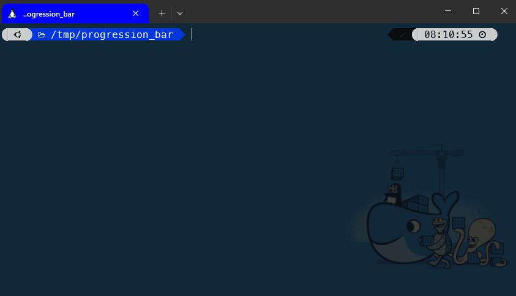

<!-- cspell:ignore bashpid, pids, nproc,ephase  -->
<!-- markdownlint-disable MD022,MD025 -->

<TLDR>
This follow-up article adds a visual progress bar to Bash scripts (building on the earlier parallel-jobs post) using a reusable `progress_bar.sh` helper: source it, pipe your loop's output through `progress_bar::process "Doing some stuff" 50`, and echo `Progress=N` from inside the loop to drive the bar — useful for long-running batch jobs like CSV-driven API uploads.
</TLDR>

In my previous article; <Link to="/blog/bash-parallel-task">Linux - Take advantage of the number of CPUs you have; start concurrent jobs</Link>, we've seen how to start jobs in parallel.

The next cool thing is to show a progression bar in your console. This has a number of advantages, including a clear view of what's been done and what's still to be done, as well as an attractive interface.

*When the number of items isn't known in advance, a live counter is the better fit; see <Link to="/blog/linux-inotifywait">Keep running and count the number of files in a folder using inotifywait</Link>. And to keep a trace of what happened once the bar is gone, <Link to="/blog/bash-logging">Bash - Script to add logging features to your script</Link>.*

Months ago, I've found this French blog post in my RSS feeds: [https://xieme-art.org/post/bash-avance-barre-de-progression/](https://xieme-art.org/post/bash-avance-barre-de-progression/) and, just, **wow!!!**

Let's play with it.

<!-- truncate -->

First, please create a new folder on your disk and jump into that folder: `mkdir /tmp/progress && cd $_`.

Then, create a `demo.sh` file in the folder and copy/paste the bash script below:

<Snippet filename="demo.sh" source="./files/demo.sh" />

Make the script executable by running `chmod +x ./demo.sh`.

As you can see, we'll run a function 50 times. There are three things we need to do:

1. We need to source the `progress_bar.sh` script ([credits to ephase](https://xieme-art.org/post/bash-avance-barre-de-progression/));
2. We need to run our `main` function in a specific way; not just `main` but `main > >(progress_bar::process "Doing some stuff" 50)`. The figure `50` should be set to our number of occurrences; in our example, we'll run our function 50 times so...
3. and finally, we should just output one thing to the console using `echo` and that thing should be `Progress=` followed by a number (from 1 till 50). In our example, we'll simply pass our `i` variable as a function parameter to achieve this need.

Not so difficult, right?

## Let's create the progress_bar.sh script

Here is the content you'll need to copy/paste into a file called `progress_bar.sh`, created in the same folder as the `demo.sh` one.

Please create a new file on your hard disk; name it `progress_bar.sh` and copy/paste the content below into it.

<Snippet filename="progress_bar.sh" source="./files/progress_bar.sh" />

## Time to run the code

Simply return to the console and run `./demo.sh` and... wow; that's pretty cool.

In a real-life example, I've implemented this feature in a Bash script where I need to read a CSV file and for each record retrieved in the file, I need to run a `curl` statement for calling a RESTful POST API and upload a PDF.

And, when started in an interactive way, the screen output is really practical and terribly effective.

Of course, I'm also using a log file where I redirect a maximum amount of information.
