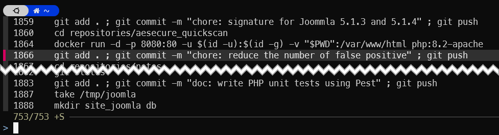

<!-- cspell:ignore DOSKEY,HISTIGNORE,HISTFILE,gacom -->


For me, one of the undeniable strengths of the command line under Linux is the management of the history of previously executed commands.

To be able to press the <kbd>Up</kbd> or <kbd>Down</kbd> keys on the keyboard to return to previously run commands, wow.

For older users, there was [DOSKEY](https://en.wikipedia.org/wiki/DOSKEY) under MSDos, but Linux goes much further.

Let's look at a few tricks.

<!-- truncate -->

## Getting your history

First things first, to display the list of commands you've entered in the past, simply start `history` in a Linux console.

## Location of your history

By default, your history is stored in a file called `.bash_history` in your home directory. You can display the last five commands f.i. by running `tail -n5 ~/.bash_history`.

:::info On my own, since I'm using [ZSH](/blog/tags/zsh), my history is in `~/.zsh_history`.
The easiest way to determine where is stored your history is to show the content of the `$HISTFILE` variable like this: `echo $HISTFILE`. 
:::

:::tip
Very recently, I had to take over a script developed by a colleague (let's call him JohnDoe) and I didn't know how to call it from the command line or what parameters to pass to it.

As I'm a *root user* on the server, I simply consulted his history.  All I had to do was display its `/home/john_doe/.bash_history` file.
:::

### HISTIGNORE // HISTORY_IGNORE variables

The `HISTIGNORE` (for Bash) or the `HISTORY_IGNORE` (ZSH) variable can be used to specify some patterns you don't want to be saved in your history file.

Let's take an example: `HISTIGNORE="sudo *"` will prevent all commands starting with `sudo` to be written in the history file.

You can also use a pattern like `HISTIGNORE="*password*"` to prevent commands having the word *password* to be written.

To be able to specify more than one rule, just use the pipe `|` character like in `HISTIGNORE="sudo * | *password*"`.

## Don't put a specific command in the history

Imagine a command like `curl --user name:password http://www.example.com`. Did you really want to put that command (so your login and password in plain text) in the history file?

Using [ZSH](/blog/tags/zsh), I just need to add a space before my command so by running `[SPACE]curl --user name:password http://www.example.com`.

```text
# So, don't start your command like this:
$ curl --user name:password http://www.example.com

# v--- But just add a space character before
$  curl --user name:password http://www.example.com
```

:::info
The space character is triggered by the `hist_ignore_space` option, defined in `.oh-my-zsh/lib/history.zsh`.
:::

## Using grep to filter your history

Let's say you wish to retrieve the latest `docker exec` instructions you've fired: `history | grep -i "docker exec"` i.e. simply *pipe* the output of the `history` command to the `grep` one and apply a filter (case insensitive using the `-i` flag). 

On my own, I don't need this because I'm using <kbd>CTRL</kbd>+<kbd>R</kbd> under ZSH.

## CTRL-R is your friend

The <kbd>CTRL</kbd>+<kbd>R</kbd> keystrokes will display a small popup window (both in Bash or ZSH) and you'll be able to quickly search in your command’s history.

Below the look&feel for ZSH; much better and easier than under Bash.



So press <kbd>CTRL</kbd>+<kbd>R</kbd> then start to type some letters like *gacom* and every entry having these letters (like **g**it add . ; git **com**mit ... will be retrieved).

## Autosuggestions in the console using ZSH

By using ZSH and zsh-autosuggestion (see [my previous post](/blog/zsh-plugin-autosuggestions)) you even don't need anymore to care about the history.

Just start to type the first letters of a command like **doc** and all your previous **docker** fired statements will be accessible (just use navigation keys to select a previous command or type some more letters to be more restrictive).

## Delete an instruction from your history

Ouch! You've forgotten to add a single space before your confidential instruction so, now, it's stored in the history.

No panic! The history file is ... a file so just run `vi $HISTFILE` and you can edit it.

Or, perhaps easier, just use `history -d` followed by the line number as displayed in the history output.

So if the output of `history` is the one below, I can remove the `vi` line by running `history -d 2130`

```text
2129  history | grep -i "docker exec"
2130  vi $HISTFILE
2131  history | grep -i "docker exec"
```

:::tip
But, then the command `history -d 2130` will appears in the history, of course. So editing the file using a text editor is perhaps more ... discreet.
:::

:::note
You can specify a range like `history -N 2100-2130`.
:::
