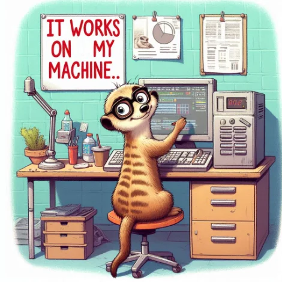

<!-- cspell:ignore Wépion,telework,virtualise -->

But what is Docker anyway? In the simplest possible terms, how can we explain what Docker is used for?

Let's take the case of a cooking recipe as a starting point.

<!-- truncate -->

## Culinary analogy

Let's imagine for a moment that you have to write a recipe.  I'm the one who writes the recipe and you're the ones (there are many, many of you) who have to do the same thing again and, for sure, your cake will be as beautiful and excellent as mine. Exactly like mine, down to the last crumb.

So I write down the recipe on a piece of paper: you need this many grams of this; this many grams of that. You have to go and buy all this (a mind-boggling list of ingredients) and you have to buy certain varieties (e.g. Belgian [strawberries from Wépion](https://en.wikipedia.org/wiki/W%C3%A9pion_strawberry) and not, of course, those that are industrially produced and full of pesticides), and so on.

You receive a very long list from me and you must, absolutely must, have the same ingredients as I do.

In my recipe, I tell you what to prepare first, then what to add; at what precise moment and in what precise quantity. I ask you to cook at the same number of degrees, sometimes in the oven, with or without fanfare, sometimes in a frying pan.

That's it; it's up to you.

Of course, 95% of you will fail (**I'll too**).  Because you don't have the time to go and buy everything; because you don't have the right quantities or qualities (Belgian strawberries, aren't they?); because you don't have the time to run around to different shops.

## Let's go back to the IT world

My list of ingredients becomes a list of technical specifications (you need such-and-such a version of the operating system), you need to have such-and-such versions of (an insane list of dependencies); you need such-and-such software to be configured in such-and-such a way so that communication can take place with such-and-such other software (e.g. Joomla needs to communicate with MySQL on such-and-such a port); you obviously need to have the correct file access rights, you need ...

Here again, despite a perfectly written list of specifications, over 95% of you won't be able to make my cake (**me too**). And yet I've taken a lot of time to give you an exhaustive recipe.

In the software world, you might say *OK, no worries, just all the things on a USB stick*. Instead of sending you a recipe, I'm sending you all a USB stick. Maybe that would solve the problem, eh?

Well no, apart from the fact that it's going to cost me a lot of money and that it's really not practical, how can you run Linux, Joomla, MySQL and lots of other things on a single USB stick? To have a button somewhere that says ‘Start the programme’ and the magic of that button means that, for example, Joomla is up and running and I can access my local website.

## ... and Docker

Docker simplifies everything. It's a bit like a virtual machine, but not really.

You could try to say that Docker is a bit like *I telework, I'm at home and I connect remotely to a computer at my employer's*; it's almost that, but it's so much different.

It's almost the same thing, but it's so different. On your home computer, you don't have the professional software you use, you don't have your professional e-mail, etc. The comparison (finding software and applications that you use at home) is very different. But the comparison (finding software and configurations that you don't have on your PC) stops there.

Docker will *virtualise* a new operating system on your computer (whether it's Linux, macOS or Windows): thanks to Docker, you'll be able to run a Linux (Debian, Ubuntu 24.04, etc.) on your Windows computer: if you need to access files from Linux, they'll be those on your computer (unlike the example above with your professional PC). If you need to use a webcam, it will be that of your PC, your webcam, your sound card, your printer, etc.

It's your computer, but in a slightly special environment: a Docker image running in RAM.

But what is a **Docker image**? It's my cake! Not only have I written the recipe for my cake, but more importantly, I'm giving it to you (in the form of a Docker image).  I've made it available on the internet and all you have to do is grab it (`docker pull`) and use it (`docker run`).

You can all use my image. Whether you're one, ten, a thousand, a million, everyone will have exactly the same image as me and it will be ready to use. You won't have to do anything, really nothing, other than use it.  I'll update my image (a new, even better recipe); you get it back (docker pull of the new version) and that's it.

What's in it for you? No ingredients to buy, prepare or cook. Just a few seconds to download the image and you're ready to eat.

What's in it for us? Everyone has exactly the same environment; if it works for me, it will work for you. As everything is pre-configured, the program that runs in a Docker environment will run in the same way for everyone.

## ... and to an example such as Joomla

You've got it: if someone (me or anything) creates a Docker image to run Joomla; you just have to get the image; wait a few seconds and you're ready to use it. All you have to do is run a few commands (`docker run` or `docker compose` according to the image's official documentation) and it's ready to go.

For Joomla, the official image is here: [https://hub.docker.com/_/joomla](https://hub.docker.com/_/joomla). The instructions are explained in the ‘How to use this image’ chapter.

## Some more information

A Docker image runs in RAM memory, so if I shut down the computer, I lose everything. This isn't quite true because Docker has a mechanism for storing information in ‘volumes’. If I turn my computer on again, I'll find everything (=according to the programmed configuration).

With Docker, everything is isolated: I can install a MySQL 5.x and an old PHP 7.x as well as a Joomla 3.x and, why not, have a second Joomla site that would be on MySQL 5.4, PHP 8.1 and Joomla 4.4.8 and ... a third site that would be a WordPress and so on. There will be no conflict between versions because everyone will be in ‘their own space’. Just think of the misery of having to install different versions of PHP on your computer... That's no longer the case with Docker, which makes it super-easy.

Today, at the end of 2024, it's almost possible to run everything in Docker; Linux of course, but also [Windows](https://hub.docker.com/r/dockurr/windows) or [macOS](https://hub.docker.com/r/dockurr/macos).

You can also play [Doom](https://github.com/CallumHoughton18/Doom-In-Docker), work with [Gimp](https://hub.docker.com/r/gimp/gimp/), use [Firefox](https://hub.docker.com/r/linuxserver/firefox) without having to install it...

Personally, I use Docker every day to develop ([Linux bash](https://hub.docker.com/_/alpine), [Python](https://hub.docker.com/_/python), [PHP](https://hub.docker.com/_/php), [Node](https://hub.docker.com/search?q=node), ...), for my databases ([postgres](https://hub.docker.com/_/postgres), [MySQL](https://hub.docker.com/_/mysql) and even for fun [Microsoft SQL Server](https://localhost:3000/blog/docker-mssql-server)), to keep my blog ([Docusaurus](https://localhost:3000/blog/docusaurus-docker-own-blog)), ...

I no longer install anything on my machines apart from Docker.

