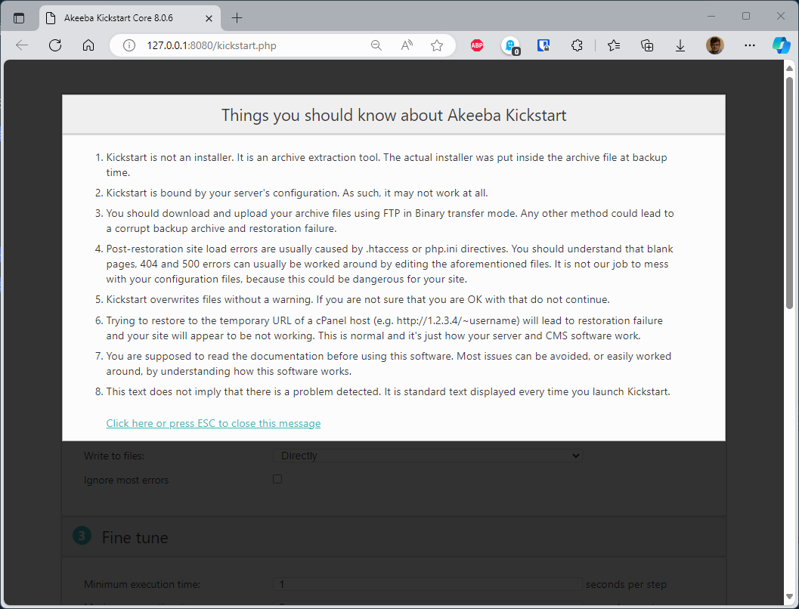
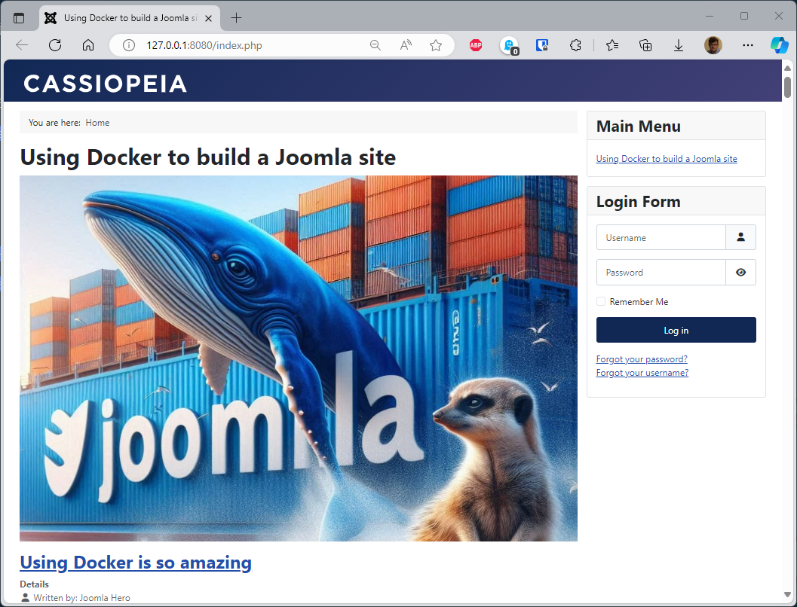

<!-- cspell:ignore Akeeba -->
<!-- markdownlint-disable-file MD010 MD026 -->


In previous articles ([Part 1](/blog/docker-joomla) and [Part 2](/blog/docker-joomla-part-2)), we've seen how to create a Joomla site from scratch by using Docker: pull Joomla, PHP, Apache and MySQL from Docker Hub and do magic stuff so we have a fresh `http://127.0.0.1:8080` local site.

In this article, we'll see how to restore on our machine, a backup created thanks to great **[Akeeba Backup](https://www.akeeba.com/products/akeeba-backup.html)** component.

We'll reuse some files from [Part 2](/blog/docker-joomla-part-2) and make some changes to them.

At the end, we'll have a `make import` command that will start **[Akeeba Kickstart](https://www.akeeba.com/download.html#kickstart)**.

<!-- truncate -->

## Creating required files

:::tip Skipping the files creation process
In the next chapters, you'll need to create several files using copy/paste. If you wish go faster, just run the following commands to retrieve files from my [Github repo](https://github.com/cavo789/docker_joomla_restore) so you don't need to create them.

<Terminal>
$ mkdir /tmp/joomla_restore && cd $_
$ curl -LOJ --silent https://github.com/cavo789/docker_joomla_restore/archive/refs/tags/1.0.0.tar.gz
$ tar -xzvf docker_joomla_restore-1.0.0.tar.gz --strip-components 1 && rm -f docker_joomla_restore-1.0.0.tar.gz
$ tar -xzvf docker_joomla_restore.gz --strip-components 1 && rm -f docker_joomla_restore.gz
</Terminal>

By following the instructions below, you'll create a xxx folder where you can copy all the files you need to restore a Joomla site using Docker.  You can then proceed immediately to the “Run the import process” chapter, as the files are already in place.
:::

*If you prefer to understand what you do and create files manually, please continue your lecture here below.*

Please create a new folder on your computer like f.i. `mkdir /tmp/joomla_restore && cd $_`.

<Terminal>
$ mkdir /tmp/joomla_restore && cd $_
</Terminal>

In that folder, you'll need to create several files (please refer to [Part 2](/blog/docker-joomla-part-2)) if you need more explanations about these files.

### The orchestration file: compose.yaml

Below, highlighted, small differences from the `compose.yaml` file we saw in [Part 2](/blog/docker-joomla-part-2#updated-composeyaml).

Here is why: this time we don't need to download a fresh copy of Joomla since **we already have a Joomla site** (our backup). What we need is **PHP** and **Apache**. We don't need Joomla so, this time, we'll use a custom Docker image; not a already existing one.

Except highlighted lines, all the rest is the same that in [Part 2](/blog/docker-joomla-part-2).

<Snippet filename="compose.yaml">

```yaml
name: ${PROJECT_NAME:-your-project-name}

services:
  joomla:
    # highlight-next-line
    build:
      # highlight-next-line
      context: .
      # highlight-next-line
      args:
        # highlight-next-line
        - PHP_VERSION=${PHP_VERSION:-8.3-apache}
    container_name: ${CONTAINER_PREFIX:-joomla}-app
    restart: always
    ports:
      - ${WEB_PORT:-8080}:80
    environment:
      - JOOMLA_DB_HOST=joomladb
      - JOOMLA_DB_NAME=${DB_NAME:-joomla}
      - JOOMLA_DB_PASSWORD=${DB_PASSWORD:-examplepass}
      - JOOMLA_DB_USER=${DB_USER:-joomla}
    depends_on:
      joomladb:
        condition: service_healthy
    user: ${UID:-1000}:${GID:-1000}
    volumes:
      - ./joomla_data:/var/www/html
    networks:
      - joomla_network

  joomladb:
    image: mysql:${MYSQL_VERSION:-latest}
    container_name: ${CONTAINER_PREFIX:-joomla}-db
    restart: always
    ports:
      - ${MYSQL_PORT-:3306}:3306
    environment:
      - MYSQL_DATABASE=${DB_NAME:-joomla}
      - MYSQL_PASSWORD=${DB_PASSWORD:-examplepass}
      - MYSQL_ROOT_PASSWORD=${DB_ROOT_PASSWORD:-rootpass}
      - MYSQL_USER=${DB_USER:-joomla}
    healthcheck:
      test: ["CMD", "mysqladmin" ,"ping", "-h", "localhost"]
      timeout: 20s
      retries: 10
    user: ${UID:-1000}:${GID:-1000}
    volumes:
      - ./db_data:/var/lib/mysql
    networks:
      - joomla_network

  phpmyadmin:
    image: phpmyadmin
    container_name: ${CONTAINER_PREFIX:-joomla}-phpmyadmin
    restart: always
    depends_on:
      joomladb:
        condition: service_healthy
    ports:
      - 8081:80
    environment:
      - PMA_HOST=joomladb
      - PMA_PASSWORD=${DB_ROOT_PASSWORD:-rootpass}
    networks:
      - joomla_network

networks:
  joomla_network:
```

</Snippet>

### The .env file

As introduced above; we don't need Joomla anymore but just PHP and Apache. We'll then define a `PHP_VERSION` variable and initialise it to the desired version.

<Snippet filename=".env">

```.env
CONTAINER_PREFIX=joomla
DB_NAME=joomla
DB_PASSWORD=examplepass
DB_USER=joomla
MYSQL_PORT=3306
MYSQL_VERSION=8.4.2
// highlight-next-line
PHP_VERSION=8.3-apache
PROJECT_NAME=running-joomla-in-docker
WEB_PORT=8080
```

</Snippet>

:::caution
Since we need to restore an existing site, make sure to use the same PHP version than the one used by your site.
:::

### Our makefile

We'll need a new action called `import`:

<Snippet filename="makefile">

```makefile
-include .env

config:
	@UID=$$(id -u) GID=$$(id -g) docker compose config

down: stop
	-@UID=$$(id -u) GID=$$(id -g) docker compose down

log:
	-@UID=$$(id -u) GID=$$(id -g) docker compose logs

reset: down
	-@rm -rf db_data joomla_data

start:
	@clear
	@printf "\033[1;33m%s\033[0m\n\n" "To start your site, please jump to http://127.0.0.1:${WEB_PORT}"
	@printf "\033[1;33m%s\033[0m\n\n" "Go to http://127.0.0.1:${WEB_PORT}/administrator to open your backend."

	@printf "\033[1;104m%s\033[0m\n\n" "Below a summary of your current installation:"

	@printf "\033[1;34m%s\033[0m\n\n" "JOOMLA"
	@printf "\033[1;34m%-30s\033[0m\033[1;104m%s\033[0m\n" "  * Project name" "${PROJECT_NAME}"
	@printf "\033[1;34m%-30s\033[0m\033[1;104m%s\033[0m\n" "  * Version" "${JOOMLA_VERSION}"
	@printf "\033[1;34m%-30s\033[0m\033[1;104m%s\033[0m\n\n" "  * Port" "${WEB_PORT}"

	@printf "\033[1;34m%s\033[0m\n\n" "DATABASE"
	@printf "\033[1;34m%-30s\033[0m\033[1;104m%s\033[0m\n" "  * Host" "joomla-db"
	@printf "\033[1;34m%-30s\033[0m\033[1;104m%s\033[0m\n" "  * User name" "${DB_USER}"
	@printf "\033[1;34m%-30s\033[0m\033[1;104m%s\033[0m\n" "  * Password" "${DB_PASSWORD}"
	@printf "\033[1;34m%-30s\033[0m\033[1;104m%s\033[0m\n" "  * Database name" "${DB_NAME}"
	@printf "\033[1;34m%-30s\033[0m\033[1;104m%s\033[0m\n" "  * Version" "${MYSQL_VERSION}"
	@printf "\033[1;34m%-30s\033[0m\033[1;104m%s\033[0m\n\n" "  * Port" "${MYSQL_PORT}"

stop:
	-@UID=$$(id -u) GID=$$(id -g) docker compose stop

up:
	-@mkdir -p db_data joomla_data
	@UID=$$(id -u) GID=$$(id -g) docker compose up --detach --build

# highlight-next-line
import: reset
    # highlight-next-line
	-@mkdir -p db_data joomla_data
    # highlight-next-line

    # highlight-next-line
	@clear
    # highlight-next-line
	@printf "\033[1;33m%s\033[0m\n" "Copying Akeeba Kickstart to the Docker Joomla container..."
    # highlight-next-line
	@cp en-GB.kickstart.ini ./joomla_data
    # highlight-next-line
	@cp kickstart.php ./joomla_data/kickstart.php
    # highlight-next-line

    # highlight-next-line
	@printf "\033[1;33m%s\033[0m\n\n" "Copying your backup to the Docker Joomla container..."
    # highlight-next-line
	@cp backup.jpa ./joomla_data
    # highlight-next-line

    # highlight-next-line
	@UID=$$(id -u) GID=$$(id -g) docker compose up --detach
    # highlight-next-line

    # highlight-next-line
	@printf "\n\n\033[1;33m%s\033[0m\n\n" "Please now jump to http://127.0.0.1:${WEB_PORT}/kickstart.php to finalise your site restoration."
    # highlight-next-line

    # highlight-next-line
	@printf "\033[1;104m%s\033[0m\n\n" "Below a summary of your current installation:"
    # highlight-next-line

    # highlight-next-line
	@printf "\033[1;34m%s\033[0m\n\n" "JOOMLA"
    # highlight-next-line
	@printf "\033[1;34m%-30s\033[0m\033[1;104m%s\033[0m\n\n" "  * Port" "${WEB_PORT}"
    # highlight-next-line

    # highlight-next-line
	@printf "\033[1;34m%s\033[0m\n\n" "DATABASE"
    # highlight-next-line
	@printf "\033[1;34m%-30s\033[0m\033[1;104m%s\033[0m\n" "  * Host" "joomla-db"
    # highlight-next-line
	@printf "\033[1;34m%-30s\033[0m\033[1;104m%s\033[0m\n" "  * User name" "${DB_USER}"
    # highlight-next-line
	@printf "\033[1;34m%-30s\033[0m\033[1;104m%s\033[0m\n" "  * Password" "${DB_PASSWORD}"
    # highlight-next-line
	@printf "\033[1;34m%-30s\033[0m\033[1;104m%s\033[0m\n" "  * Database name" "${DB_NAME}"
    # highlight-next-line
	@printf "\033[1;34m%-30s\033[0m\033[1;104m%s\033[0m\n" "  * Version" "${MYSQL_VERSION}"
    # highlight-next-line
	@printf "\033[1;34m%-30s\033[0m\033[1;104m%s\033[0m\n\n" "  * Port" "${MYSQL_PORT}"
```

</Snippet>

:::important
If you don't know if you already have `GNU make`, just run `which make` in the console. If you see `make not found` then please run `sudo apt-get update && sudo apt-get install make` to proceed the installation.

<Terminal>
$ which make
</Terminal>

<Terminal>
$ sudo apt-get update && sudo apt-get install make
</Terminal>
:::

### We also need a file called Dockerfile

In the very first lines of the `compose.yaml` file we've this portion:

<Snippet filename="compose.yaml">

```yaml
name: ${PROJECT_NAME:-your-project-name}

services:
  joomla:
    # highlight-next-line
    build:
      # highlight-next-line
      context: .
      # highlight-next-line
      args:
        # highlight-next-line
        - PHP_VERSION=${PHP_VERSION:-8.3-apache}
```

</Snippet>

We don't see here an `image:` statement but a `build:` one. This means that we need a special file called `Dockerfile`.

Please create a new file called `Dockerfile` in your folder with this content:

<Snippet filename="Dockerfile">

```docker
ARG PHP_VERSION=8.3-apache

FROM php:${PHP_VERSION:-latest}

RUN set -e -x ; \
    docker-php-ext-install mysqli pdo pdo_mysql && docker-php-ext-enable pdo_mysql
```

</Snippet>

That file is quite simple right now: it tells we need a PHP Docker image and we also need to install the `mysqli` drivers.

### We need a backup for sure

Please also put a backup of your existing site and save it in the same folder. For standardisation needs, please call that file `backup.jpa`.

To make this step more explicit: jump to your existing Joomla website and, using Akeeba Backup, create a backup (file format: `.jpa`) and download the backup. Please rename the backup file like this: `backup.jpa`.

### And finally, we need Akeeba Kickstart

Finally, we also need to have two files coming from **[Akeeba Kickstart](https://www.akeeba.com/download.html#kickstart)**.

By following the link [Akeeba Kickstart](https://www.akeeba.com/download.html#kickstart), we'll be able to download a `.zip` file (called `kickstart-core-xxx.zip` where `xxx` is a version number). Proceed to the download and open the archives: we'll get two files in it. Please copy these files in your folder.

The two files we need are called `en-GB.kickstart.ini` and `kickstart.phsp`.

## Before starting

We're ready. Just before you begin, please check that you have all the required files (please run `ls -alh`):

<Terminal>
$ ls -alh

Permissions Size User       Group      Date Modified    Name
drwxr-xr-x     - christophe christophe 2024-10-18 13:30 .
drwxrwxrwt     - root       root       2024-10-18 13:30 ..
.rw-r--r--   151 christophe christophe 2024-10-18 13:30 .env
.rw-r--r--   34M christophe christophe 2024-10-18 13:30 backup.jpa
.rw-r--r--  1.3k christophe christophe 2024-10-18 13:30 compose.yaml
.rw-r--r--   162 christophe christophe 2024-10-18 13:30 Dockerfile
.rw-r--r--   11k christophe christophe 2024-10-18 13:30 en-GB.kickstart.ini
.rw-r--r--  390k christophe christophe 2024-10-18 13:30 kickstart.php
.rw-r--r--  2.9k christophe christophe 2024-10-18 13:30 makefile
</Terminal>

:::tip Skipping the files creation process
If you've skipped file's creation earlier by downloading files from my repo; you'll have all the files listed here above.
:::

:::important
Remember, for Linux users, we need `GNU make` to be able to run commands like `make import` or `make up`. If you see `make not found` then please run `sudo apt-get update && sudo apt-get install make` to proceed the installation.
:::

## Run the importation process

Ok, you've copied a lot of files. Time to start restoring your site.

For Linux users, simply take advantage of `GNU Make` and run the `make import` instruction.

For Windows (Powershell or DOS), please run these commands:

<Terminal title="Powershell">
mkdir db_data
mkdir joomla_data
copy en-GB.kickstart.ini joomla_data\
copy kickstart.php joomla_data\
copy backup.jpa joomla_data\
docker compose up --detach
</Terminal>

For both users (Linux and Windows), you'll something like this output in the console:

<Terminal>
[+] Building 1.4s (7/7) FINISHED                                 docker:default
=> [joomla internal] load build definition from Dockerfile                 0.0s
 => => transferring dockerfile: 200B                                       0.0s
 => [joomla internal] load metadata for docker.io/library/php:8.3-apache   1.2s
 => [joomla internal] load .dockerignore                                   0.0s
 => => transferring context: 2B                                            0.0s
 [...]
 => [joomla] resolving provenance for metadata file                        0.0s

[+] Running 3/3
 ✔ Network running-joomla-in-docker_joomla_network  Created                0.0s
 ✔ Container joomla-db                              Healthy               31.0s
 ✔ Container joomla-app                             Started               31.3s
</Terminal>

When finished, just start your browser and surf to `http://127.0.0.1:8080/kickstart.php` to start the restoration of your website using the **Akeeba Kickstart** wizard.



Once you'll need to fill in the database information's, please refer to what was displayed in your console:


Continue restoration as you always have; close the window once Akeeba Kickstart ask for, then click on the *Clean Up* button; then on *Visit your site's frontend* and enjoy:



:::tip
If you've used the provided demo site, the admin account is **joomla** and his password is **joomla@secured**.
:::

## Conclusion

As we've just seen, restoring a Joomla site locally has become really simple.

All you need to do is retrieve a few configuration files, and just the one named `.env` should be updated with the PHP and MySQL versions you're using on your production site.

You download the local backup of your site and, with a single command (`make import`), your site is restored.

<Terminal>
$ make import
</Terminal>

No matter what version of Joomla or MySQL you're using.

Piece of cake, no?
