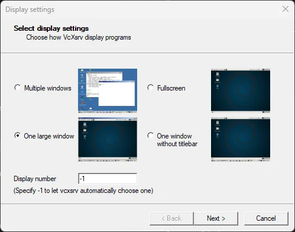
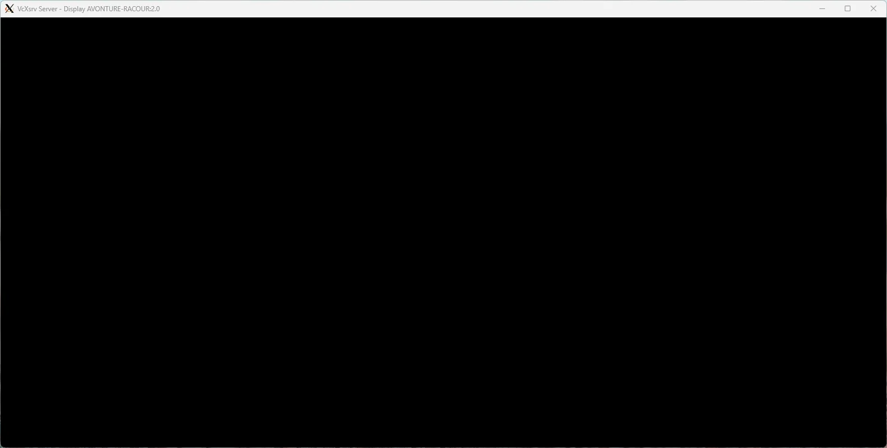
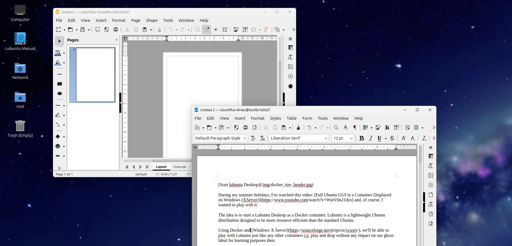

<!-- cspell:ignore lubuntu,initialising,xremote,autologin,realise -->

During my summer holidays, I've watched this video: [Full Ubuntu GUI in a Container Displayed on Windows (XServer)](https://www.youtube.com/watch?v=WutV6n21dys) and, of course, I wanted to play with it.

The idea is to start a Lubuntu Desktop distribution as a Docker container. Lubuntu is a lightweight Ubuntu distribution designed to be more resource-efficient than the standard Ubuntu.

Using Docker and [Windows X Server](https://sourceforge.net/projects/vcxsrv/), we'll be able to play with Lubuntu just like any other containers i.e. play and drop without any impact on our ghost. Ideal for learning purposes then.

<!-- truncate -->

I encourage you to watch the video [Full Ubuntu GUI in a Container Displayed on Windows (XServer)](https://www.youtube.com/watch?v=WutV6n21dys).

## Step 1 - Create the Dockerfile

There is just one file to create called `Dockerfile` and with this content:

<Snippet filename="Dockerfile" source="./files/Dockerfile" />

Build the image by running `docker build --tag cavo789/lubuntu .` (think to replace `cavo789` with your pseudo).

## Step 2 - Install Windows X Server

Building the image will take a few minutes (the final image will be around 3 GB).

During the creation of the image, please install [Windows X Server](https://sourceforge.net/projects/vcxsrv/). It's just a .exe to install on your Windows machine.

Once installed, run it program. On the first screen, as explained on the video, select *One large window*; click on `Next` and keep all default values then click on `Finish´ on the last screen.

By clicking on `Finish` you'll get a black screen. **It's normal.**

## Step 3 - Start the container

Run your container by starting `docker run -t cavo789/lubuntu` and **wait, wait and wait again. If you got warnings on the console, don't worry and still wait**.

You may have to wait a minute before you'll start to see the Linux Lubuntu desktop and then, you'll still need to wait because the operating system is loading and initialising (since it's the first time you start it).

<AlertBox variant="note" title="Multi-screen support does not seem to work with X Server">
During my tests, the display wasn't up to scratch and I had to remove the cable from my second screen to get a correct display.

</AlertBox>

## Impressive

Do you realise that we've installed a Linux distribution and launched its GUI as a container? In fact, it's like installing a new PC.

Of course, we'd have to go further than that, e.g. to keep data persistent (via volumes).
