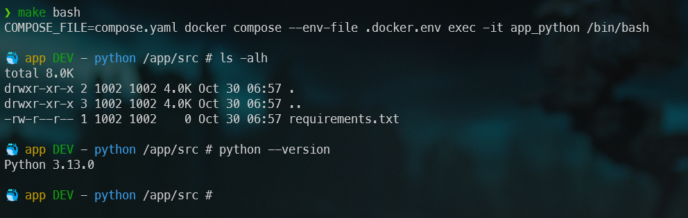

<!-- cspell:ignore PYTHONDONTWRITEBYTECODE,PYTHONUNBUFFERED,HISTFILE -->
<!-- cspell:ignore addgroup,adduser,keyscan,hadolint,gecos,endregion -->
<!-- cspell:ignore bashhistory,groupid,commandhistory,pylint,synchronised -->


As you know, VSCode is a superb editor that lets you program in probably any programming language.  An editor, not an IDE, because VSCode is basically a Notepad in its ultimate version.

If you want to program in Python, you'll need to install a few extensions in VSCode to be really comfortable, i.e. syntax highlighting, code navigation, code refactoring (like renaming a variable or a class), etc.

There are ‘ready-to-use’ editors like PyCharm but 1. they cost money and 2. they are specific (you won't be able to program in PHP with PyCharm; or even work easily with HTML/CSS files).

In this new article, we'll look at how to get a VSCode environment ready to use straight away for coding in Python, and as it's VSCode it's 1. free, 2. multi-purpose and 3. insanely powerful.

<!-- truncate -->

In this article, we'll create a **devcontainer** i.e. a development environment based on Docker. The creation of the devcontainer will take a few minutes but it's just a question of copy/paste from this article to your system.

Once files will be created, you can then reuse the devcontainer for all your Python projects.

## Let's create the files for our Docker environment

Like always, we'll create a new folder and create files there. Please run `mkdir /tmp/python && cd $_` to create that folder and jump in it.

Start VSCode from there i.e. run `code .-` in the console when you're located in the folder. This will open VSCode and you'll be able to create as many files you want.

### Dockerfile

The first file to create will be used to build our Docker image. Please create a file called `Dockerfile` with the following content:

<Snippets filename="Dockerfile">

```dockerfile
# syntax=docker/dockerfile:1

# cspell:ignore PYTHONDONTWRITEBYTECODE,PYTHONUNBUFFERED,HISTFILE
# cspell:ignore addgroup,adduser,keyscan,hadolint,gecos,endregion

# Those variables are initialized in the .docker.env file
ARG DOCKER_APP_HOME="/app"
ARG DOCKER_CONTAINER_NAME="python"
ARG DOCKER_OS_GROUPID=1000
ARG DOCKER_OS_USERID=1000
ARG DOCKER_OS_USERNAME="python"
ARG DOCKER_PYTHON_VERSION=3.10-slim

# region - Our Python base image. We'll install Linux and Python dependencies here
# and do some other configuration work

FROM python:${DOCKER_PYTHON_VERSION} AS base

# Prevents Python from writing pyc files.
ENV PYTHONDONTWRITEBYTECODE=1

# Keeps Python from buffering stdout and stderr to avoid situations where
# the application crashes without emitting any logs due to buffering.
ENV PYTHONUNBUFFERED=1

ARG DOCKER_APP_HOME
WORKDIR "${DOCKER_APP_HOME}/src"

# hadolint ignore=DL3008
RUN --mount=type=cache,target=/var/cache/apk,rw \
    set -e -x \
    && printf "\e[0;105m%s\e[0;0m\n" "Install required Linux binaries..."  \
    && apt-get update -yqq \
    && apt-get install -y --no-install-recommends bash git openssh-client tree \
    && apt-get clean \
    && rm -rf /tmp/* /var/list/apt/*

# Install Python dependencies
#
# Download dependencies as a separate step to take advantage of Docker's caching.
# Leverage a cache mount to /root/.cache/pip to speed up subsequent builds.
# Leverage a bind mount to requirements.txt to avoid having to copy them into
# into this layer.

RUN --mount=type=cache,target=/root/.cache/pip \
    --mount=type=bind,source=src/requirements.txt,target=requirements.txt \
    printf "\e[0;105m%s\e[0;0m\n" "Install Python dependencies" \
    && python -m pip install --no-cache-dir -r requirements.txt

# Keep the container running
ENTRYPOINT ["tail", "-f", "/dev/null"]

# endregion

# region - Define our development image
FROM base AS development

ENV SHELL /bin/bash

# Our user will be part of the root group since we're building the development image
ARG DOCKER_OS_GROUPID
ARG DOCKER_OS_USERID
ARG DOCKER_OS_USERNAME

RUN set -e -x \
    mkdir -p "/home/.vscode-server/bin" \
    && mkdir -p "/home/.vscode-server/extensions" \
    && mkdir -p "/home/.vscode-server/extensionsCache" \
    && printf "\e[0;105m%s\e[0;0m\n" "Create our ${DOCKER_OS_USERNAME} application user" \
    && mkdir -p "/home/${DOCKER_OS_USERNAME}/.vscode-server/bin" \
    && mkdir -p "/home/${DOCKER_OS_USERNAME}/.vscode-server/extensions" \
    && mkdir -p "/home/${DOCKER_OS_USERNAME}/.vscode-server/extensionsCache" \
    # Create the application user home directory
    && mkdir -p "/home/${DOCKER_OS_USERNAME}" \
    # Create our application user group
    && addgroup "${DOCKER_OS_USERNAME}" --gid "${DOCKER_OS_GROUPID}" \
    # Create our application user
    && adduser \
    --system \
    --disabled-password \
    --gecos "" \
    --home "/home/${DOCKER_OS_USERNAME}" \
    --uid "${DOCKER_OS_USERID}" \
    "${DOCKER_OS_USERNAME}" \
    # And, finally, set the correct permissions to the home folder of our user
    && chown -R "${DOCKER_OS_USERNAME}:${DOCKER_OS_USERNAME}" "/home/${DOCKER_OS_USERNAME}"

USER "${DOCKER_OS_USERNAME}"

ARG DOCKER_CONTAINER_NAME

RUN /bin/bash -c "echo \"PS1='\n\e[0;33m🐳 ${DOCKER_CONTAINER_NAME} \e[0;32mDEV\e[0m - \e[0;36m$(whoami)\e[0m \w # '\" >> /home/${DOCKER_OS_USERNAME}/.bashrc"

# Save the bash history in file /home/${OS_USERNAME}/commandhistory/.bash_history
# Like this we'll be able to map that folder using a volume in our
# compose.yaml file and then make the history persistent.
RUN set -e -x \
    && SNIPPET="export PROMPT_COMMAND='history -a' && export HISTFILE=/home/${DOCKER_OS_USERNAME}/commandhistory/.bash_history" \
    && mkdir -p "/home/${DOCKER_OS_USERNAME}/commandhistory" \
    && touch "/home/${DOCKER_OS_USERNAME}/commandhistory/.bash_history" \
    && echo "${SNIPPET}" >> "/home/${DOCKER_OS_USERNAME}/.bashrc" \
    && echo "${SNIPPET}" >> "/home/${DOCKER_OS_USERNAME}/.bashrc"

# endregion
```

</Snippets>

### compose.yaml

Next to the `Dockerfile`, we'll create our `compose.yaml` one. Please create that file with the following content:


<Snippets filename="compose.yaml">

```yaml
name: app_python

services:
  app_python:
    build:
      context: .
      target: development
      args:
        # Version of Python to use
        - DOCKER_PYTHON_VERSION=${DOCKER_PYTHON_VERSION}
        # Application root directory in the container (PHP or NGINX) (--app-home)
        - DOCKER_APP_HOME=${DOCKER_APP_HOME:-/app}
        # Name of the container to show in the bash prompt
        - DOCKER_CONTAINER_NAME=${DOCKER_CONTAINER_NAME:-python}
        # Set OS groupid in your Docker Linux containers (1000 = root) (--os-groupid)
        - DOCKER_OS_GROUPID=${DOCKER_OS_GROUPID:-1000}
        # Set OS userid in your Docker Linux containers (1000 = root) (--os-userid)
        - DOCKER_OS_USERID=${DOCKER_OS_USERID:-1000}
        # Set OS username in your Docker Linux containers (--os-username)
        - DOCKER_OS_USERNAME=${DOCKER_OS_USERNAME:-python}
    user: ${DOCKER_OS_USERID:-1000}:${DOCKER_OS_GROUPID:-1000}
    env_file:
      - .docker.env
    container_name: app_python
    volumes:
      # Our codebase on our host
      - .:${DOCKER_APP_HOME}
      # Keep installed VSCode extensions in a volume to avoid to reinstall them
      - vscode-extensions:/home/${DOCKER_OS_USERNAME}/.vscode-server/extensions
      # Remember the bash history
      - bashhistory:/home/${DOCKER_OS_USERNAME}/commandhistory

volumes:
  # Use a Docker volume self-managed volume to store vscode's cache
  vscode-extensions:
  # Use a Docker volume self-managed volume to store bash history
  bashhistory:
```

</Snippets>

### .docker.env

The third file to create will be called `.docker.env` where we'll initialise some values. Please create that file with the content below:


<Snippets filename=".docker.env">

```dotenv
# Application root directory in the container (PHP or NGINX) (--app-home)
DOCKER_APP_HOME=/app

# Name of the container to show in the bash prompt
DOCKER_CONTAINER_NAME=app

# Set OS groupid in your Docker Linux containers (1000 = root) (--os-groupid)
DOCKER_OS_GROUPID=1000

# Set OS userid in your Docker Linux containers (1000 = root) (--os-userid)
DOCKER_OS_USERID=1000

# Set OS username in your Docker Linux containers (--os-username)
DOCKER_OS_USERNAME="python"

# Version of Python to use
DOCKER_PYTHON_VERSION=3.13-slim
```

</Snippets>

:::tip
All you have to do is duplicate the other files we've created for each of your projects and the settings for your project will be made here, in the `.docker.env` file.
:::

### makefile

To make life easier, we're going to group together a set of commands in a file called `makefile`. Please create a `makefile` file with the contents below:


<Snippets filename="makefile">

```makefile
# cspell:ignore ifdef,pydocstyle,isort,mypy
default: help

# Folder where Python binaries are installed
BIN=/usr/local/bin

# Name of our Docker container
CONTAINER=app_python

# The project type
DOCKER_PROJECT_TYPE=Python

# Name of our Docker environment file
DOCKER_ENV_FILE=.docker.env

# The environment file we'll use
ENV=--env-file ${DOCKER_ENV_FILE}

# The list of  Docker compose yaml file we'll use
YAML=COMPOSE_FILE=compose.yaml

COLOR_CYAN:=36
_CYAN := "\033[1;${COLOR_CYAN}m%s\033[0m %s\n"

# Required for `make devcontainer`: we need to convert a string like "python" to
# an hexadecimal string. (printf "python" | xxd -p will return 63325f66646d5f706870)
DOCKER_VSCODE:=$(shell printf "${CONTAINER}" | xxd -p)

.PHONY: bash
bash: ## App - Start an interactive shell inside your application container
	${YAML} docker compose ${ENV} exec -it ${CONTAINER} /bin/bash

.PHONY: build
build: ## App - Build a fresh Docker image for this project
	${YAML} docker compose ${ENV} build ${ARGS}

.PHONY: config
config: ## App - Show the docker configuration
	${YAML} docker compose ${ENV} config

.PHONY: devcontainer
devcontainer: ## App - Open the PHP container in vscode (you can f.i. directly start your debugging session)
	code --folder-uri vscode-remote://attached-container+${DOCKER_VSCODE}/app

.PHONY: help
help: ## App - Show the help with the list of commands
	@clear

    # Parse this file, search for `##` followed by a description
	@awk 'BEGIN {FS = ":.*##"; printf "\nUsage:\n  make \033[36m<target>\033[0m\n\n"} /^[a-zA-Z_-]+:.*?##/ { printf "  \033[36m%-21s\033[0m %s\n", $$1, $$2 } /^##@/ { printf "\n\033[0;33m%s\033[0m\n", substr($$0, 5) } ' $(MAKEFILE_LIST)

	@echo ""

.PHONY: remove
remove: ## App - Stop containers and remove them (you will lose updated files if you do not have locally)
	${YAML} docker compose ${ENV} down --remove-orphans --rmi all --volumes

.PHONY: up
up: ## App - Based on the created Docker images (made with `make build`), create containers and start them
	${YAML} docker compose ${ENV} up --detach

##@ Quality assurance

.PHONY: doc-style
doc-style: ## QA - pydocstyle is a static analysis tool for checking compliance with Python docstring conventions
	@clear
	${YAML} docker compose ${ENV} exec ${CONTAINER} ${BIN}/pydocstyle /app/src

.PHONY: format
format: ## QA - Format the script using Black
	@clear
	@${YAML} docker compose ${ENV} exec ${CONTAINER} ${BIN}/black /app/src

.PHONY: lint
lint: ## QA - Lint the script using Pylint - Run  analyses your code without actually running it
	@clear
	${YAML} docker compose ${ENV} exec ${CONTAINER} ${BIN}/pylint /app/src

.PHONY: mypy
mypy: ## QA - Mypy is a program that will type check your Python code
	@clear
	${YAML} docker compose ${ENV} exec ${CONTAINER} ${BIN}/mypy --cache-dir /tmp/mypy
```
</Snippets>

:::important
If you don't know if you already have `GNU make`, just run `which make` in the console. If you see `make not found` then please run `sudo apt-get update && sudo apt-get install make` to proceed the installation.
:::

Right now, we can run `make up` in our console and we'll get this screen:


As you can see, we've a lot of commands like `make up` to start our Docker container. Let's try and, ouch, we miss a file called `/src/requirements.txt`.


### src/requirements.txt

Please create an empty file called `src/requirements.txt`. The file can stay empty (you'll add your own requirements later on).

By running `make up` again, yes!, this time we can build our images and create our container:


This time we can, if you need to, enter in our container by running `make bash` and f.i. what is inside our current folder and which version of Python has been installed:



:::note
As you see, Python 3.13 is used. Why that specific version? Just go back to your `.docker.env` file and take a look to the `DOCKER_PYTHON_VERSION` variable. If you need another just update the `.docker.env` file and run `make up` again.
:::

## Let's start creating our first script

If you're still inside your container, please type `exit` so your prompt will be the one of your machine (your *host*); no more the one of your running container.

Please create your first script: create a new file in the `src` folder and call that file `hello.py`.

Be creative and type a simple `print` statement:

```python
print("I'm your Python code")
```


To be able to run the code, start `make bash` again (to jump in the container) and start `python hello.py`


:::info
It will works because, in the container, the working directory is `/app/src`. If this had not been the case, we would have had to write, for example, `python /app/src/hello.py` i.e. the absolute path to the script.
:::

As you can see, files on your machine are synchronised with your host. If VSCode is still open, you can change your script to f.i.

```python
print("Hey! It's synchronised; cool!")
```


## What have we done so far?

We have created the minimal structure for our future Python projects. We've defined our Docker image (thanks to the `Dockerfile` file) and how to use it (`compose.yaml` file).

We've also configured our project (`.docker.env` file) and set up a number of useful commands (`makefile` file).

All these files can be used across all your Python projects.

## Now, let's create our devcontainer environment

We've to create an additional file. Please create a new folder called `.devcontainer` and, there, a file called `devcontainer.json`. Copy/paste the content below:

<Snippets filename=".devcontainer/devcontainer.json">

<!-- cspell:disable -->
```json
{
    "name": "app_python",
    "dockerComposeFile": [
        "./../compose.yaml",
    ],
    "service": "app_python",
    "remoteUser": "python",
    "workspaceFolder": "/app",
    "customizations": {
        "vscode": {
            "extensions": [
                "aaron-bond.better-comments",
                "DavidAnson.vscode-markdownlint",
                "eamodio.gitlens",
                "EricSia.pythonsnippets3",
                "foxundermoon.shell-format",
                "gruntfuggly.todo-tree",
                "mde.select-highlight-minimap",
                "mgesbert.python-path",
                "mikestead.dotenv",
                "mrmlnc.vscode-duplicate",
                "ms-azuretools.vscode-docker",
                "ms-python.black-formatter",
                "ms-python.debugpy",
                "ms-python.isort",
                "ms-python.mypy-type-checker",
                "ms-python.pylint",
                "ms-python.python",
                "ms-python.vscode-pylance",
                "ms-vscode-remote.remote-containers",
                "ms-vscode.makefile-tools",
                "njpwerner.autodocstring",
                "redhat.vscode-xml",
                "redhat.vscode-yaml",
                "sirtori.indenticator",
                "sonarsource.sonarlint-vscode",
                "streetsidesoftware.code-spell-checker-dutch",
                "streetsidesoftware.code-spell-checker-french",
                "streetsidesoftware.code-spell-checker",
                "tomoki1207.pdf",
                "tyriar.sort-lines"
            ],
            "settings": {
                "[dockerfile]": {
                    "files.eol": "\n",
                    "editor.defaultFormatter": "ms-azuretools.vscode-docker"
                },
                "[json]": {
                    "editor.defaultFormatter": "vscode.json-language-features"
                },
                "[jsonc]": {
                    "editor.defaultFormatter": "vscode.json-language-features",
                    "editor.wordWrap": "wordWrapColumn",
                    "editor.wordWrapColumn": 80,
                    "editor.wrappingIndent": "indent"
                },
                "[markdown]": {
                    "editor.defaultFormatter": "DavidAnson.vscode-markdownlint",
                    "editor.wordWrap": "wordWrapColumn",
                    "editor.wordWrapColumn": 80,
                    "editor.wrappingIndent": "indent"
                },
                "[python]": {
                    "editor.defaultFormatter": "ms-python.black-formatter",
                    "editor.formatOnSave": true,
                    "editor.codeActionsOnSave": {
                        "source.fixAll": "always",
                        "source.organizeImports": "always"
                    }
                },
                "[shellscript]": {
                    "editor.defaultFormatter": "foxundermoon.shell-format"
                },
                "[xml]": {
                    "editor.defaultFormatter": "redhat.vscode-xml",
                    "editor.wordWrap": "wordWrapColumn",
                    "editor.wordWrapColumn": 80,
                    "editor.wrappingIndent": "indent"
                },
                "[yaml]": {
                    "editor.defaultFormatter": "redhat.vscode-yaml",
                    "editor.insertSpaces": true,
                    "editor.tabSize": 2
                },
                "cSpell.language": "en,fr,nl",
                "docker-explorer.enableTelemetry": false,
                "editor.bracketPairColorization.enabled": true,
                "editor.codeActionsOnSave": {
                    "source.fixAll": "explicit"
                },
                "editor.defaultFoldingRangeProvider": null,
                "editor.detectIndentation": false,
                "editor.folding": true,
                "editor.foldingStrategy": "auto",
                "editor.formatOnSave": true,
                "editor.guides.bracketPairs": "active",
                "editor.guides.bracketPairsHorizontal": "active",
                "editor.guides.highlightActiveIndentation": true,
                "editor.guides.indentation": true,
                "editor.multiCursorModifier": "ctrlCmd",
                "editor.renderWhitespace": "all",
                "editor.rulers": [
                    120,
                    70
                ],
                "editor.stickyScroll.enabled": true,
                "editor.tabCompletion": "on",
                "editor.tabSize": 4,
                "editor.wordBasedSuggestionsMode": "allDocuments",
                "editor.wordWrapColumn": 120,
                "explorer.compactFolders": false,
                "explorer.confirmDelete": true,
                "explorer.confirmDragAndDrop": true,
                "extensions.autoCheckUpdates": false,
                "files.autoSave": "onFocusChange",
                "files.defaultLanguage": "${activeEditorLanguage}",
                "files.eol": "\n",
                "files.exclude": {
                    "**/.cache": true,
                    "**/.git": true
                },
                "files.insertFinalNewline": true,
                "files.trimTrailingWhitespace": true,
                "markdown.extension.toc.levels": "2..6",
                "markdownlint.config": {
                    "MD033": false,
                    "MD036": false
                },
                "mypy-type-checker.args": [
                    "--config-file=.config/.mypy.ini"
                ],
                "python.analysis.autoFormatStrings": true,
                "python.analysis.autoImportCompletions": true,
                "python.analysis.autoIndent": true,
                "python.analysis.autoSearchPaths": true,
                "python.analysis.fixAll": [
                    "source.convertImportFormat"
                ],
                "python.analysis.typeCheckingMode": "strict",
                "python.defaultInterpreterPath": "/usr/local/bin/python3",
                "python.formatting.provider": "black",
                "python.languageServer": "Pylance",
                "python.linting.enabled": true,
                "python.linting.flake8Enabled": true,
                "python.linting.pylintEnabled": true,
                "python.sortImports.args": [
                    "--profile",
                    "black"
                ],
                "redhat.telemetry.enabled": false,
                "sonarlint.output.showAnalyzerLogs": true,
                "sonarlint.disableTelemetry": true,
                "sonarlint.rules": {
                    "docker:S7031": {
                        "level": "off"
                    }
                },
                "telemetry.telemetryLevel": "off",
                "terminal.integrated.profiles.linux": {
                    "bash": {
                        "path": "/bin/bash",
                        "icon": "terminal-bash"
                    }
                },
                "terminal.integrated.defaultProfile.linux": "bash",
                "terminal.integrated.fontFamily": "MesloLGS NF",
                "update.enableWindowsBackgroundUpdates": false,
                "update.mode": "none",
                "yaml.format.enable": true,
                "yaml.completion": true,
                "yaml.validate": true,
                "workbench.editor.enablePreview": false,
                "workbench.editor.wrapTabs": true
            }
        }
    }
}
```
<!-- cspell:enable -->

</Snippets>

This file is very long; can be shorter but ... the idea is to configure VSCode so we've specified all extensions we want in our coding environment and a bunch of settings.

We've finished our set-up. Here is our final project's structure:


## Start the project in a devcontainer

If VSCode is still open, please close it. If you're still in the container's console, please type `exit` to go back to your host console.

Now, please run `make devcontainer` (on your host machine thus) which is one of the command we've already in our `makefile`.

VSCode will start and open the project directly *inside* the container:


VSCode will ask (see bottom right) to install the Microsoft Python extension; just allow this and click on `Install`.

VSCode will also ask if you want to install recommended extensions; please do it.


## Conclusion

You've now a fully coding environment to work with Python. Thanks to our Docker image, Python has been installed and configured to run in a Docker container (understand: nothing was installed on your machine) and thanks to the Devcontainer, you're sure that VSCode is properly configured with all required extensions to work with ease.
