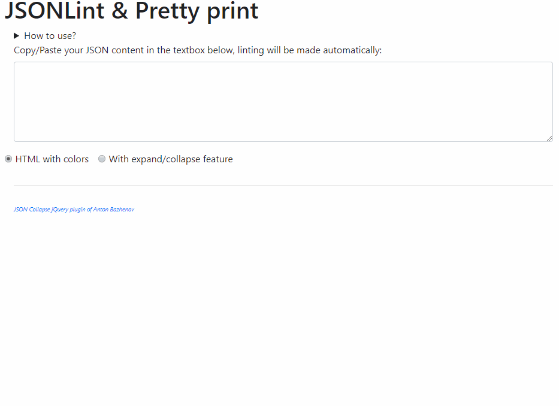
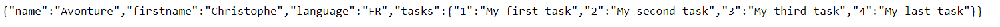
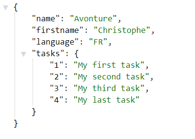

<!-- cspell:ignore favourites, analyse -->

Exactly like my [SQL - Formatting tool](/blog/sql-formatter), it's always useful to have a tool in your favourites that lets you copy/paste a JSON character string and display it as a tree-view with or without code folding feature.

I use it quite regularly when I'm writing a JSON string and I want to check that there are no syntax errors (lint) or, on the other hand, and for example, when I call an API that returns JSON and I want to analyse the code received.  In these cases, the collapse functionality comes in very handy.

<!-- truncate -->

Retrieve my **JSON Linter** tool and sources on [https://github.com/cavo789/jsonlint](https://github.com/cavo789/jsonlint).

The tool is accessible online: [https://jsonlint.avonture.be/](https://jsonlint.avonture.be/)

## Chrome Addon

If you're using Chrome and if the web page output is a JSON string, the [JSON Formatter](https://chromewebstore.google.com/detail/json-formatter/bcjindcccaagfpapjjmafapmmgkkhgoa) addon will immediately display it in a readable form.

For instance, instead of getting this page:

Chrome will show this:

