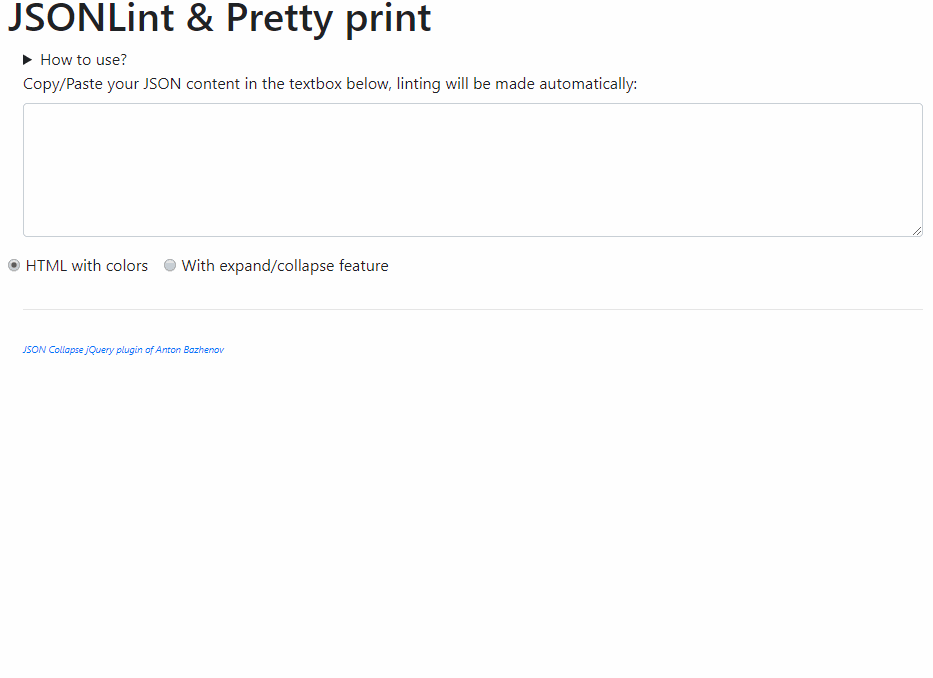
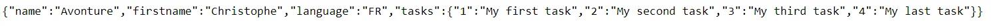
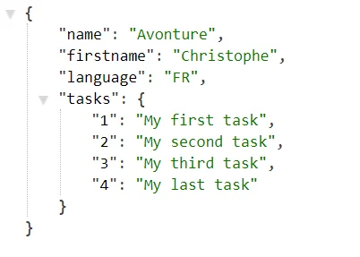

<!-- cspell:ignore favourites, analyse -->

<TLDR>
This article introduces the author's free JSON Linter tool (source on GitHub, hosted at jsonlint.avonture.be) for pasting a JSON string and viewing it as a foldable, readable tree — useful for both syntax-checking JSON you're writing and inspecting API responses. It also mentions the Chrome "JSON Formatter" extension for auto-formatting JSON pages in the browser.
</TLDR>

Exactly like my <Link to="/blog/sql-formatter">SQL - Formatting tool</Link>, it's always useful to have a tool in your favorites that lets you copy/paste a JSON character string and display it as a tree-view with or without a code folding feature.

I use it quite regularly when I'm writing a JSON string and I want to check that there are no syntax errors (lint) or, on the other hand, and for example, when I call an API that returns JSON and I want to analyze the code received. In these cases, the collapse functionality comes in very handy.

*Two alternatives depending on the context: <Link to="/blog/linux-jq">`jq`</Link> when you're already in a console, and <Link to="/blog/json-crack">Rendering a JSON file as a mind map</Link> when the structure matters more than the values. To produce test JSON rather than read it, see <Link to="/blog/json-faker">JSON - Faker & Mockup</Link>.*

<!-- truncate -->

Retrieve my **JSON Linter** tool and sources on [https://github.com/cavo789/jsonlint](https://github.com/cavo789/jsonlint).

The tool is accessible online: [https://jsonlint.avonture.be/](https://jsonlint.avonture.be/)

## Chrome Addon

If you're using Chrome and if the web page output is a JSON string, the [JSON Formatter](https://chromewebstore.google.com/detail/json-formatter/bcjindcccaagfpapjjmafapmmgkkhgoa) addon will immediately display it in a readable form.

For instance, instead of getting this page:

Chrome will show this:

Other JSON tools worth knowing about: <Link to="/blog/json-crack">rendering a JSON file as a mind map</Link> and <Link to="/blog/json-faker">generating fake JSON data</Link>.
