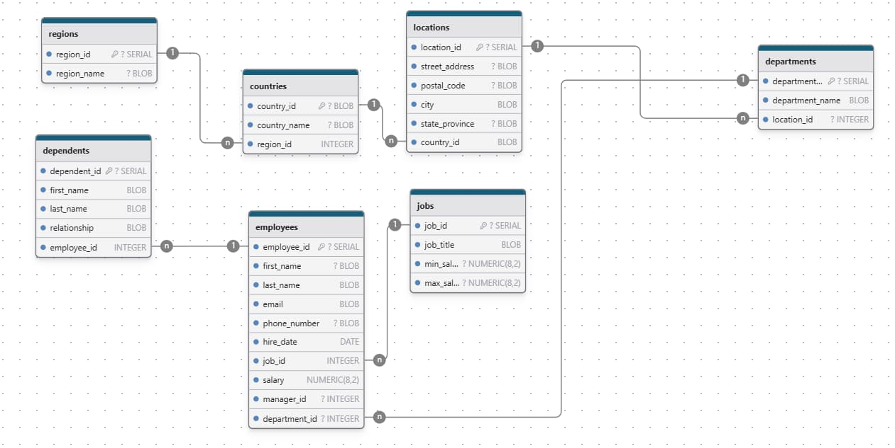
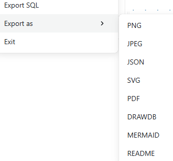

<!-- cspell:ignore drawdb,xinsodev -->

In my RSS feed recently, I came across another great application that lets you create a database model from scratch, i.e. create tables one by one and create the links between them.

However, there's another option that I find really nice: you can get a visual of the tables and relationships of any existing application in a few seconds from an .sql file that you import into drawdb-app.

Let's take a quick look at how it works.

<!--truncate-->

By opening the [https://www.drawdb.app/editor](https://www.drawdb.app/editor) website, the first thing you'll be prompted to do is to choose your target database format. For instance, let's choice PostgreSQL (Situation: *I'm coding a Laravel application using PostgreSQL and I want to relations of my DB in a nice pic*).

I think the most common use I could personally make of it is to load an SQL file. To do this, just click on the `File` menu, then choose `Import from SQL` and, finally, retrieve a previously created .sql file from your hard drive.

## Create and import a dummy sql file

If you don't have such file, I suggest to copy one from [https://www.sqltutorial.org/sql-sample-database/](https://www.sqltutorial.org/sql-sample-database/). I put here below a PostgreSQL content found on that site ([direct link](https://www.sqltutorial.org/wp-content/uploads/2020/04/postgresql.txt)) or to take any valid `.sql` file you can found on the Internet.

<Snippet filename="create_db.sql" source="./files/create_db.sql" />

So just copy/paste this SQL in Notepad; save it on your disk and go back to [https://www.drawdb.app/editor](https://www.drawdb.app/editor); `File` -> `Import from SQL`.

And let's the magic happens:

<AlertBox variant="info" title="The image here above as been done using the `File` -> `Export as` feature." />

### You can self host the application thanks to Docker if you want

By visiting [https://hub.docker.com/search?q=drawdb-io](https://hub.docker.com/search?q=drawdb-io), you'll find a few Docker images for drawdb-app. For instance [https://hub.docker.com/r/xinsodev/drawdb](https://hub.docker.com/r/xinsodev/drawdb).

To run it, just start `docker run --name some-drawdb -p 81:80 -d xinsodev/drawdb` and access the interface on `http://localhost:81`.

## Playing with exportation feature

From now, take time to check export features; click on the `File` menu again and click on `Export as`.

It's really cool to export a SQL file so easily to JSON but it's even cooler to export as markdown.

<AlertBox variant="highlyImportant" title="Auto-generated content here below">
The rest of this article was generated by drawDB.app; a really useful tool to help developers document their database!
</AlertBox>

### Summary

- Introduction
- Database Type
- Table Structure
	- regions
	- countries
	- locations
	- departments
	- jobs
	- employees
	- dependents
- Relationships
- Database Diagram

### Introduction

### Database type

- **Database system:** PostgreSQL

### Table structure

#### regions

| Name        | Type          | Settings                      | References                    | Note                           |
|-------------|---------------|-------------------------------|-------------------------------|--------------------------------|
| **region_id** | SERIAL | 🔑 PK, not null  |  | |
| **region_name** | BLOB | not null  |  | |

#### countries

| Name        | Type          | Settings                      | References                    | Note                           |
|-------------|---------------|-------------------------------|-------------------------------|--------------------------------|
| **country_id** | BLOB | 🔑 PK, not null  |  | |
| **country_name** | BLOB | not null  |  | |
| **region_id** | INTEGER | not null  | countries_region_id_fk | |

#### locations

| Name        | Type          | Settings                      | References                    | Note                           |
|-------------|---------------|-------------------------------|-------------------------------|--------------------------------|
| **location_id** | SERIAL | 🔑 PK, not null  |  | |
| **street_address** | BLOB | not null  |  | |
| **postal_code** | BLOB | not null  |  | |
| **city** | BLOB | not null  |  | |
| **state_province** | BLOB | not null  |  | |
| **country_id** | BLOB | not null  | locations_country_id_fk | |

#### departments

| Name        | Type          | Settings                      | References                    | Note                           |
|-------------|---------------|-------------------------------|-------------------------------|--------------------------------|
| **department_id** | SERIAL | 🔑 PK, not null  |  | |
| **department_name** | BLOB | not null  |  | |
| **location_id** | INTEGER | not null  | departments_location_id_fk | |

#### jobs

| Name        | Type          | Settings                      | References                    | Note                           |
|-------------|---------------|-------------------------------|-------------------------------|--------------------------------|
| **job_id** | SERIAL | 🔑 PK, not null  |  | |
| **job_title** | BLOB | not null  |  | |
| **min_salary** | NUMERIC(8,2) | not null  |  | |
| **max_salary** | NUMERIC(8,2) | not null  |  | |

#### employees

| Name        | Type          | Settings                      | References                    | Note                           |
|-------------|---------------|-------------------------------|-------------------------------|--------------------------------|
| **employee_id** | SERIAL | 🔑 PK, not null  |  | |
| **first_name** | BLOB | not null  |  | |
| **last_name** | BLOB | not null  |  | |
| **email** | BLOB | not null  |  | |
| **phone_number** | BLOB | not null  |  | |
| **hire_date** | DATE | not null  |  | |
| **job_id** | INTEGER | not null  | employees_job_id_fk | |
| **salary** | NUMERIC(8,2) | not null  |  | |
| **manager_id** | INTEGER | not null  |  | |
| **department_id** | INTEGER | not null  | employees_department_id_fk | |

#### dependents

| Name        | Type          | Settings                      | References                    | Note                           |
|-------------|---------------|-------------------------------|-------------------------------|--------------------------------|
| **dependent_id** | SERIAL | 🔑 PK, not null  |  | |
| **first_name** | BLOB | not null  |  | |
| **last_name** | BLOB | not null  |  | |
| **relationship** | BLOB | not null  |  | |
| **employee_id** | INTEGER | not null  | dependents_employee_id_fk | |

### Relationships

- **countries to regions**: many_to_one
- **locations to countries**: many_to_one
- **departments to locations**: many_to_one
- **employees to jobs**: many_to_one
- **employees to departments**: many_to_one
- **dependents to employees**: many_to_one

### Database Diagram