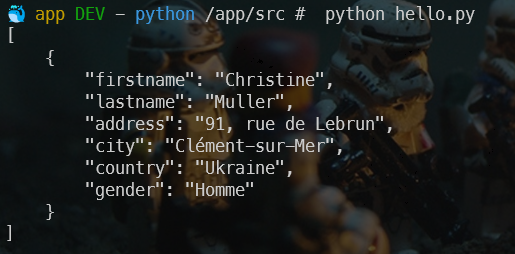
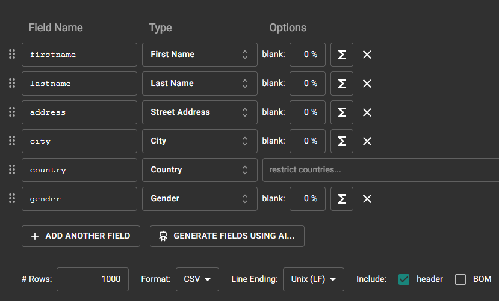
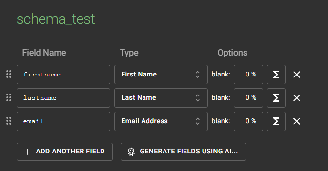
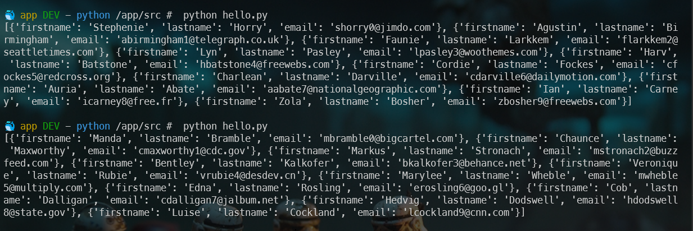
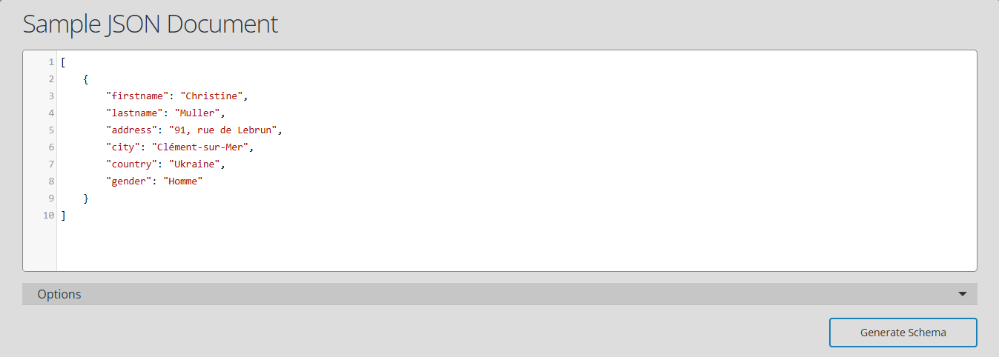
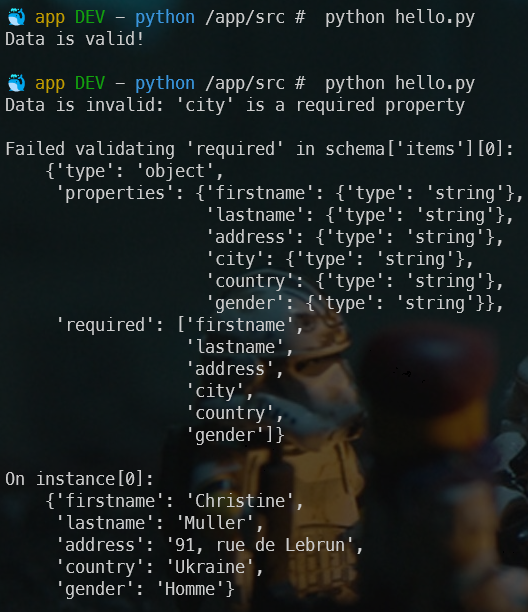

<!-- cspell:ignore birthdate,homme,femme,binaire,Mockaroo -->

I recently worked on an ETL project in Python. Among other things, the script had to process JSON files that users dropped into a specific folder.

As this was a sensitive application, it was important to validate the script by submitting fake JSON files, but also to ensure the quality of the files received.

For the fake files, I used a tool like the Faker library for Python.

<!-- truncate -->

## Generate faker JSON file

So the idea is to generate a dictionary (a json file) with fake data. Using the `Faker` library, it's really, really easy.

First install the library using `pip install faker`.

And below a small Python script to generate fake data in French (just replace `range(1)` by f.i. `range(100)` to get 100 records):

<Snippet filename="fake.py">

```python
import json

from faker import Faker

fake = Faker()

fake = Faker('fr_FR')

data = []

for _ in range(1):
    user = {
        'firstname': fake.first_name(),
        'lastname': fake.last_name(),
        'address': fake.street_address(),
        'city': fake.city(),
        'country': fake.country(),
        'gender': fake.random_element(elements=('Homme', 'Femme', 'Non binaire'))
    }

    data.append(user)

# Pretty print the JSON data
print(json.dumps(data, indent=4, ensure_ascii=False))
```

</Snippet>



:::info
Continue your reading with the official Faker documentation: [https://faker.readthedocs.io/en/master/](https://faker.readthedocs.io/en/master/)
:::

## Using Mockaroo.com

The [https://www.mockaroo.com/](https://www.mockaroo.com/) website allows you to create, for free (to access certain functions, you will need to create a free account).



### Creating a fake data using a schema

By creating a free account on Mockaroo, click on the `Schemas` button, then select `Create a schema`. In the next screen, click on `Generate fields using AI...` and paste a JSON existing string:


This done, you'll be able to generate a big number of rows like f.i. creating a file with more than 1,000 records.

By saving examples to a real JSON file on disk, you can then use that file to test your application.

### Using API

By creating a free account on Mockaroo, you can obtain a free API key (allowing 200 requests/day).

The API documentation is here: [https://mockaroo.com/docs](https://mockaroo.com/docs).

Like previously, click on the `Schemas` button, create a schema and save it.

I've created the *schema_test* like this:



I can then use it in Python like this:

<Snippet filename="schema_test.py">

```python
import requests

# My API key as displayed in my profile page on Mockaroo
api_key = "MY_API_KEY"

# This is the name of my schema
schema = "schema_test"

# Number of records I want
num_records = 10

# Construct the API endpoint URL
url = f"https://api.mockaroo.com/api/generate?key={api_key}&count={num_records}&schema={schema}"

# Make the API request
response = requests.get(url)

# Check if the request was successful
if response.status_code == 200:
    # Parse the JSON response
    data = response.json()

    # Display the result on the console
    print(data)
else:
    print(f"Error fetching data: {response.text}")
```

</Snippet>

:::info
To make this code working, think to install the requests library: `pip install requests`.
:::

By calling my script twice; each time I got a different set of data:



## Online JSON to Schema Converter

The [https://www.liquid-technologies.com/online-json-to-schema-converter](https://www.liquid-technologies.com/online-json-to-schema-converter) site will allow you to copy/paste existing JSON and get a skeleton of a JSON schema.



Once you've the schema, you can use it in Python like this:

<Snippet filename="validate.py">

```python
import json
import jsonschema

def validate_json(data_file, schema_file):
  with open(schema_file) as f:
    schema = json.load(f)

  with open(data_file) as f:
    data = json.load(f)

  jsonschema.validate(instance=data, schema=schema)

data_file = "data.json"
schema_file = "schema.json"

try:
    validate_json(data_file, schema_file)
    print("Data is valid!")
except jsonschema.exceptions.ValidationError as exception:
    print(f{"Data is invalid: {exception}")
```

</Snippet>

:::info
You'll need to run `pip install jsonschema` first.
:::

Now, I'll test my file. The first time, my JSON file will be correct. I've then removed the `city` record in my JSON and rerunning the script will indeed fails as expected:



:::success
As we can see, quite quickly, we've generated 1,000 records and, too, a validation schema. Then using few lines in Python, we've ensure the file is correct or, if not, we've spotted where the error is located.
:::
