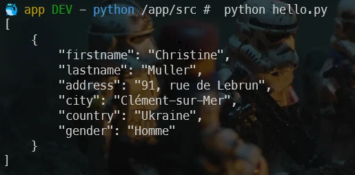
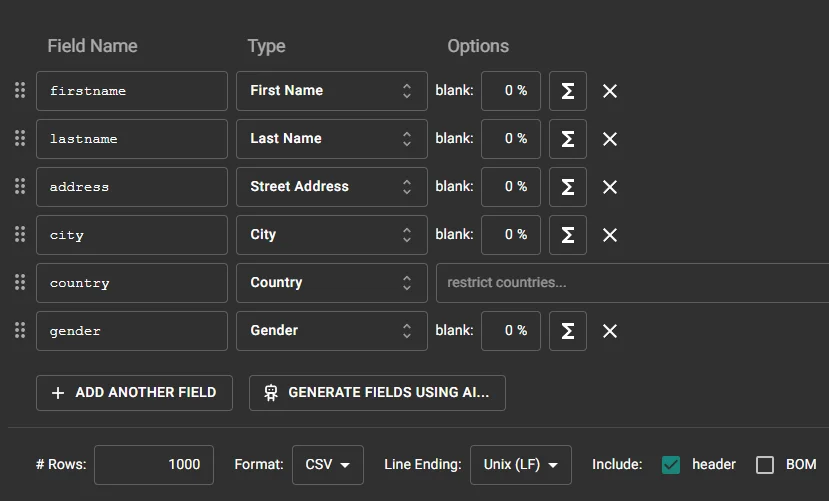
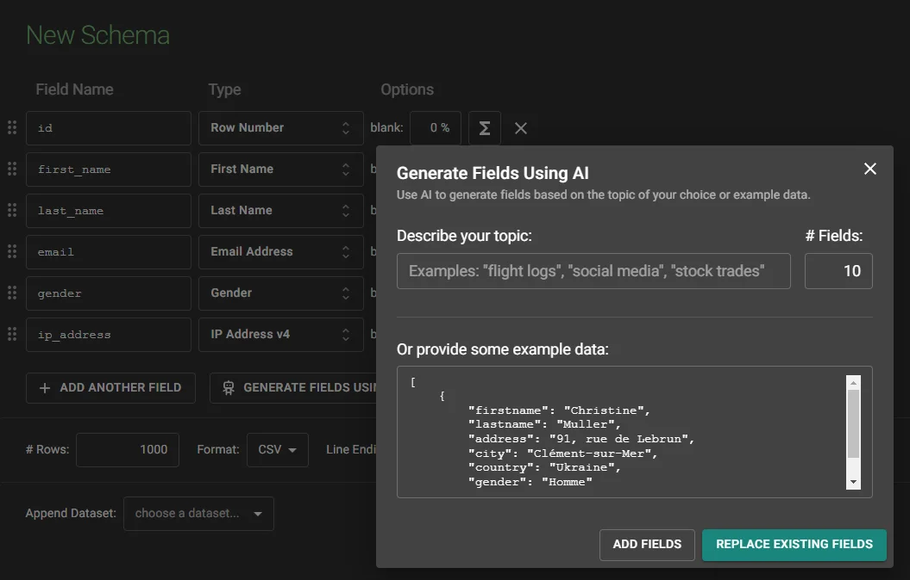
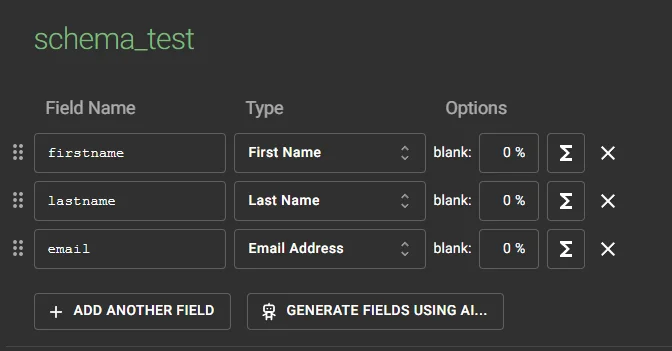
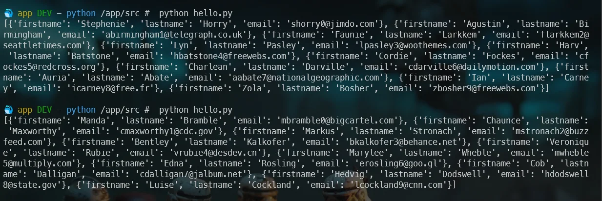
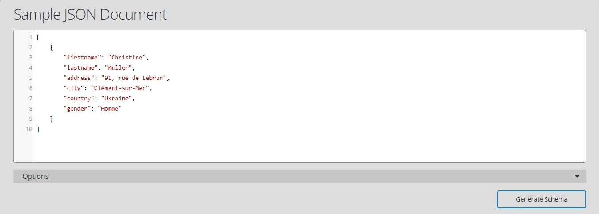
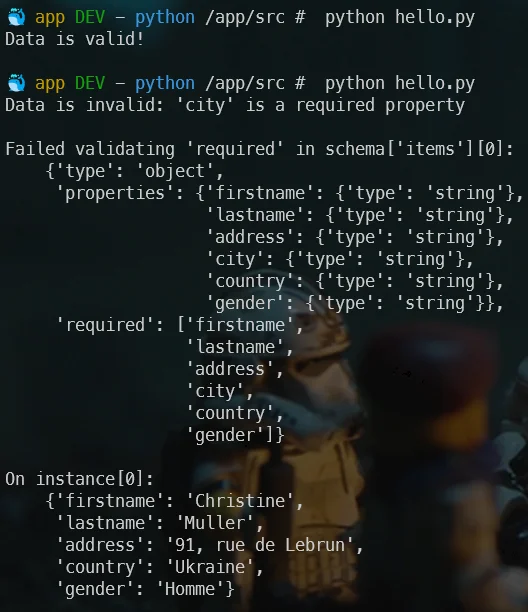

<!-- cspell:ignore birthdate,homme,femme,binaire,Mockaroo -->

<TLDR>
This article covers generating and validating fake JSON test data: using Python's `Faker` library to script custom fake records, using Mockaroo.com (schema builder + free API) to generate large datasets like 1,000+ rows, and using an online JSON-to-schema converter with Python's `jsonschema` library to validate that received files match the expected structure.
</TLDR>

I recently worked on an ETL project in Python. Among other things, the script had to process JSON files that users dropped into a specific folder.

As this was a sensitive application, it was important to validate the script by submitting fake JSON files, but also to ensure the quality of the files received.

*Two companions when you work with JSON on the command line: <Link to="/blog/linux-jq">The jq utility for Linux</Link> to inspect and filter a generated file, and <Link to="/blog/json-crack">Rendering a JSON file as a mind map</Link> to grasp the structure of an unfamiliar one at a glance.*

For the fake files, I used a tool like the Faker library for Python.

<!-- truncate -->

## Generate faker JSON file

So the idea is to generate a dictionary (a json file) with fake data. Using the `Faker` library, it's really, really easy.

First install the library using `pip install faker`.

Below is a small Python script to generate fake data in French (just replace `range(1)` with `range(100)`, for example, to get 100 records):

<Snippet filename="fake.py" source="./files/fake.py" />

<AlertBox variant="info">
Continue your reading with the official Faker documentation: [https://faker.readthedocs.io/en/master/](https://faker.readthedocs.io/en/master/)

</AlertBox>

## Using Mockaroo.com

The [https://www.mockaroo.com/](https://www.mockaroo.com/) website allows you to create fake data for free (to access certain functions, you will need to create a free account).

### Creating a fake data using a schema

By creating a free account on Mockaroo, click on the `Schemas` button, then select `Create a schema`. In the next screen, click on `Generate fields using AI...` and paste an existing JSON string:

This done, you'll be able to generate a large number of rows — for instance, a file with more than 1,000 records.

By saving examples to a real JSON file on disk, you can then use that file to test your application.

### Using API

By creating a free account on Mockaroo, you can obtain a free API key (allowing 200 requests/day).

The API documentation is here: [https://mockaroo.com/docs](https://mockaroo.com/docs).

Like previously, click on the `Schemas` button, create a schema and save it.

I've created the *schema_test* like this:

I can then use it in Python like this:

<Snippet filename="schema_test.py" source="./files/schema_test.py" />

<AlertBox variant="info">
To make this code work, remember to install the requests library: `pip install requests`.

</AlertBox>

By calling my script twice; each time I got a different set of data:

## Online JSON to Schema Converter

The [https://www.liquid-technologies.com/online-json-to-schema-converter](https://www.liquid-technologies.com/online-json-to-schema-converter) site will allow you to copy/paste existing JSON and get a skeleton of a JSON schema.

Once you've the schema, you can use it in Python like this:

<Snippet filename="validate.py" source="./files/validate.py" />

<AlertBox variant="info">
You'll need to run `pip install jsonschema` first.

</AlertBox>

Now, I'll test my file. The first time, my JSON file will be correct. I've then removed the `city` record from my JSON, and rerunning the script will indeed fail, as expected:

<AlertBox variant="info">
As we can see, quite quickly, we've generated 1,000 records and, also, a validation schema. Then, using a few lines of Python, we've ensured the file is correct or, if not, we've spotted where the error is located.

</AlertBox>

Other JSON tools worth knowing about: <Link to="/blog/json-crack">rendering a JSON file as a mind map</Link> and <Link to="/blog/json-lint">linting/validating your JSON files</Link>.
