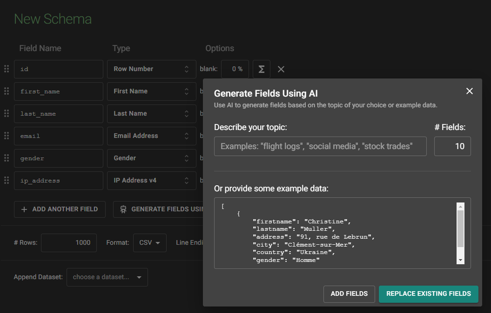

<!-- cspell:ignore birthdate,homme,femme,binaire,Mockaroo -->

I recently worked on an ETL project in Python. Among other things, the script had to process JSON files that users dropped into a specific folder.

As this was a sensitive application, it was important to validate the script by submitting fake JSON files, but also to ensure the quality of the files received.

For the fake files, I used a tool like the Faker library for Python.

<!-- truncate -->

## Generate faker JSON file

So the idea is to generate a dictionary (a json file) with fake data. Using the `Faker` library, it's really, really easy.

First install the library using `pip install faker`.

And below a small Python script to generate fake data in French (just replace `range(1)` by f.i. `range(100)` to get 100 records):

<Snippet filename="fake.py" source="./files/fake.py" />

<AlertBox variant="info" title="">
Continue your reading with the official Faker documentation: [https://faker.readthedocs.io/en/master/](https://faker.readthedocs.io/en/master/)

</AlertBox>

## Using Mockaroo.com

The [https://www.mockaroo.com/](https://www.mockaroo.com/) website allows you to create, for free (to access certain functions, you will need to create a free account).

### Creating a fake data using a schema

By creating a free account on Mockaroo, click on the `Schemas` button, then select `Create a schema`. In the next screen, click on `Generate fields using AI...` and paste a JSON existing string:

This done, you'll be able to generate a big number of rows like f.i. creating a file with more than 1,000 records.

By saving examples to a real JSON file on disk, you can then use that file to test your application.

### Using API

By creating a free account on Mockaroo, you can obtain a free API key (allowing 200 requests/day).

The API documentation is here: [https://mockaroo.com/docs](https://mockaroo.com/docs).

Like previously, click on the `Schemas` button, create a schema and save it.

I've created the *schema_test* like this:

I can then use it in Python like this:

<Snippet filename="schema_test.py" source="./files/schema_test.py" />

<AlertBox variant="info" title="">
To make this code working, think to install the requests library: `pip install requests`.

</AlertBox>

By calling my script twice; each time I got a different set of data:

## Online JSON to Schema Converter

The [https://www.liquid-technologies.com/online-json-to-schema-converter](https://www.liquid-technologies.com/online-json-to-schema-converter) site will allow you to copy/paste existing JSON and get a skeleton of a JSON schema.

Once you've the schema, you can use it in Python like this:

<Snippet filename="validate.py" source="./files/validate.py" />

<AlertBox variant="info" title="">
You'll need to run `pip install jsonschema` first.

</AlertBox>

Now, I'll test my file. The first time, my JSON file will be correct. I've then removed the `city` record in my JSON and rerunning the script will indeed fails as expected:

<AlertBox variant="info" title="">
As we can see, quite quickly, we've generated 1,000 records and, too, a validation schema. Then using few lines in Python, we've ensure the file is correct or, if not, we've spotted where the error is located.

</AlertBox>
