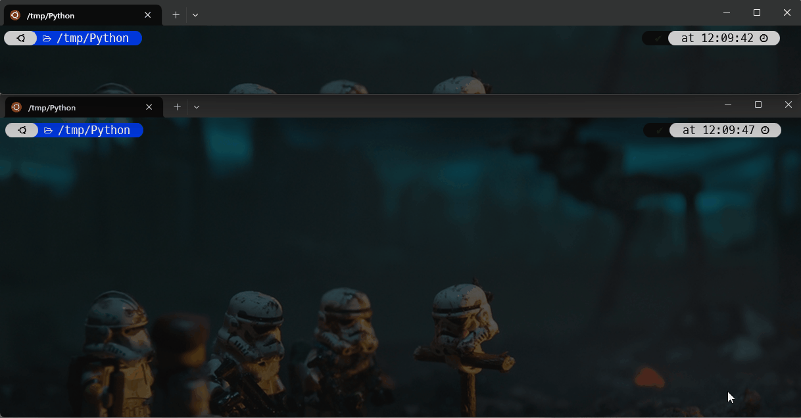

<!-- cspell:ignore joinpath,pathlib -->


Over the last few weeks, I've been working on a Python script that generates PDFs. My script had to generate 70,000 of them and that obviously takes a while.

My idea was to have my script run in a Linux console and, in a second console, with a counter that increases with the number of files that have been created on the hard disk.

The first script will be in Python and I wanted something ultra-simple and using a simple Linux command.

The command `ls folder_name | wc -l` works but didn't stay running. Let's see how we can do better with **inotifywait**.

<!-- truncate -->

## Let's create our Python environment

:::important
You can skip this part if you already have Python installed on your computer.
:::

I need a Python environment so let's quickly create it thanks to Docker.

Please create a file called `Dockerfile` with this content:

<details>

<summary>Dockerfile</summary>

```dockerfile
# syntax=docker/dockerfile:1

FROM python:3.10-slim AS base

# The /app/out folder where we'll create files
RUN mkdir -p /app/out  

# The /app/src where we'll put our Python script
WORKDIR "/app/src"

# Keep the container running
ENTRYPOINT ["tail", "-f", "/dev/null"]
```

</details>

Create the image by running `docker build --tag inotify .`.

We can now create our Docker container: `docker run --detach --name demo -v ./src:/app/src -v ./out:/app/out inotify`.

This will create a Docker container that will remain running. We'll share our script `src/script.py` with the container and, too, the `out/` folder on our host as the `/app/out` folder of the container.

## Create a sample Python script:

We need a very small Python script to generate our files:

<details>

<summary>src/script.py</summary>

```python
import os
import signal
import tempfile
import time

from pathlib import Path

def signal_handler(sig, frame):
    print('Stop')
    exit(0)

signal.signal(signal.SIGINT, signal_handler)

# We'll put files in our application out folder
folder : Path = Path("/app/out/")

folder.mkdir(parents=True, exist_ok=True)

counter : int = 0

while True:
    file : Path = folder.joinpath(os.path.basename(tempfile.mktemp()))
    print(file.absolute())

    with open(file, 'w') as f:
        pass

    counter += 1

    print(f"{counter} files have been created.")

    time.sleep(1)
```

</details>

## Creating the monitory.sh script

Please create a script called `monitor.sh` with this content:

<details>

<summary>monitory.sh</summary>

```bash
#!/bin/bash

# cspell:ignore inotifywait,inotify

count=0

# Folder to monitor
folder="$1"

# Monitor the directory for changes
# -r - Recursively monitors subdirectories
# -m - Monitor file modifications

# shellcheck disable=SC2034
inotifywait -m ${folder} | while read -r line; do
    #shellcheck disable=SC2012
    if (( count != $(ls "${folder}" | wc -l) )); then

        count=$(ls "${folder}" | wc -l)

        # Clear the terminal screen
        clear

        # Count the files and display the updated count
        echo "Number of files in ${folder}: ${count}"
    fi
done

```

</details>

Make the script executable: `chmod +x ./monitor.sh` and make sure to install **inotify** by running `sudo apt-get update && sudo apt-get install -y --no-install-recommends inotify-tools`.

:::info
You can quickly check if `inotifywait` is already installed by running `which inotifywait`. If you don't get an answer (empty response); then it's not yet there.
:::

We're finally ready.

## Running the scripts

First, in a separate console, we'll start our monitoring script: `./monitor.sh out`.

In a second window, start the Python script: `docker exec -it demo python script.py`.



## Conclusion

Now, I can minimized the main screen and just keep the counter displayed.

I'm also sure that the script is well creating file since I've used two different technologies; Python and Bash.