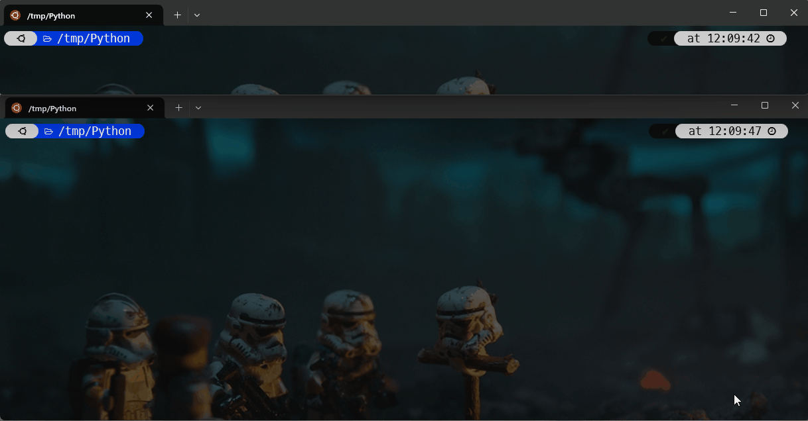

<!-- cspell:ignore joinpath,pathlib -->

<TLDR>
This article shows how to get a live, continuously updating count of files being created in a folder using `inotifywait` (unlike the one-shot `ls folder | wc -l`), wrapped in a small `monitor.sh` script — used here in a second terminal to watch progress while a Python script (running in a Docker container) generates tens of thousands of PDF files.
</TLDR>

Over the last few weeks, I've been working on a Python script that generates PDFs. My script had to generate 70,000 of them and that obviously takes a while.

My idea was to have my script run in a Linux console and, in a second console, with a counter that increases with the number of files that have been created on the hard disk.

The first script will be in Python and I wanted something ultra-simple and using a simple Linux command.

The command `ls folder_name | wc -l` works but didn't stay running. Let's see how we can do better with **inotifywait**.

<!-- truncate -->

## Let's create our Python environment

<AlertBox variant="caution">
You can skip this part if you already have Python installed on your computer.

</AlertBox>

I need a Python environment so let's quickly create it thanks to Docker.

Please create a file called `Dockerfile` with this content:

<Snippet filename="Dockerfile" source="./files/Dockerfile" />

Create the image by running `docker build --tag inotify .`.

We can now create our Docker container: `docker run --detach --name demo -v ./src:/app/src -v ./out:/app/out inotify`.

This will create a Docker container that will remain running. We'll share our script `src/script.py` with the container and, too, the `out/` folder on our host as the `/app/out` folder of the container.

## Create a sample Python script

We need a very small Python script to generate our files:

<Snippet filename="src/script.py" source="./files/script.py" />

## Creating the monitor.sh script

Please create a script called `monitor.sh` with this content:

<Snippet filename="monitor.sh" source="./files/monitor.sh" />

Make the script executable: `chmod +x ./monitor.sh` and make sure to install **inotify** by running `sudo apt-get update && sudo apt-get install -y --no-install-recommends inotify-tools`.

<AlertBox variant="info">
You can quickly check if `inotifywait` is already installed by running `which inotifywait`. If you don't get an answer (empty response); then it's not yet there.

</AlertBox>

We're finally ready.

## Running the scripts

First, in a separate console, we'll start our monitoring script: `./monitor.sh out`.

In a second window, start the Python script: `docker exec -it demo python script.py`.

## Conclusion

Now, I can minimize the main screen and just keep the counter displayed.

I'm also confident that the script is correctly creating files, since I've used two different technologies: Python and Bash.
