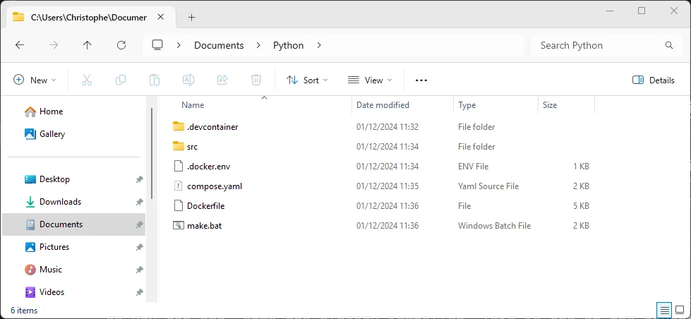
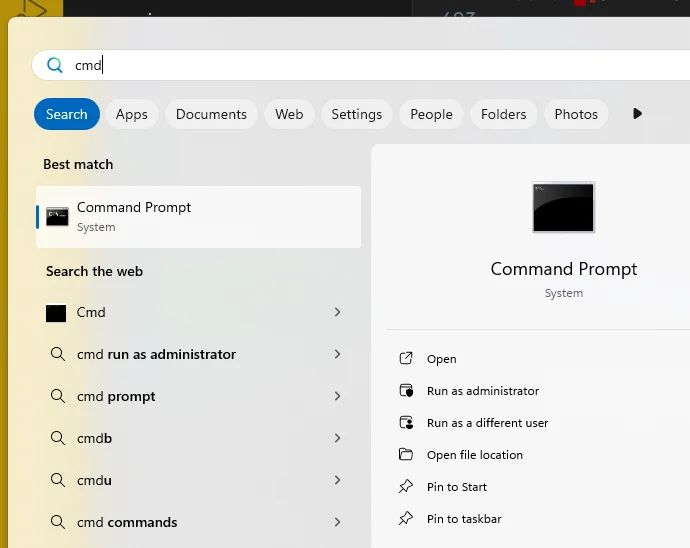
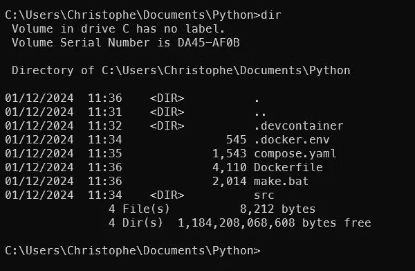
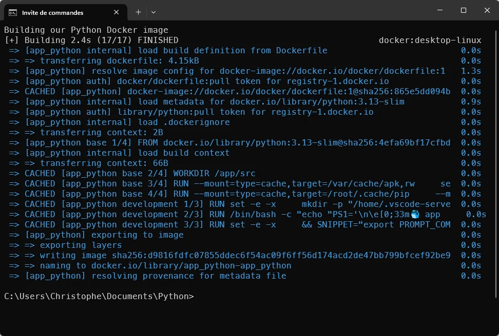
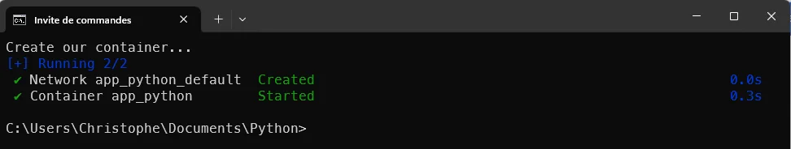
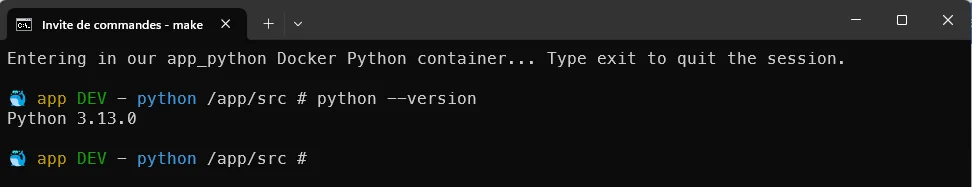
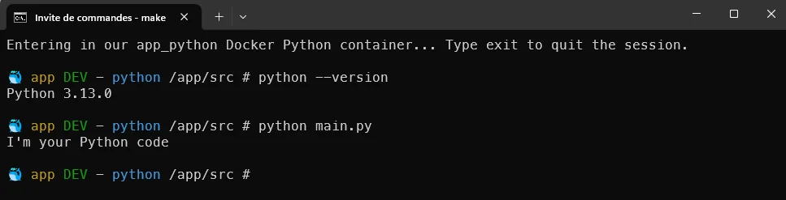
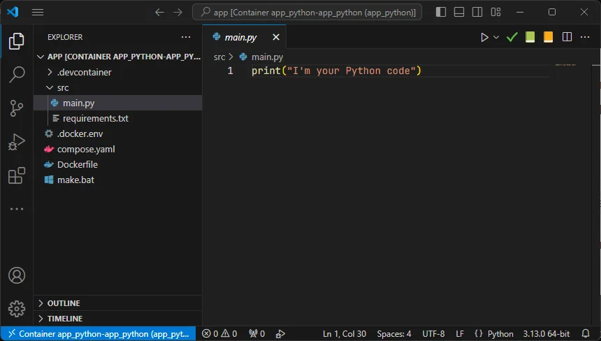
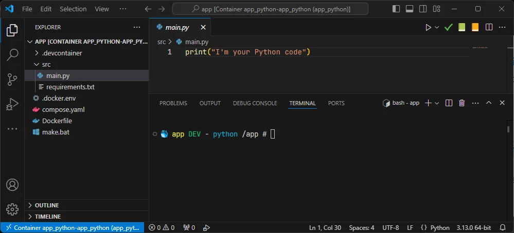
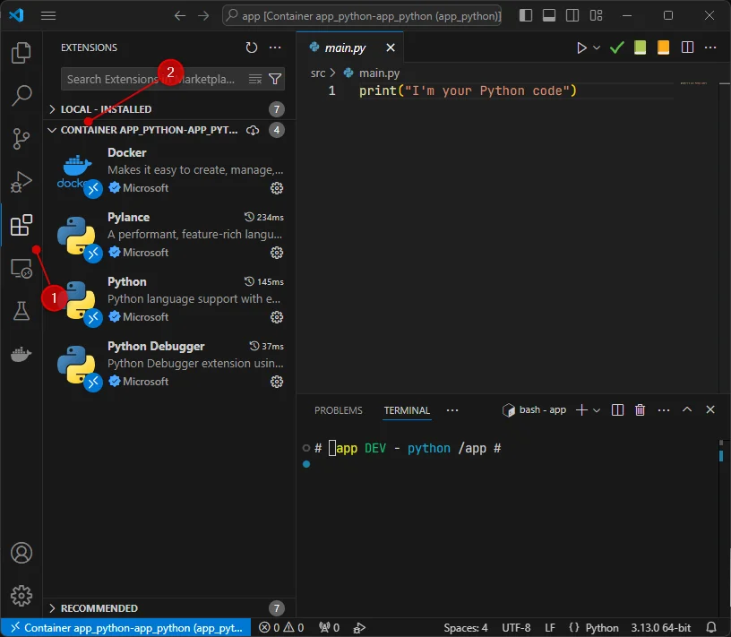

<!-- cspell:ignore PYTHONDONTWRITEBYTECODE,PYTHONUNBUFFERED,HISTFILE -->
<!-- cspell:ignore addgroup,adduser,keyscan,hadolint,gecos,endregion -->
<!-- cspell:ignore bashhistory,groupid,commandhistory,pylint,synchronised,hexa -->
<!-- cspell:ignore mypy,pylance -->

In a <Link to="/blog/docker-python-devcontainer">previous article</Link>, I've provided some files to be able to quickly create a Python environment under Linux. Today, let's play and use the exact same files but this time under Windows.

The today challenge is easy: create a Python environment on my Windows machine without to have install Python of course and without to have to configure VSCode. Just run some magic and, voilà, as a Python newcomer, I can start to code without first losing time to configure my computer.

<!-- truncate -->

So, in the <Link to="/blog/docker-python-devcontainer">Docker - Python devcontainer</Link> blog post, I've provided a few files and we'll reuse them in this article.

I'm speaking about magic but, let's go in details in the article below. I could provide you with a ZIP archive, for example, with all the files already created and the structure, but that would be less ... fun, wouldn't it?

## Create a file/folder structure

Please create a folder on your Windows machine, f.i. let's create a folder called `Python` in your documents (in MS-DOS, here is the command to run `mkdir %USERPROFILE%\Documents\Python` and jump in in `cd %USERPROFILE%\Documents\Python`).

Of course, you can start Windows Explorer, go to your *Documents* folder and create the folder and all the files like that:

Please create all required files (the one from the previous blog post). We've NOT modified these files: we can thus use the exact same files whatever if we're running under Linux or Windows.

Just add a new file on your Windows folder and copy/paste the content from here below.

Copy/paste the content below in a file on your system called `.devcontainer/devcontainer.json`.

<Snippet filename=".devcontainer/devcontainer.json" source="./files/devcontainer.json" />

Copy/paste the content below in a file on your system called `src/main.py`.

<Snippet filename="src/main.py" source="./files/main.py" />

<Snippet filename="src/requirements.txt">

Yes, an empty file... The file has to be present but right now, we don't need to put any dependencies.

</Snippet>

Copy/paste the content below in a file on your system called `.docker.env` (in Linux world; such files are hidden ones since they start with a dot).

<Snippet filename=".docker.env" source="./files/.docker.env" />

Copy/paste the content below in a file on your system called `compose.yaml`.

<Snippet filename="compose.yaml" source="./files/compose.yaml" />

Copy/paste the content below in a file on your system called `Dockerfile`.

<Snippet filename="Dockerfile" source="./files/Dockerfile" />

## Create our DOS batch file

Here the difference with Linux: instead of using GNU Make, we'll simply use a MS-DOS batch script. We'll call it `make.bat` so we can use actions like `make build` or `make up` as we are used to under Linux; but this time, under DOS.

Please create this additional file:

<Snippet filename="make.bat" source="./files/make.bat" />

## Our configuration right now

At this stage, here is our project is VSCode:

And here's how we can see it in Windows Explorer:

Start a MS-DOS console (i.e. press the <kbd>Windows</kbd> key on your keyboard or click on the Start Menu, then start to type `cmd`)

Open the console and go to your project's folder i.e. run `cd %USERPROFILE%\Documents\Python`.

Below how the project looks like right now:

## Time to start

All the commands below should be started from a MS-DOS command prompt and you should be located in your project's folder (`cd %USERPROFILE%\Documents\Python`).

### Build the Python Docker image

The first thing to do, only once, is to create the Docker image. This is done by running `make build`:

### Create a Docker container

Then, once a day, you've to run `make up`:

You've to do this just once a day i.e. most probably the container will be terminated when you'll shut down your computer. Just run `make up` the next morning to *awake* it back.

### Entering in the container

If you need to enter in your Docker container (started by `make up`), just run `make bash`.

You'll get a different console like below illustrated (see the blue whale f.i.). The screenshot below illustrate displaying the Python's version number:

Remember the files we've created in the previous chapter. One file was called `main.py` with a straightforward Python script; let's run it:

You simply need to run the `python` binary followed by the script name to start.

<AlertBox variant="info" title="">
So, you're actually inside a running container (see the blue whale). You should type `exit` to quit the container (the container will still keep running) and returns to your MS-DOS console.

</AlertBox>

### Starting VSCode and start your developer journey

Just run `make devcontainer` (in your MS-DOS console; not in a container), you'll start Visual Studio Code inside your Docker container. That feature is called *devcontainer*.

In VSCode, you can, if you like this way of working, press <kbd>CTRL</kbd>+<kbd>´</kbd> to start a terminal (you can also click on the `View` menu then click on `Terminal` menu entry; same thing).

So, here, if you want to run the `main.py` script, just type `python src/main.py` and press <kbd>Enter</kbd>.

<AlertBox variant="info" title="">
For Windows users, please note that the container (and thus VSCode) is running in Linux. There are a lot of differences for sure. What you should know is that Linux use `/` as directory separator and not `\` like DOS/Windows. This is why we've typed `src/main.py` and not `src\main.py`.

</AlertBox>

#### Can I add Python's addons in VSCode?

For sure, just go to the list of addons (press <kbd>CTRL</kbd>+<kbd>SHIFT</kbd>+<kbd>X</kbd>) and ... as you can see, some are already installed. This is one of the advantages of using a Devcontainer like you do right now (see the `.devcontainer/devcontainer.json` file you've created earlier).

#### Can I use another version of Python?

For sure, just edit the file called `.docker.env` and you'll find this line: `DOCKER_PYTHON_VERSION=3.13-slim`. Just change the version number, save the file and run `make build` then `make up` and, finally, `make devcontainer` to rebuild everything and use the newer version.
