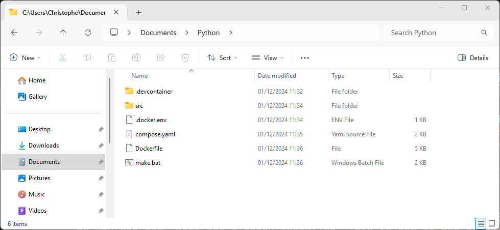
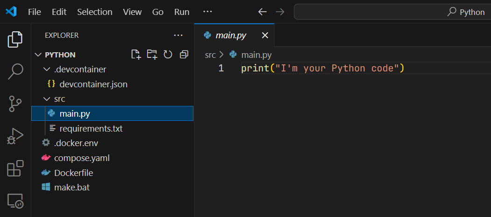
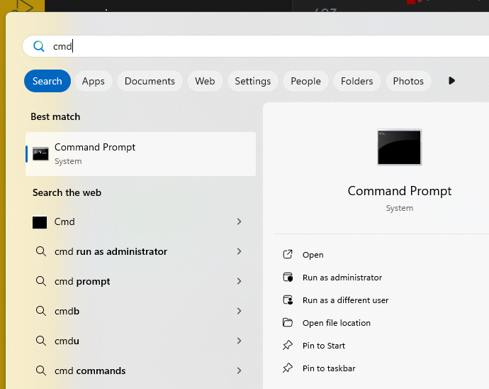
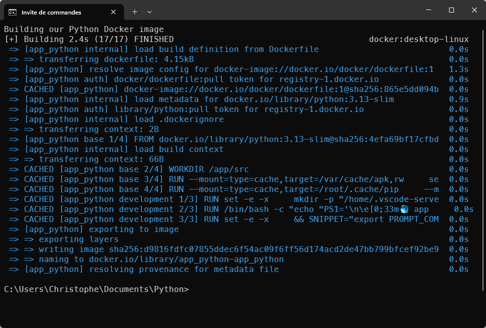
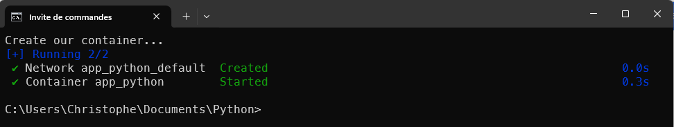
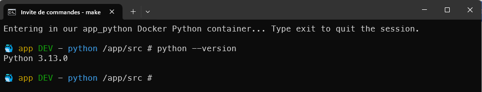
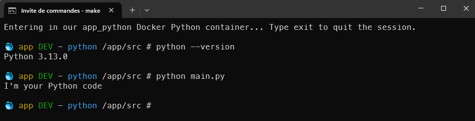
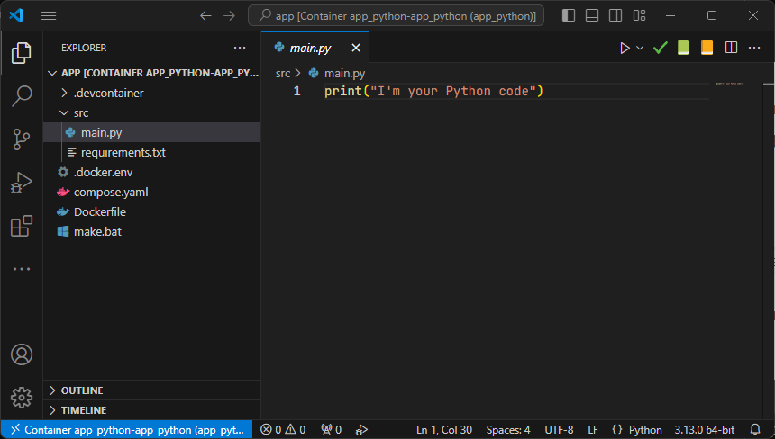
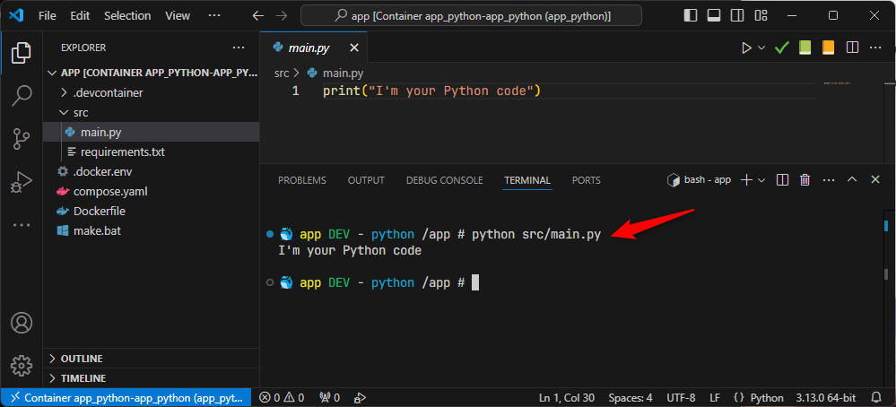

<!-- cspell:ignore PYTHONDONTWRITEBYTECODE,PYTHONUNBUFFERED,HISTFILE -->
<!-- cspell:ignore addgroup,adduser,keyscan,hadolint,gecos,endregion -->
<!-- cspell:ignore bashhistory,groupid,commandhistory,pylint,synchronised,hexa -->
<!-- cspell:ignore mypy,pylance -->


In a <Link to="/blog/docker-python-devcontainer">previous article</Link>, I've provided some files to be able to quickly create a Python environment under Linux. Today, let's play and use the exact same files but this time under Windows.

The today challenge is easy: create a Python environment on my Windows machine without to have install Python of course and without to have to configure VSCode. Just run some magic and, voilà, as a Python newcomer, I can start to code without first losing time to configure my computer.

<!-- truncate -->

So, in the <Link to="/blog/docker-python-devcontainer">Docker - Python devcontainer</Link> blog post, I've provided a few files and we'll reuse them in this article.

I'm speaking about magic but, let's go in details in the article below. I could provide you with a ZIP archive, for example, with all the files already created and the structure, but that would be less ... fun, wouldn't it?

## Create a file/folder structure

Please create a folder on your Windows machine, f.i. let's create a folder called `Python` in your documents (in MS-DOS, here is the command to run `mkdir %USERPROFILE%\Documents\Python` and jump in in `cd %USERPROFILE%\Documents\Python`).

Of course, you can start Windows Explorer, go to your *Documents* folder and create the folder and all the files like that:



Please create all required files (the one from the previous blog post). We've NOT modified these files: we can thus use the exact same files whatever if we're running under Linux or Windows.

Just add a new file on your Windows folder and copy/paste the content from here below.

Copy/paste the content below in a file on your system called `.devcontainer/devcontainer.json`.

<Snippet filename=".devcontainer/devcontainer.json">

<!-- cspell:disable -->
```json
{
    "name": "app_python",
    "dockerComposeFile": [
        "./../compose.yaml",
    ],
    "service": "app_python",
    "remoteUser": "python",
    "workspaceFolder": "/app",
    "customizations": {
        "vscode": {
            "extensions": [
                "aaron-bond.better-comments",
                "DavidAnson.vscode-markdownlint",
                "eamodio.gitlens",
                "EricSia.pythonsnippets3",
                "foxundermoon.shell-format",
                "gruntfuggly.todo-tree",
                "mde.select-highlight-minimap",
                "mgesbert.python-path",
                "mikestead.dotenv",
                "mrmlnc.vscode-duplicate",
                "ms-azuretools.vscode-docker",
                "ms-python.black-formatter",
                "ms-python.debugpy",
                "ms-python.isort",
                "ms-python.mypy-type-checker",
                "ms-python.pylint",
                "ms-python.python",
                "ms-python.vscode-pylance",
                "ms-vscode-remote.remote-containers",
                "ms-vscode.makefile-tools",
                "njpwerner.autodocstring",
                "redhat.vscode-xml",
                "redhat.vscode-yaml",
                "sirtori.indenticator",
                "sonarsource.sonarlint-vscode",
                "streetsidesoftware.code-spell-checker-dutch",
                "streetsidesoftware.code-spell-checker-french",
                "streetsidesoftware.code-spell-checker",
                "tomoki1207.pdf",
                "tyriar.sort-lines"
            ],
            "settings": {
                "[dockerfile]": {
                    "files.eol": "\n",
                    "editor.defaultFormatter": "ms-azuretools.vscode-docker"
                },
                "[json]": {
                    "editor.defaultFormatter": "vscode.json-language-features"
                },
                "[jsonc]": {
                    "editor.defaultFormatter": "vscode.json-language-features",
                    "editor.wordWrap": "wordWrapColumn",
                    "editor.wordWrapColumn": 80,
                    "editor.wrappingIndent": "indent"
                },
                "[markdown]": {
                    "editor.defaultFormatter": "DavidAnson.vscode-markdownlint",
                    "editor.wordWrap": "wordWrapColumn",
                    "editor.wordWrapColumn": 80,
                    "editor.wrappingIndent": "indent"
                },
                "[python]": {
                    "editor.defaultFormatter": "ms-python.black-formatter",
                    "editor.formatOnSave": true,
                    "editor.codeActionsOnSave": {
                        "source.fixAll": "always",
                        "source.organizeImports": "always"
                    }
                },
                "[shellscript]": {
                    "editor.defaultFormatter": "foxundermoon.shell-format"
                },
                "[xml]": {
                    "editor.defaultFormatter": "redhat.vscode-xml",
                    "editor.wordWrap": "wordWrapColumn",
                    "editor.wordWrapColumn": 80,
                    "editor.wrappingIndent": "indent"
                },
                "[yaml]": {
                    "editor.defaultFormatter": "redhat.vscode-yaml",
                    "editor.insertSpaces": true,
                    "editor.tabSize": 2
                },
                "cSpell.language": "en,fr,nl",
                "docker-explorer.enableTelemetry": false,
                "editor.bracketPairColorization.enabled": true,
                "editor.codeActionsOnSave": {
                    "source.fixAll": "explicit"
                },
                "editor.defaultFoldingRangeProvider": null,
                "editor.detectIndentation": false,
                "editor.folding": true,
                "editor.foldingStrategy": "auto",
                "editor.formatOnSave": true,
                "editor.guides.bracketPairs": "active",
                "editor.guides.bracketPairsHorizontal": "active",
                "editor.guides.highlightActiveIndentation": true,
                "editor.guides.indentation": true,
                "editor.multiCursorModifier": "ctrlCmd",
                "editor.renderWhitespace": "all",
                "editor.rulers": [
                    120,
                    70
                ],
                "editor.stickyScroll.enabled": true,
                "editor.tabCompletion": "on",
                "editor.tabSize": 4,
                "editor.wordBasedSuggestionsMode": "allDocuments",
                "editor.wordWrapColumn": 120,
                "explorer.compactFolders": false,
                "explorer.confirmDelete": true,
                "explorer.confirmDragAndDrop": true,
                "extensions.autoCheckUpdates": false,
                "files.autoSave": "onFocusChange",
                "files.defaultLanguage": "${activeEditorLanguage}",
                "files.eol": "\n",
                "files.exclude": {
                    "**/.cache": true,
                    "**/.git": true
                },
                "files.insertFinalNewline": true,
                "files.trimTrailingWhitespace": true,
                "markdown.extension.toc.levels": "2..6",
                "markdownlint.config": {
                    "MD033": false,
                    "MD036": false
                },
                "mypy-type-checker.args": [
                    "--config-file=.config/.mypy.ini"
                ],
                "python.analysis.autoFormatStrings": true,
                "python.analysis.autoImportCompletions": true,
                "python.analysis.autoIndent": true,
                "python.analysis.autoSearchPaths": true,
                "python.analysis.fixAll": [
                    "source.convertImportFormat"
                ],
                "python.analysis.typeCheckingMode": "strict",
                "python.defaultInterpreterPath": "/usr/local/bin/python3",
                "python.formatting.provider": "black",
                "python.languageServer": "Pylance",
                "python.linting.enabled": true,
                "python.linting.flake8Enabled": true,
                "python.linting.pylintEnabled": true,
                "python.sortImports.args": [
                    "--profile",
                    "black"
                ],
                "redhat.telemetry.enabled": false,
                "sonarlint.output.showAnalyzerLogs": true,
                "sonarlint.disableTelemetry": true,
                "sonarlint.rules": {
                    "docker:S7031": {
                        "level": "off"
                    }
                },
                "telemetry.telemetryLevel": "off",
                "terminal.integrated.profiles.linux": {
                    "bash": {
                        "path": "/bin/bash",
                        "icon": "terminal-bash"
                    }
                },
                "terminal.integrated.defaultProfile.linux": "bash",
                "terminal.integrated.fontFamily": "MesloLGS NF",
                "update.enableWindowsBackgroundUpdates": false,
                "update.mode": "none",
                "yaml.format.enable": true,
                "yaml.completion": true,
                "yaml.validate": true,
                "workbench.editor.enablePreview": false,
                "workbench.editor.wrapTabs": true
            }
        }
    }
}
```
<!-- cspell:enable -->
</Snippet>

Copy/paste the content below in a file on your system called `src/main.py`.

<Snippet filename="src/main.py">

```python
print("I'm your Python code")
```

</Snippet>

<Snippet filename="src/requirements.txt">

Yes, an empty file... The file has to be present but right now, we don't need to put any dependencies.

</Snippet>

Copy/paste the content below in a file on your system called `.docker.env` (in Linux world; such files are hidden ones since they start with a dot).

<Snippet filename=".docker.env">

```ini
# Application root directory in the container (PHP or NGINX) (--app-home)
DOCKER_APP_HOME=/app

# Name of the container to show in the bash prompt
DOCKER_CONTAINER_NAME=app

# Set OS groupid in your Docker Linux containers (1000 = root) (--os-groupid)
DOCKER_OS_GROUPID=1000

# Set OS userid in your Docker Linux containers (1000 = root) (--os-userid)
DOCKER_OS_USERID=1000

# Set OS username in your Docker Linux containers (--os-username)
DOCKER_OS_USERNAME="python"

# Version of Python to use
DOCKER_PYTHON_VERSION=3.13-slim
```

</Snippet>


Copy/paste the content below in a file on your system called `compose.yaml`.

<Snippet filename="compose.yaml">

```yaml
name: app_python

services:
  app_python:
    build:
      context: .
      target: development
      args:
        # Version of Python to use
        - DOCKER_PYTHON_VERSION=${DOCKER_PYTHON_VERSION}
        # Application root directory in the container (PHP or NGINX) (--app-home)
        - DOCKER_APP_HOME=${DOCKER_APP_HOME:-/app}
        # Name of the container to show in the bash prompt
        - DOCKER_CONTAINER_NAME=${DOCKER_CONTAINER_NAME:-python}
        # Set OS groupid in your Docker Linux containers (1000 = root) (--os-groupid)
        - DOCKER_OS_GROUPID=${DOCKER_OS_GROUPID:-1000}
        # Set OS userid in your Docker Linux containers (1000 = root) (--os-userid)
        - DOCKER_OS_USERID=${DOCKER_OS_USERID:-1000}
        # Set OS username in your Docker Linux containers (--os-username)
        - DOCKER_OS_USERNAME=${DOCKER_OS_USERNAME:-python}
    user: ${DOCKER_OS_USERID:-1000}:${DOCKER_OS_GROUPID:-1000}
    env_file:
      - .docker.env
    container_name: app_python
    volumes:
      # Our codebase on our host
      - .:${DOCKER_APP_HOME}
      # Keep installed VSCode extensions in a volume to avoid to reinstall them
      - vscode-extensions:/home/${DOCKER_OS_USERNAME}/.vscode-server/extensions
      # Remember the bash history
      - bashhistory:/home/${DOCKER_OS_USERNAME}/commandhistory

volumes:
  # Use a Docker volume self-managed volume to store vscode's cache
  vscode-extensions:
  # Use a Docker volume self-managed volume to store bash history
  bashhistory:
```

</Snippet>

Copy/paste the content below in a file on your system called `Dockerfile`.

<Snippet filename="Dockerfile">

```docker
# syntax=docker/dockerfile:1

# cspell:ignore PYTHONDONTWRITEBYTECODE,PYTHONUNBUFFERED,HISTFILE
# cspell:ignore addgroup,adduser,keyscan,hadolint,gecos,endregion

# Those variables are initialized in the .docker.env file
ARG DOCKER_APP_HOME="/app"
ARG DOCKER_CONTAINER_NAME="python"
ARG DOCKER_OS_GROUPID=1000
ARG DOCKER_OS_USERID=1000
ARG DOCKER_OS_USERNAME="python"
ARG DOCKER_PYTHON_VERSION=3.10-slim

# region - Our Python base image. We'll install Linux and Python dependencies here
# and do some other configuration work

FROM python:${DOCKER_PYTHON_VERSION} AS base

# Prevents Python from writing pyc files.
ENV PYTHONDONTWRITEBYTECODE=1

# Keeps Python from buffering stdout and stderr to avoid situations where
# the application crashes without emitting any logs due to buffering.
ENV PYTHONUNBUFFERED=1

ARG DOCKER_APP_HOME
WORKDIR "${DOCKER_APP_HOME}/src"

# hadolint ignore=DL3008
RUN --mount=type=cache,target=/var/cache/apk,rw \
    set -e -x \
    && printf "\e[0;105m%s\e[0;0m\n" "Install required Linux binaries..."  \
    && apt-get update -yqq \
    && apt-get install -y --no-install-recommends bash git openssh-client tree \
    && apt-get clean \
    && rm -rf /tmp/* /var/list/apt/*

# Install Python dependencies
#
# Download dependencies as a separate step to take advantage of Docker's caching.
# Leverage a cache mount to /root/.cache/pip to speed up subsequent builds.
# Leverage a bind mount to requirements.txt to avoid having to copy them into
# into this layer.

RUN --mount=type=cache,target=/root/.cache/pip \
    --mount=type=bind,source=src/requirements.txt,target=requirements.txt \
    printf "\e[0;105m%s\e[0;0m\n" "Install Python dependencies" \
    && python -m pip install --no-cache-dir -r requirements.txt

# Keep the container running
ENTRYPOINT ["tail", "-f", "/dev/null"]

# endregion

# region - Define our development image
FROM base AS development

ENV SHELL /bin/bash

# Our user will be part of the root group since we're building the development image
ARG DOCKER_OS_GROUPID
ARG DOCKER_OS_USERID
ARG DOCKER_OS_USERNAME

RUN set -e -x \
    mkdir -p "/home/.vscode-server/bin" \
    && mkdir -p "/home/.vscode-server/extensions" \
    && mkdir -p "/home/.vscode-server/extensionsCache" \
    && printf "\e[0;105m%s\e[0;0m\n" "Create our ${DOCKER_OS_USERNAME} application user" \
    && mkdir -p "/home/${DOCKER_OS_USERNAME}/.vscode-server/bin" \
    && mkdir -p "/home/${DOCKER_OS_USERNAME}/.vscode-server/extensions" \
    && mkdir -p "/home/${DOCKER_OS_USERNAME}/.vscode-server/extensionsCache" \
    # Create the application user home directory
    && mkdir -p "/home/${DOCKER_OS_USERNAME}" \
    # Create our application user group
    && addgroup "${DOCKER_OS_USERNAME}" --gid "${DOCKER_OS_GROUPID}" \
    # Create our application user
    && adduser \
    --system \
    --disabled-password \
    --gecos "" \
    --home "/home/${DOCKER_OS_USERNAME}" \
    --uid "${DOCKER_OS_USERID}" \
    "${DOCKER_OS_USERNAME}" \
    # And, finally, set the correct permissions to the home folder of our user
    && chown -R "${DOCKER_OS_USERNAME}:${DOCKER_OS_USERNAME}" "/home/${DOCKER_OS_USERNAME}"

USER "${DOCKER_OS_USERNAME}"

ARG DOCKER_CONTAINER_NAME

RUN /bin/bash -c "echo \"PS1='\n\e[0;33m🐳 ${DOCKER_CONTAINER_NAME} \e[0;32mDEV\e[0m - \e[0;36m$(whoami)\e[0m \w # '\" >> /home/${DOCKER_OS_USERNAME}/.bashrc"

# Save the bash history in file /home/${OS_USERNAME}/commandhistory/.bash_history
# Like this we'll be able to map that folder using a volume in our
# compose.yaml file and then make the history persistent.
RUN set -e -x \
    && SNIPPET="export PROMPT_COMMAND='history -a' && export HISTFILE=/home/${DOCKER_OS_USERNAME}/commandhistory/.bash_history" \
    && mkdir -p "/home/${DOCKER_OS_USERNAME}/commandhistory" \
    && touch "/home/${DOCKER_OS_USERNAME}/commandhistory/.bash_history" \
    && echo "${SNIPPET}" >> "/home/${DOCKER_OS_USERNAME}/.bashrc" \
    && echo "${SNIPPET}" >> "/home/${DOCKER_OS_USERNAME}/.bashrc"

# endregion
```

</Snippet>

## Create our DOS batch file

Here the difference with Linux: instead of using GNU Make, we'll simply use a MS-DOS batch script. We'll call it `make.bat` so we can use actions like `make build` or `make up` as we are used to under Linux; but this time, under DOS.

Please create this additional file:

<Snippet filename="make.bat">

```batch
@echo off

cls

if "%1"=="" goto :help

set APP_NAME=app_python

REM The code below is the hex representation of the APP_NAME here above i.e. "app_python"
REM You can get that value by running "make bash" then 'python -c "print('app_python'.encode().hex())"'
REM Needed by the "make devcontainer" action
set DEV_CODE=6170705f707974686f6e

if "%1"=="bash" goto bash
if "%1"=="build" goto build
if "%1"=="devcontainer" goto devcontainer
if "%1"=="up" goto up
if "%1"=="start" goto start "%2"

call :error "Invalid action."
goto :help

:help
echo Usage: %0 command
echo.
echo Available Commands:
echo.
echo   bash         Enter the Docker Python container
echo   build        Build the Python Docker image (to be done only once)
echo   devcontainer Start VSCode and open the Docker container
echo   up           Create and start the Docker container (to be done once a day if you've turned off your computer)
echo   start        Start a Python script in the Docker container (call it like 'make start main.py')
goto :eof

:bash
echo Entering in our %APP_NAME% Docker Python container... Type exit to quit the session.
docker compose --env-file .docker.env exec -it %APP_NAME% /bin/bash
goto :eof

:build
echo Building our Python Docker image
docker compose --env-file .docker.env build
goto :eof

:devcontainer
echo Start vscode and open the Docker container
code --folder-uri vscode-remote://attached-container+%DEV_CODE%/app
goto :eof

:up
echo Create our container...
docker compose --env-file .docker.env up --detach
goto :eof

:start
if "%2"=="" (
    call :error "Please specify the name of the script to execute, f.i. 'make start main.py'"
    goto :eof
)
docker compose --env-file .docker.env exec -it %APP_NAME% python %2
goto :eof

:error
REM Trim double quotes from the beginning and end of the message
set "ERROR_MESSAGE=%*"
set "ERROR_MESSAGE=%ERROR_MESSAGE:~1,-1%"

echo ERROR - %ERROR_MESSAGE%

echo.
goto :eof

:eof

```

</Snippet>

## Our configuration right now

At this stage, here is our project is VSCode:



And here's how we can see it in Windows Explorer:


Start a MS-DOS console (i.e. press the <kbd>Windows</kbd> key on your keyboard or click on the Start Menu, then start to type `cmd`)



Open the console and go to your project's folder i.e. run `cd %USERPROFILE%\Documents\Python`.

Below how the project looks like right now:


## Time to start

All the commands below should be started from a MS-DOS command prompt and you should be located in your project's folder (`cd %USERPROFILE%\Documents\Python`).

### Build the Python Docker image

The first thing to do, only once, is to create the Docker image. This is done by running `make build`:



### Create a Docker container

Then, once a day, you've to run `make up`:



You've to do this just once a day i.e. most probably the container will be terminated when you'll shut down your computer. Just run `make up` the next morning to *awake* it back.

### Entering in the container

If you need to enter in your Docker container (started by `make up`), just run `make bash`.

You'll get a different console like below illustrated (see the blue whale f.i.). The screenshot below illustrate displaying the Python's version number:



Remember the files we've created in the previous chapter. One file was called `main.py` with a straightforward Python script; let's run it:



You simply need to run the `python` binary followed by the script name to start.

:::info
So, you're actually inside a running container (see the blue whale). You should type `exit` to quit the container (the container will still keep running) and returns to your MS-DOS console.
:::

### Starting VSCode and start your developer journey

Just run `make devcontainer` (in your MS-DOS console; not in a container), you'll start Visual Studio Code inside your Docker container. That feature is called *devcontainer*.



In VSCode, you can, if you like this way of working, press <kbd>CTRL</kbd>+<kbd>´</kbd> to start a terminal (you can also click on the `View` menu then click on `Terminal` menu entry; same thing).


So, here, if you want to run the `main.py` script, just type `python src/main.py` and press <kbd>Enter</kbd>.



:::info
For Windows users, please note that the container (and thus VSCode) is running in Linux. There are a lot of differences for sure. What you should know is that Linux use `/` as directory separator and not `\` like DOS/Windows. This is why we've typed `src/main.py` and not `src\main.py`.
:::

#### Can I add Python's addons in VSCode?

For sure, just go to the list of addons (press <kbd>CTRL</kbd>+<kbd>SHIFT</kbd>+<kbd>X</kbd>) and ... as you can see, some are already installed. This is one of the advantages of using a Devcontainer like you do right now (see the `.devcontainer/devcontainer.json` file you've created earlier).


#### Can I use another version of Python?

For sure, just edit the file called `.docker.env` and you'll find this line: `DOCKER_PYTHON_VERSION=3.13-slim`. Just change the version number, save the file and run `make build` then `make up` and, finally, `make devcontainer` to rebuild everything and use the newer version.
