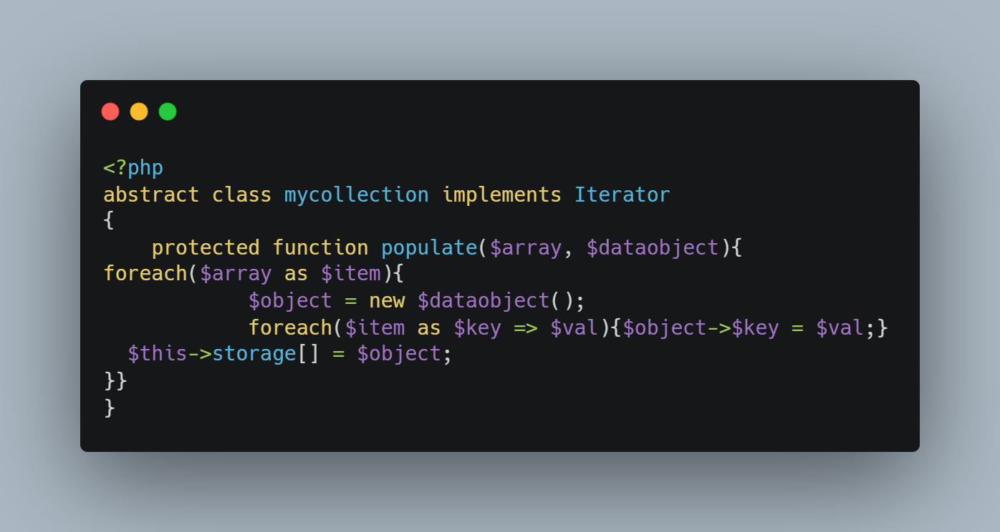
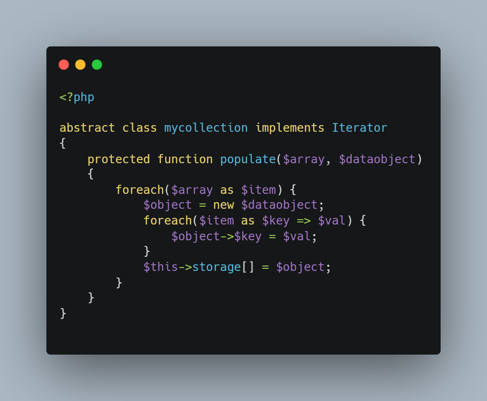

You're recovering some old PHP code; you want to answer a question asked on a forum and the person who posted the PHP question didn't take care to ensure that it was properly formatted; ... there are too many occasions when the syntactic quality of a code can be rotten.

You'd like to have an online tool that you can use to quickly retrieve code with a much more polished layout, just by copying and pasting. Without having to install anything and without any headaches.

For example, how do you make the code below look cleaner in five seconds?

<Snippets filename="my_collection.php">

```php
<?php
abstract class mycollection implements Iterator
{
    protected function populate($array, $dataobject){
foreach($array as $item){
            $object = new $dataobject();
            foreach($item as $key => $val){$object->$key = $val;}
  $this->storage[] = $object;
}}
}
```

</Snippets>

<!-- truncate -->

There are a huge number of *linters* on the internet, but this is perhaps one of the best:  [https://benjamincrozat.com/pint-express](https://benjamincrozat.com/pint-express). It's based on the [Laravel Pint](https://laravel.com/docs/11.x/pint) tool (but not limited to Laravel code for sure).

So, here was how the code looks&like before:



Jump to [Pint-express](https://benjamincrozat.com/pint-express), copy the code in the **Code** textarea of the script and let's the reformatting occurs:



Much better.

Note: there are other tools like for instance [https://codebeautify.org/php-beautifier](https://codebeautify.org/php-beautifier).

## If you're a PHP developer ...

... then make sure to use tools like [PHP-CS-Fixer](https://github.com/PHP-CS-Fixer/PHP-CS-Fixer) or [PHP_CodeSniffer](https://github.com/squizlabs/PHP_CodeSniffer) or many others. See also my [Docker image that provides static analysis tools for PHP](/blog/php-jakzal-phpqa).

Think to add these tools in your editor (there are many VSCode extensions), in your workflow (f.i. by using local `make` actions) or adding these steps in a remote pipeline
