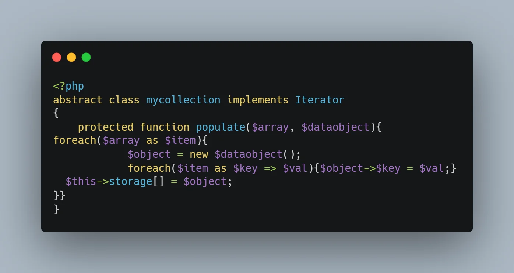
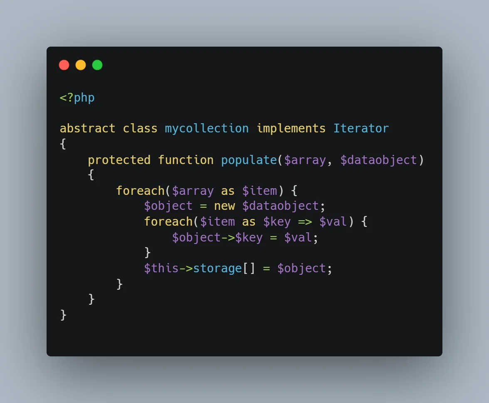

<TLDR>
This article points to Pint-express (benjamincrozat.com/pint-express), an online PHP formatter based on Laravel Pint, for instantly cleaning up poorly formatted PHP code by pasting it into a textarea — no install needed. For ongoing projects, it recommends wiring up PHP-CS-Fixer or PHP_CodeSniffer in the editor, build process, or CI pipeline instead.
</TLDR>

You're recovering some old PHP code; you want to answer a question asked on a forum and the person who posted the PHP question didn't take care to ensure that it was properly formatted; ... there are too many occasions when the syntactic quality of the code can be rotten.

You'd like to have an online tool that you can use to quickly retrieve code with a much more polished layout, just by copying and pasting. Without having to install anything and without any headaches.

For example, how do you make the code below look cleaner in five seconds?

<Snippet filename="my_collection.php" source="./files/my_collection.php" />

<!-- truncate -->

There are a huge number of *linters* on the internet, but this is perhaps one of the best:  [https://benjamincrozat.com/pint-express](https://benjamincrozat.com/pint-express). It's based on the [Laravel Pint](https://laravel.com/docs/11.x/pint) tool (but not limited to Laravel code for sure).

So, here's how the code looked before:

Jump to [Pint-express](https://benjamincrozat.com/pint-express), copy the code into the **Code** textarea of the script and let the reformatting happen:

Much better.

Note: there are other tools like for instance [https://codebeautify.org/php-beautifier](https://codebeautify.org/php-beautifier).

An online tool is perfect for a one-off paste. For your own projects, wire the formatter into your workflow instead: <Link to="/blog/php-jakzal-phpqa">jakzal/phpqa</Link> gives you `php-cs-fixer` and `phpcbf` without installing anything, and <Link to="/blog/git-precommit">Git - pre-commit-hooks</Link> runs them before each commit.

## If you're a PHP developer

... then make sure to use tools like [PHP-CS-Fixer](https://github.com/PHP-CS-Fixer/PHP-CS-Fixer) or [PHP_CodeSniffer](https://github.com/squizlabs/PHP_CodeSniffer) or many others. See also my <Link to="/blog/php-jakzal-phpqa">Docker image that provides static analysis tools for PHP</Link>.

Remember to add these tools to your editor (there are many VSCode extensions), to your workflow (f.i. by using local `make` actions), or add these steps to a remote pipeline.
