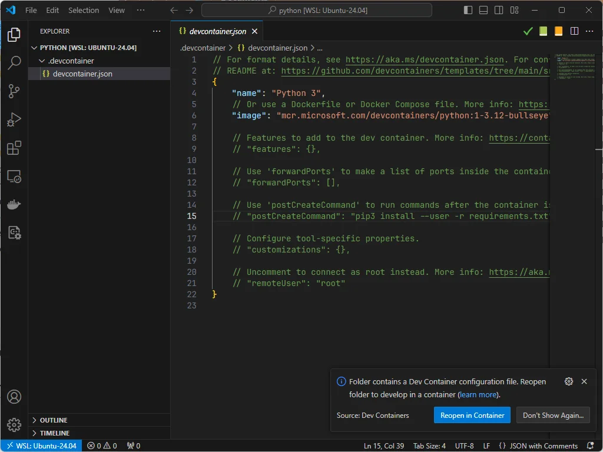
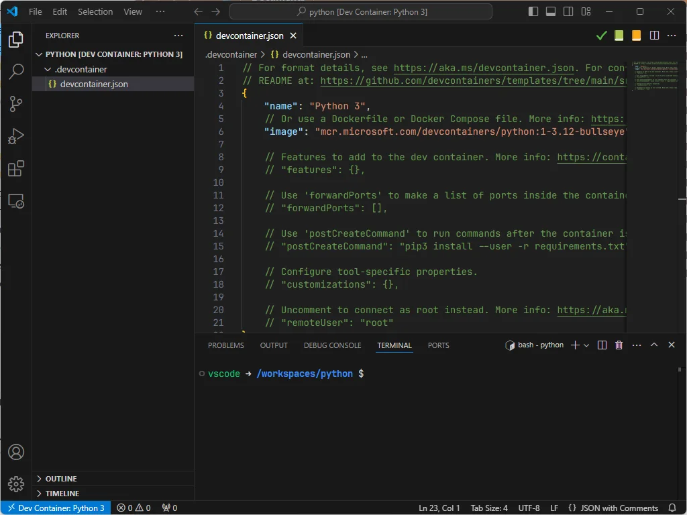
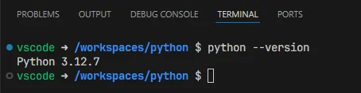
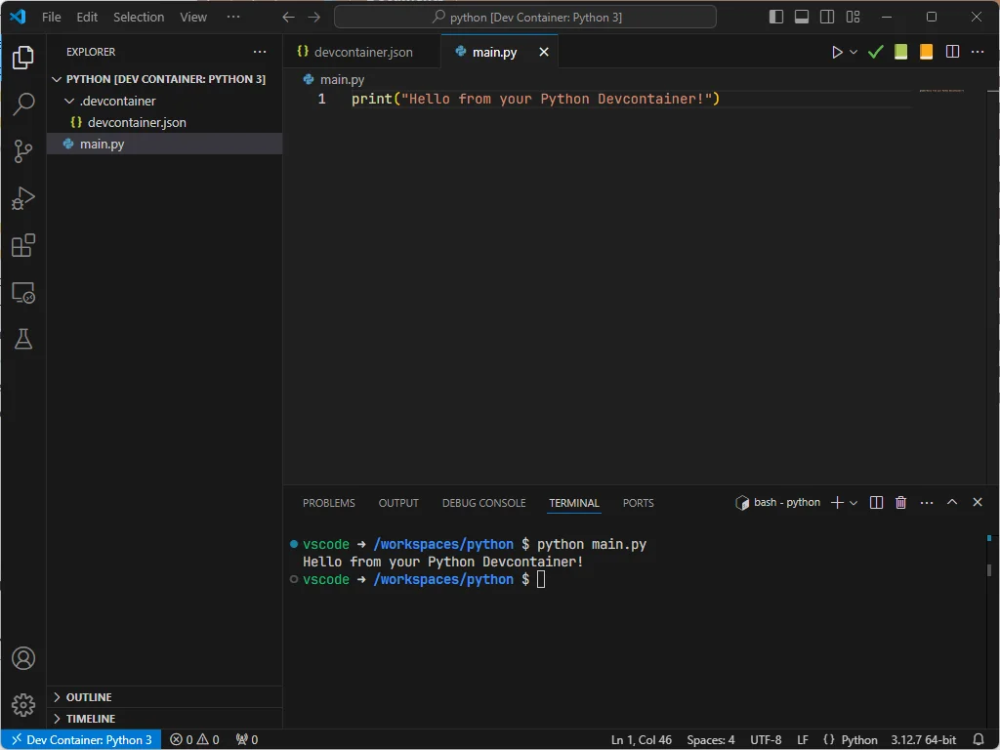

<!-- cspell:ignore substeps -->

Nothing to install, nothing to configure, nothing to create first.

Here is how to use VSCode and Docker to create a ready-to-user Python environment, whatever if you're under Windows, Linux or Mac.

<StepsCard
  title="The only prerequisites are:"
  variant="prerequisites"
  steps={[
    "You should have Docker installed on your system",
    "You should have Visual Studio Code",
    "You've installed the <a href=\"https://marketplace.visualstudio.com/items?itemName=ms-azuretools.vscode-docker\">Docker for Visual Studio Code</a> addon in VSCode",
  ]}
/>

<!-- truncate -->

<StepsCard
  title="If you've these three things, just do this:"
  variant="steps"
  steps={[
    'Start Visual Studio Code',
    'Press <kbd>CTRL</kbd>+<kbd>SHIFT</kbd>+<kbd>P</kbd> to open the Command Palette.',
    'Select **Dev Containers: Add Dev Container Configuration files...**',
    {
      content: "And follow the wizard:",
      substeps: [
        "Search for **Python**",
        "Select the most recent version of Python, right now it's `3.12-bullseye`",
        "No need to install additional features, just press <kbd>Enter</kbd>",
        "Same for optional files; not needed, just press <kbd>Enter</kbd>"
      ]
    }
  ]}
/>

This done, VSCode will create a file called `.devcontainer/devcontainer.json`

See bottom right, please click on the `Reopen in Container` button.

Depending on the speed of your computer and if things were already downloaded, you'll get this screen:

See the bottom part, a terminal window has been displayed and you've a prompt showing `vscode -> /workspaces/python $`.

Click in the terminal and type `python --version`:

Now, for the demo, create a new file called `main.py` with this line `print("Hello from your Python Devcontainer!")`.

Save the file.

Click in the terminal and type `python main.py` to execute the script and tadaaa:

