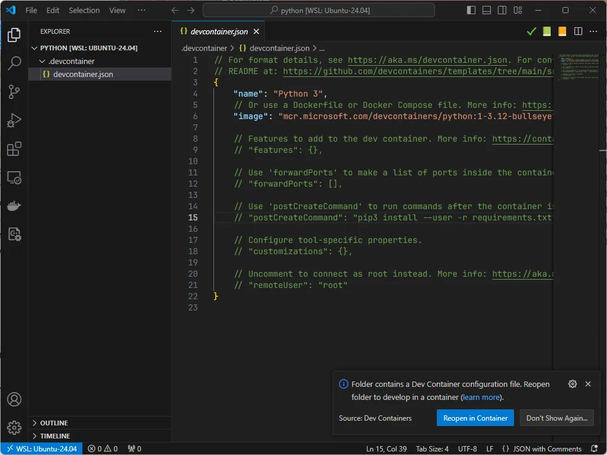
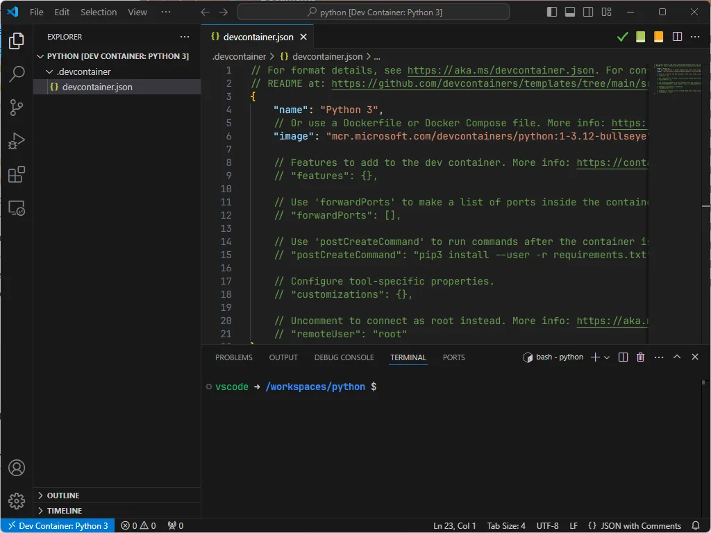
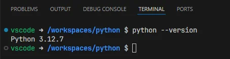
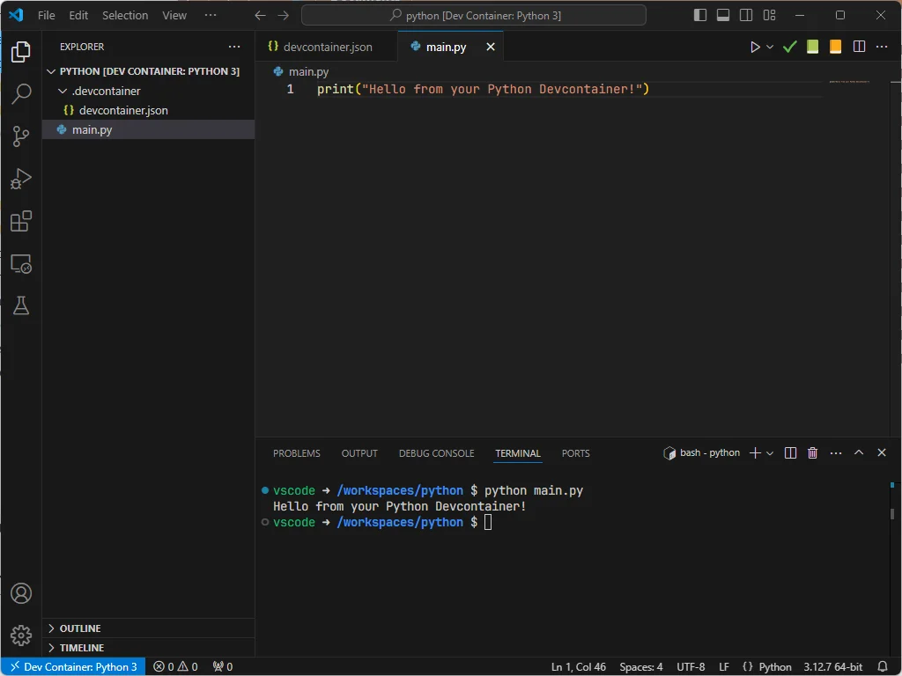

<!-- cspell:ignore substeps -->

<TLDR>
This article shows the fastest way yet to get a Python devcontainer: with Docker and the VSCode Docker extension installed, use the Command Palette's built-in "Dev Containers: Add Dev Container Configuration files..." wizard to auto-generate `.devcontainer/devcontainer.json` for Python, then click "Reopen in Container" — no manual file creation needed at all.
</TLDR>

Nothing to install, nothing to configure, nothing to create first.

In <Link to="/blog/docker-python-devcontainer">a previous article</Link> (and its <Link to="/blog/docker-python-devcontainer-windows">Windows-specific follow-up</Link>), I built the `Dockerfile`, `compose.yaml` and `devcontainer.json` files by hand. Turns out VSCode can generate all of that for you.

Here is how to use VSCode and Docker to create a ready-to-use Python environment, whether you're under Windows, Linux, or Mac.

*The wizard is the fastest route, but writing the files yourself is what lets you control exactly what goes into the image — and keep development tooling out of production, as explained in <Link to="/blog/docker-prod-devcontainer">One Docker Image for Production and Devcontainers - The Clean Way</Link>.*

<StepsCard
  title="The only prerequisites are:"
  variant="prerequisites"
  steps={[
    "You should have Docker installed on your system",
    "You should have Visual Studio Code",
    "You've installed the <a href=\"https://marketplace.visualstudio.com/items?itemName=ms-azuretools.vscode-docker\">Docker for Visual Studio Code</a> addon in VSCode",
  ]}
/>

<!-- truncate -->

<StepsCard
  title="If you have these three things, just do this:"
  variant="steps"
  steps={[
    'Start Visual Studio Code',
    'Press <kbd>CTRL</kbd>+<kbd>SHIFT</kbd>+<kbd>P</kbd> to open the Command Palette.',
    'Select **Dev Containers: Add Dev Container Configuration files...**',
    {
      content: "And follow the wizard:",
      substeps: [
        "Search for **Python**",
        "Select the most recent version of Python, right now it's `3.13-bookworm`",
        "No need to install additional features, just press <kbd>Enter</kbd>",
        "Same for optional files; not needed, just press <kbd>Enter</kbd>"
      ]
    }
  ]}
/>

This done, VSCode will create a file called `.devcontainer/devcontainer.json`.

See bottom right, please click on the `Reopen in Container` button.

Depending on the speed of your computer and if things were already downloaded, you'll get this screen:

See the bottom part, a terminal window has been displayed and you've a prompt showing `vscode -> /workspaces/python $`.

Click in the terminal and type `python --version`:

Now, for the demo, create a new file called `main.py` with this line `print("Hello from your Python Devcontainer!")`.

Save the file.

Click in the terminal and type `python main.py` to execute the script and tadaaa:

