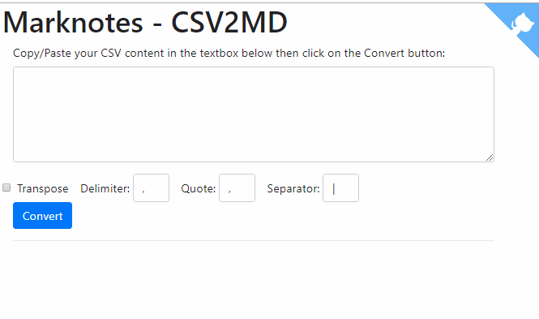

See also [Markdown - Convert Excel ranges to Markdown tables](/blog/markdown-xls2md).

Next to my XLS2MD script, you can also convert CSV file to Markdown very easily.

Just copy/paste your CSV content like the one below on the main text area appearing on [Markdown - Convert CSV to Markdown tables](https://csv2md.avonture.be/) and enjoy.

```csv
Column 1 Header,Column 2 Header
Row 1-1,Row 1-2
Row 2-1,Row 2-2
```
<!-- truncate -->

Here is a demo:



## Source code

You can find it on Github too: [https://github.com/cavo789/marknotes_csv2md](https://github.com/cavo789/marknotes_csv2md).

<Snippets filename="index.php">

```php
<?php

declare(strict_types = 1);

namespace Avonture;

/*
 * AUTHOR : AVONTURE Christophe
 *
 * Written date : 3 october 2018
 *
 * CSV to markdown converter.
 * Need to be rework for adding a form where we can specify the input string,
 * delimiters (like "," or ";"), click on a submit button and, thanks to an ajax
 * request, get the result in a dynamic div; without leaving the form.
 *
 * Last mod:
 * 2019-01-01 - Abandonment of jQuery and migration to vue.js
 */

define('REPO', 'https://github.com/cavo789/marknotes_csv2md');

require_once 'classes/Csv2Md.php';

// Retrieve posted data
$data = json_decode(file_get_contents('php://input'), true);

if ($data !== []) {
    $task = filter_var(($data['task'] ?? ''), FILTER_SANITIZE_STRING);

    if ('convert' == $task) {
        // Retrieve the CSV content
        $csv = base64_decode(filter_var(($data['csv'] ?? ''), FILTER_SANITIZE_STRING));

        // Delimiters between columns (, or ; or ...)
        $delim = base64_decode($data['delim'] ?? '');
        if ('' == trim($delim)) {
            $delim = ',';
        }

        // In case of the text are between quotes like, for instance,
        //   "field1","field2", ...   If so, mention '"' as value for $enclosure
        $enclosure = base64_decode($data['enclosure'] ?? '');

        // Separator to use in markdown to separate columns ('|' is the standard)
        $separator = base64_decode($data['separator'] ?? '');

        if ('' == trim($separator)) {
            $separator = '|';
        }

        // Transpose will works ONLY when there is two records in the
        // input string. Instead of having a long "horizontal" table, convert
        // the table vertically. The result table will have two columns and as
        // many rows that there was columns in the string
        $bTranspose = boolval(filter_var(($data['transpose'] ?? ''), FILTER_VALIDATE_BOOLEAN));

        // Create a new CSV parser
        $csvParser = new Csv2Md();

        $csvParser->setCsv($csv);
        $csvParser->setDelimiter($delim);
        $csvParser->setEnclosure($enclosure);
        $csvParser->setTableSeparator($separator);
        $csvParser->setTranspose($bTranspose);

        // Create a Markdown table from the parsed input
        header('Content-Type: text/plain');
        echo base64_encode($csvParser->getMarkup());
        die();
    }
}

// Get the GitHub corner
$github = '';
if (is_file($cat = __DIR__ . DIRECTORY_SEPARATOR . 'octocat.tmpl')) {
    $github = str_replace('%REPO%', REPO, file_get_contents($cat));
}
?>

<!DOCTYPE html>
<html lang="en">

<head>
    <meta charset="utf-8" />
    <meta name="author" content="Christophe Avonture" />
    <meta name="robots" content="noindex, nofollow" />
    <meta name="viewport" content="width=device-width, initial-scale=1.0" />
    <meta http-equiv="content-type" content="text/html; charset=UTF-8" />
    <meta http-equiv="X-UA-Compatible" content="IE=9; IE=8;" />
    <title>Marknotes - CSV2MD</title>
    <link rel="stylesheet" href="https://stackpath.bootstrapcdn.com/bootstrap/4.1.3/css/bootstrap.min.css">
</head>

<body>
    <?php echo $github; ?>
    <div class="container">
        <div class="page-header">
            <h1>Marknotes - CSV2MD</h1>
        </div>
        <div class="container" id="app">
            <div class="form-group">
                <how-to-use demo="https://raw.githubusercontent.com/cavo789/marknotes_csv2md/master/images/demo.gif">
                    <ul>
                        <li>Copy/Paste your CSV content in the textbox below</li>
                        <li>Update one or more options</li>
                        <li>If you've only two lines, you can select Transpose</li>
                        <li>Click on the Convert button</li>
                    </ul>
                </how-to-use>
                <label for="csv">Copy/Paste your CSV content in the textbox below then click on the Convert button:</label>
                <textarea class="form-control" rows="5" v-model="CSV" name="csv" @paste="doChangeTabByComma"></text area>
            </div>
            <div class="row">
                <form class="form-inline">
                    <div class="form-check mr-sm-3">
                        <input type="checkbox" class="form-check-input" v-model="transpose">&nbsp;
                        <label class="form-check-label" for="transpose">Transpose</label>
                    </div>
                    <div class=" form-group mr-sm-3">
                        <label for="delim">Delimiter:</label>&nbsp;
                        <input type="text" style="width:50px;" size="3" maxlength="3" v-model="delim" class="form-control">
                    </div>
                    <div class=" form-group mr-sm-3">
                        <label for="enclosure">Quote:</label>&nbsp;
                        <input type="text" style="width:50px;" size="3" maxlength="3" v-model="enclosure" class="form-control">
                    </div>
                    <div class=" form-group mr-sm-3">
                        <label for="separator">Separator:</label>&nbsp;
                        <input type="text" style="width:50px;" size="3" maxlength="3" v-model="separator" class="form-control">
                    </div>
                </form>
            </div>
            <button type="button" @click="doConvert" class="btn btn-primary">Convert</button>
            <hr />
            <div v-if="Markdown!==''">
                <h2 id="markdown">Markdown code <small style="font-size:0.4em"><a href="#html">See HTML rendering</a></small></h2>
                <pre v-html="Markdown"></pre>
                <hr />
            </div>
            <div v-if="HTML!==''">
                <h2 id="html">HTML rendering <small style="font-size:0.4em"><a href="#markdown">See Markdown code</a></small></h2>
                <pre v-html="HTML"></pre>
                <hr />
            </div>
        </div>
    </div>

    <script src="https://unpkg.com/vue@2"></script>
    <script src="https://unpkg.com/axios/dist/axios.min.js"></script>
    <script src="https://unpkg.com/marked@0.3.6"></script>
    <script type="text/javascript">
        Vue.component('how-to-use', {
            props: {
                demo: {
                    type: String,
                    required: true
                }
            },
            template: `<details>
                        <summary>How to use?</summary>
                        <div class="row">
                                <div class="col-sm">
                                    <slot></slot>
                                </div>
                                <div class="col-sm"></div>
                            </div>
                        </div>
                    </details>`
        });

        var app = new Vue({
            el: '#app',
            data: {
                CSV: "Column 1 Header,Column 2 Header\n" +
                    "Row 1-1,Row 1-2\n" +
                    "Row 2-1,Row 2-2",
                transpose: false,
                delim: ',',
                enclosure: '"',
                separator: '|',
                Markdown: ''
            },
            methods: {
                doConvert() {
                    var $data = {
                        task: 'convert',
                        csv: window.btoa(this.CSV),
                        transpose: this.transpose,
                        delim: window.btoa(this.delim),
                        enclosure: window.btoa(this.enclosure),
                        separator: window.btoa(this.separator)
                    }
                    axios.post('<?php echo basename(__FILE__); ?>', $data)
                        .then(response => (this.Markdown = window.atob(response.data)))
                        .catch(function(error) {
                            console.log(error);
                        });
                },
                doChangeTabByComma(event) {
                    // By copying/pasting from Excel or SSMS (SQL Server Management Studio),
                    // replace tabs by comma so the conversion is easier.
                    this.CSV = event.clipboardData.getData('Text');
                    this.CSV = this.CSV.replace(/	/g, ',')
                    event.clipboardData.setData('text/plain', this.CSV);
                    event.preventDefault();
                }
            },
            computed: {
                HTML() {
                    if (this.Markdown == '') {
                        return '';
                    }
                    // Call marked() to convert the MD string into a HTML table
                    var mdTable = marked(this.Markdown, {
                        sanitize: true
                    });
                    // Add Boostrap classes
                    mdTable = mdTable.replace('<table>', '<table class="table table-hover table-striped">');
                    return mdTable;
                }
            }
        });
    </script>
</body>

</html>
```

</Snippets>
