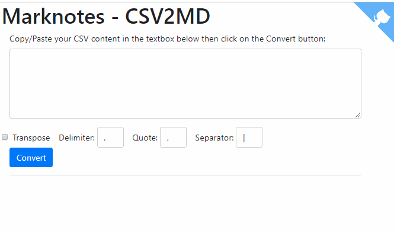

<TLDR>
This article introduces CSV2MD (csv2md.avonture.be, source on GitHub), a free online tool that converts pasted CSV content into a formatted Markdown table instantly.
</TLDR>

See also <Link to="/blog/markdown-xls2md">Markdown - Convert Excel ranges to Markdown tables</Link>. For a much broader conversion need — full Word, PDF or PowerPoint documents rather than a simple table — see <Link to="/blog/markitdown">Markitdown - Convert files and MS Office documents to Markdown</Link>.

Next to my XLS2MD script, you can also convert a CSV file to Markdown very easily.

Just copy/paste your CSV content like the one below on the main text area appearing on [Markdown - Convert CSV to Markdown tables](https://csv2md.avonture.be/) and enjoy.

```csv
Column 1 Header,Column 2 Header
Row 1-1,Row 1-2
Row 2-1,Row 2-2
```
<!-- truncate -->

Here is a demo:



## Source code

You can find it on Github too: [https://github.com/cavo789/marknotes_csv2md](https://github.com/cavo789/marknotes_csv2md).

<Snippet filename="index.php" source="./files/index.php" />
