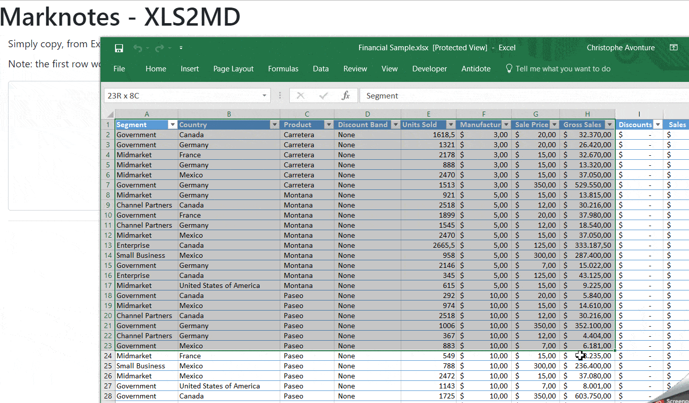

See also <Link to="/blog/markdown-csv2md">Markdown - Convert CSV to Markdown tables</Link>.

I'm a big fan of Markdown for my documentation, and from time to time I have to convert a range in Excel into a table to copy and paste into my documentation.

Years ago, I've found this repo [https://github.com/jonmagic/copy-excel-paste-markdown](https://github.com/jonmagic/copy-excel-paste-markdown) and it's was the trigger for creating an online application in VueJS to make the magic happens.

In practical terms, I open my Excel file, select a range (a series of columns and rows) f.i. `$A$1:$J:$50`, press <kbd>CTRL</kbd>+<kbd>C</kbd> on the keyboard, switch to my [Markdown - Convert Excel ranges to Markdown tables](https://xls2md.avonture.be/) website, press <kbd>CTRL</kbd>+<kbd>V</kbd> and the table is converted.

<!-- truncate -->

It's ... magical

Here is a demo:



## Source code

You can find it on Github too: [https://github.com/cavo789/marknotes_xls2md/tree/master](https://github.com/cavo789/marknotes_xls2md/tree/master).

<Snippet filename="index.php">

```php
<?php

declare(strict_types = 1);

/*
 * AUTHOR : AVONTURE Christophe
 *
 * Written date : 3 october 2018
 *
 * Excel raw table to markdown converter
 * Simply copy, from Excel, a table and paste here to convert
 * table to markdown
 *
 * The javascript has been written by `Jonathan Hoyt` and available on GitHub:
 * https://github.com/jonmagic/copy-excel-paste-markdown.
 *
 * JS script updated to:
 * - Call marked.js (https://www.npmjs.com/package/marked) to render the table from markdown
 *         to html
 * - Add bootstrap class to the rendered table
 *
 * Last mod:
 * 2019-01-01 - Abandonment of jQuery and migration to vue.js
 */

define('REPO', 'https://github.com/cavo789/marknotes_xls2md');

// Get the GitHub corner
$github = '';
if (is_file($cat = __DIR__ . DIRECTORY_SEPARATOR . 'octocat.tmpl')) {
    $github = str_replace('%REPO%', REPO, file_get_contents($cat));
}
?>

<!DOCTYPE html>
<html lang="en">
    <head>
        <meta charset="utf-8"/>
        <meta name="author" content="Christophe Avonture" />
        <meta name="robots" content="noindex, nofollow" />
        <meta name="viewport" content="width=device-width, initial-scale=1.0" />
        <meta http-equiv="content-type" content="text/html; charset=UTF-8" />
        <meta http-equiv="X-UA-Compatible" content="IE=9; IE=8;" />
        <title>Marknotes - XLS2MD - Convert Excel raw table to Markdown table</title>
        <link rel="stylesheet" href="https://stackpath.bootstrapcdn.com/bootstrap/4.1.3/css/bootstrap.min.css">
        <style>
            textarea {
                margin-top:10px;
                font-family:Consolas,Monaco,Lucida Console,Liberation Mono,DejaVu Sans Mono,Bitstream Vera Sans Mono,Courier New, monospace;
            }
            details {
                margin: 1rem;
            }
            summary {
                font-weight: bold;
            }
            .form-control {
                padding: none;
                font-size: 0.8em;
            }
        </style>
    </head>
    <body>
        <?php echo $github; ?>
        <div class="container">
            <div class="page-header"><h1>Marknotes - XLS2MD</h1></div>
            <div class="container" id="app">
                <div class="form-group">
                    <how-to-use demo="https://raw.githubusercontent.com/cavo789/marknotes_xls2md/master/image/demo.gif">
                        <ol>
                            <li>In your Excel worksheet, select a range like f.i.
                                $A$1:$H:$25 (first row need to contains column's headings).</li>
                            <li>Press <kbd>CTRL</kbd><kbd>C</kbd></li>
                            <li>In this form, click in the text area here below</li>
                            <li>Press <kbd>CTRL</kbd><kbd>V</kbd></li>
                        </ol>
                        <p>The copied data will be immediately converted to a markdown table
                            and a HTML preview will be rendered.</p>
                        <p>Adjust the markdown syntax if needed and copy/paste into your
                            notes.</p>
                    </how-to-use>
                    <label for="editor">Simply copy, from Excel, a table and paste here to convert
                        table to markdown.</label>
                    <textarea class="form-control" rows="5" v-model="editor" name="editor" @change="onChange" @paste="onPaste"></textarea>
                </div>
                <hr/>
                <div v-if="Markdown!==''">
                    <h2 id="markdown">Markdown code <small style="font-size:0.4em"><a href="#html">See HTML rendering</a></small></h2>
                    <pre v-html="Markdown"></pre>
                    <hr/>
                </div>
                <div v-if="HTML!==''">
                    <h2 id="html">HTML rendering <small style="font-size:0.4em"><a href="#markdown">See Markdown code</a></small></h2>
                    <pre v-html="HTML"></pre>
                    <hr/>
                </div>
            </div>
        </div>
        <script src="https://unpkg.com/vue@2"></script>
        <script src="https://unpkg.com/marked@0.3.6"></script>
        <script type="text/javascript">

            function columnWidth(rows, columnIndex) {
                return Math.max.apply(
                null,
                rows.map(function(row) {
                    return row[columnIndex].length;
                })
                );
            }

            function getMarkdown(data) {
                var rows = data.split(/[\n\u0085\u2028\u2029]|\r\n?/g).map(function(row) {
                    return row.split("\t");
                });

                var columnWidths = rows[0].map(function(column, columnIndex) {
                    return columnWidth(rows, columnIndex);
                });

                var markdownRows = rows.map(function(row, rowIndex) {
                    // | Name         | Title | Email Address  |
                    // |--------------|-------|----------------|
                    // | Jane Atler   | CEO   | jane@acme.com  |
                    // | John Doherty | CTO   | john@acme.com  |
                    // | Sally Smith  | CFO   | sally@acme.com |
                    return (
                        "| " +
                        row
                        .map(function(column, index) {
                            return (
                            column + Array(columnWidths[index] - column.length).join(" ")
                            );
                        })
                        .join(" | ") +
                        " |"
                    );
                    row.map;
                });

                markdownRows.splice(
                    1,
                    0,
                    "| " +
                        columnWidths
                        .map(function(width, index) {
                            return Array(columnWidths[index]).join("-");
                        })
                        .join(" | ") +
                        " |"
                );

                // Get the markdown representation of the pasted info
                return markdownRows.join("\n");
            }

            Vue.component('how-to-use', {
                props: {
                    demo: {
                        type: String,
                        required: true
                    }
                },
                template:
                    `<details>
                        <summary>How to use?</summary>
                        <div class="row">
                                <div class="col-sm">
                                    <slot></slot>
                                </div>
                                <div class="col-sm"></div>
                            </div>
                        </div>
                    </details>`
            });

            var app = new Vue({
                el: '#app',
                data: {
                    editor: '',
                    Markdown: ''
                },
                methods: {
                    onChange(event) {
                        this.Markdown = getMarkdown(this.editor);
                    },
                    onPaste(event) {
                        event.preventDefault();
                        var clipboard = event.clipboardData;
                        this.editor = clipboard.getData("text/plain").trim();
                        this.Markdown = getMarkdown(this.editor);
                    }
                },
                computed: {
                    HTML() {
                        if (this.Markdown == '') {
                            return '';
                        }
                        // Call marked() to convert the MD string into a HTML table
                        var mdTable = marked(this.Markdown, { sanitize: true });
                        // Add Boostrap classes
                        mdTable = mdTable.replace('<table>', '<table class="table table-hover table-striped">');
                        return mdTable;
                    }
                }
            });
        </script>
    </body>
</html>
```

</Snippet>
