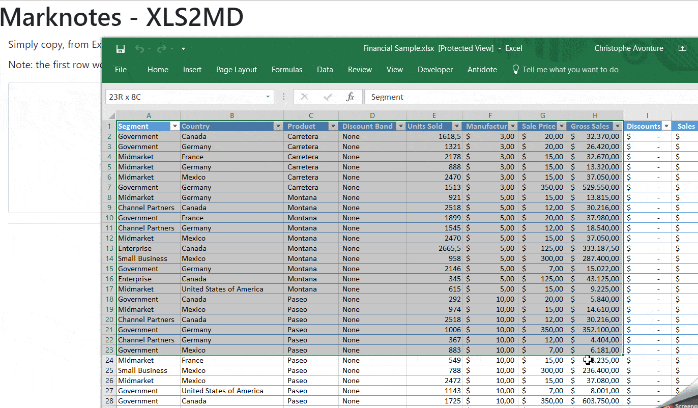

<TLDR>
This article introduces XLS2MD (xls2md.avonture.be, source on GitHub), a free online tool that converts a copied Excel range directly into a Markdown table: select cells in Excel, copy, paste into the site, and get instant Markdown output.
</TLDR>

See also <Link to="/blog/markdown-csv2md">Markdown - Convert CSV to Markdown tables</Link>. For a much broader conversion need — full Word, PDF or PowerPoint documents rather than just a range — see <Link to="/blog/markitdown">Markitdown - Convert files and MS Office documents to Markdown</Link>.

I'm a big fan of Markdown for my documentation, and from time to time I have to convert a range in Excel into a table to copy and paste into my documentation. *Documentation which, most of the time, is then rendered with <Link to="/blog/docker-quarto">Quarto</Link>.*

Years ago, I found this repo [https://github.com/jonmagic/copy-excel-paste-markdown](https://github.com/jonmagic/copy-excel-paste-markdown) and it was the trigger for creating an online application in VueJS to make the magic happen.

In practical terms, I open my Excel file, select a range (a series of columns and rows) f.i. `$A$1:$J$50`, press <kbd>CTRL</kbd>+<kbd>C</kbd> on the keyboard, switch to my [Markdown - Convert Excel ranges to Markdown tables](https://xls2md.avonture.be/) website, press <kbd>CTRL</kbd>+<kbd>V</kbd> and the table is converted.

<!-- truncate -->

It's ... magical

Here is a demo:

## Source code

You can find it on Github too: [https://github.com/cavo789/marknotes_xls2md/tree/master](https://github.com/cavo789/marknotes_xls2md/tree/master).

<Snippet filename="index.php" source="./files/index.php" />
