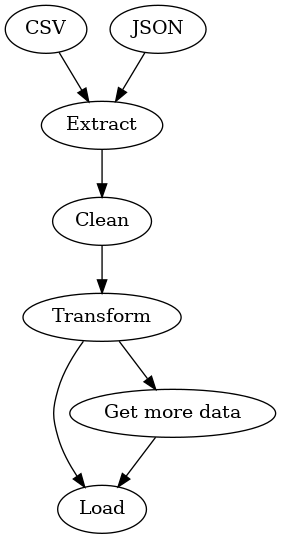
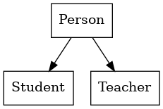
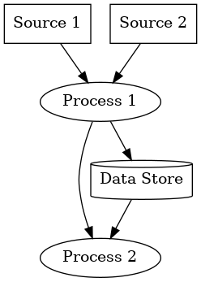
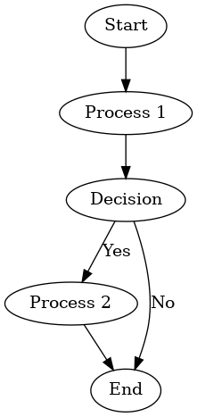
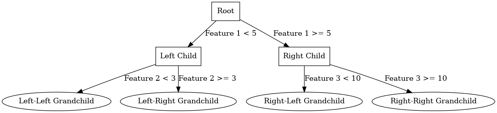

<!-- cspell:ignore Pydot,PYTHONDONTWRITEBYTECODE,hadolint,rankdir,fillcolor -->


[Pydot](https://github.com/pydot/pydot) is a **diagram as code** generator i.e. you write lines of code and thanks to a magic process, you can render the code as an image.

For guys just like me who are terrible at visuals, this is gold.

Let's say you have to describe an IT process such as ETL (data is loaded, one or other transformation rule is applied and the result is loaded into a database, for example), you can easily imagine to draw some rectangles using a tool like [https://app.diagrams.net/](https://app.diagrams.net/) (formerly known as draw.io) or use a smarter way to do it.

Let's see how in this article.

<!-- truncate -->

Pydot can generate an image like the one below:



First, we'll need a Python Docker container. Please create a file called `Dockerfile` with this content:

<details>

<summary>Dockerfile</summary>

```dockerfile
FROM python:3.13-slim

# Prevents Python from writing pyc files.
ENV PYTHONDONTWRITEBYTECODE=1

# hadolint ignore=DL3008
RUN set -e -x \
    && apt-get update -yqq \
    && apt-get install -y --no-install-recommends graphviz \
    && apt-get clean \
    && rm -rf /tmp/* /var/lib/apt/lists/*
    
# hadolint ignore=DL3013
RUN pip install --no-cache-dir pydot

```

</details>

And create the image by running `docker build --tag pydot .`.

We don't need more except ... our flow.

To build an ETL image like the one above, please create a new file called f.i. `etl.py` with this content:

<details>

<summary>etl.py</summary>

```python
import pydot

graph = pydot.Dot(graph_type='digraph', rankdir='TB')

node_csv = pydot.Node('CSV', shape='box', style='filled', fillcolor='lightblue')
node_json = pydot.Node('JSON', shape='box', style='filled', fillcolor='lightblue')

node_extract = pydot.Node('Extract', shape='box')

node_clean = pydot.Node('Clean', shape='box')
node_transform = pydot.Node('Transform', shape='box')

node_load = pydot.Node('Load', shape='box', style='filled', fillcolor='lightgreen')

graph.add_edge(pydot.Edge(node_csv, node_extract))
graph.add_edge(pydot.Edge(node_json, node_extract))
graph.add_edge(pydot.Edge(node_extract, node_clean))
graph.add_edge(pydot.Edge(node_clean, node_transform))
graph.add_edge(pydot.Edge(node_transform, node_load))

node_enrich = pydot.Node('Get more data', shape='box')
graph.add_edge(pydot.Edge(node_transform, node_enrich))
graph.add_edge(pydot.Edge(node_enrich, node_load))

graph.write_png('etl.png')
```

</details>

And, now, the easy part, render the Python `etl.py` file as an image by running `docker run --rm -it -v "${PWD}":/diagram -w /diagram pydot python etl.py`.

And bingo, you've now an image called `etl.png` in your directory.

## Some other examples

Search on the Internet for some examples and you'll find f.i. this site: [https://graphviz.readthedocs.io/en/stable/examples.html](https://graphviz.readthedocs.io/en/stable/examples.html).

You'll find there Python examples and, too, the rendered image.

### OOP classes

<details>

<summary>class_diagram.py</summary>

```python
import pydot

graph = pydot.Dot(graph_type='digraph')

# Add nodes
node_person = pydot.Node('Person', shape='box')
node_student = pydot.Node('Student', shape='box')
node_teacher = pydot.Node('Teacher', shape='box')

# Add nodes to the graph
graph.add_node(node_person)
graph.add_node(node_student)
graph.add_node(node_teacher)

# Add edges (inheritance)
graph.add_edge(pydot.Edge(node_person, node_student))
graph.add_edge(pydot.Edge(node_person, node_teacher))

# Render the graph
graph.write_png('class_diagram.png')
```

</details>



### Data flow

<details>

<summary>data_flow.py</summary>

```python
import pydot

graph = pydot.Dot(graph_type='digraph')

# Data sources
source1 = pydot.Node('Source 1', shape='box')
source2 = pydot.Node('Source 2', shape='box')
graph.add_node(source1)
graph.add_node(source2)

# Process nodes
process1 = pydot.Node('Process 1', shape='oval')
process2 = pydot.Node('Process 2', shape='oval')
graph.add_node(process1)
graph.add_node(process2)

# Data store
data_store = pydot.Node('Data Store', shape='cylinder')
graph.add_node(data_store)

# Edges representing data flow
graph.add_edge(pydot.Edge(source1, process1))
graph.add_edge(pydot.Edge(source2, process1))
graph.add_edge(pydot.Edge(process1, process2))
graph.add_edge(pydot.Edge(process1, data_store))
graph.add_edge(pydot.Edge(data_store, process2))

# Render the graph
graph.write_png('data_flow_diagram.png')

```

</details>



### Decision flow

<details>

<summary>decision_flow.py</summary>

```python
import pydot

graph = pydot.Dot(graph_type='digraph')

# Add nodes
node_start = pydot.Node('Start', shape='oval')
node_process1 = pydot.Node('Process 1', shape='box')
node_decision = pydot.Node('Decision', shape='diamond')
node_process2 = pydot.Node('Process 2', shape='box')
node_end = pydot.Node('End', shape='oval')

# Add edges
graph.add_edge(pydot.Edge(node_start, node_process1))
graph.add_edge(pydot.Edge(node_process1, node_decision))
graph.add_edge(pydot.Edge(node_decision, node_process2, label='Yes'))
graph.add_edge(pydot.Edge(node_decision, node_end, label='No'))
graph.add_edge(pydot.Edge(node_process2, node_end))

# Write the graph to a file
graph.write_png('flowchart.png')
```

</details>



### Decision tree

<details>

<summary>decision_tree.py</summary>

```python
import pydot

graph = pydot.Dot(graph_type='digraph')

# Add nodes
node_root = pydot.Node('Root', shape='box')
node_left = pydot.Node('Left Child', shape='box')
node_right = pydot.Node('Right Child', shape='box')
node_left_left = pydot.Node('Left-Left Grandchild', shape='ellipse')
node_left_right = pydot.Node('Left-Right Grandchild', shape='ellipse')
node_right_left = pydot.Node('Right-Left Grandchild', shape='ellipse')
node_right_right = pydot.Node('Right-Right Grandchild', shape='ellipse')

# Add nodes to the graph
graph.add_node(node_root)
graph.add_node(node_left)
graph.add_node(node_right)
graph.add_node(node_left_left)
graph.add_node(node_left_right)
graph.add_node(node_right_left)
graph.add_node(node_right_right)

# Add edges
graph.add_edge(pydot.Edge(node_root, node_left, label='Feature 1 < 5'))
graph.add_edge(pydot.Edge(node_root, node_right, label='Feature 1 >= 5'))
graph.add_edge(pydot.Edge(node_left, node_left_left, label='Feature 2 < 3'))
graph.add_edge(pydot.Edge(node_left, node_left_right, label='Feature 2 >= 3'))
graph.add_edge(pydot.Edge(node_right, node_right_left, label='Feature 3 < 10'))
graph.add_edge(pydot.Edge(node_right, node_right_right, label='Feature 3 >= 10'))

# Render the graph
graph.write_png('decision_tree.png')

```

</details>


