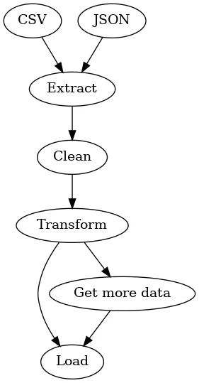
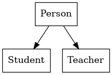
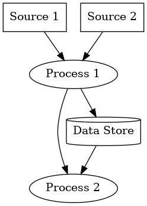
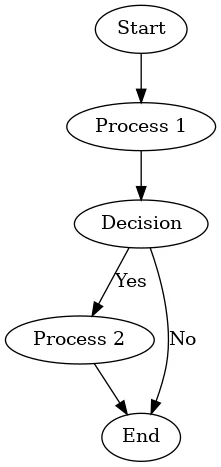
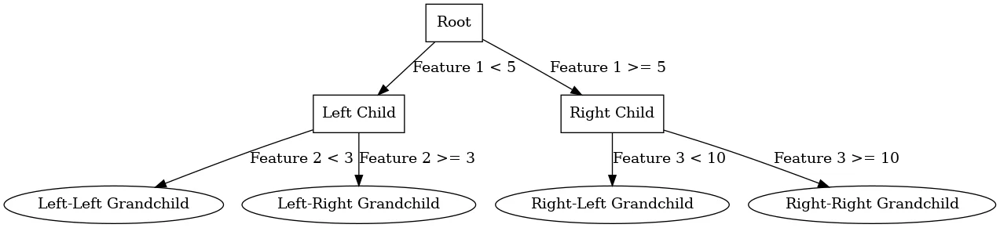

<!-- cspell:ignore Pydot,PYTHONDONTWRITEBYTECODE,hadolint,rankdir,fillcolor -->

<TLDR>
This article introduces Pydot, a Python diagram-as-code library that renders diagrams (ETL flows, class diagrams, data flows, decision trees) from Python code into images. Using a small Docker image, a `.py` script describing the diagram is run with `docker run ... python etl.py` to produce a PNG, with further examples sourced from the Graphviz documentation.
</TLDR>

[Pydot](https://github.com/pydot/pydot) is a **diagram-as-code** generator, i.e. you write lines of code and, thanks to a magic process, you can render the code as an image.

*This blog has two other articles in the same family: <Link to="/blog/docker-diagram-as-code">Docker - Diagrams as code</Link>, using the `diagrams` library and its cloud-provider icons, and <Link to="/blog/docker-python-mermaid">Documentation as Code - Transform Your Infrastructure into Beautiful Diagrams with Python and Mermaid</Link>, where the diagram is generated **from** your `compose.yaml` instead of hand-written.*

For guys just like me who are terrible at visuals, this is gold.

Let's say you have to describe an IT process such as ETL (data is loaded, one or other transformation rule is applied and the result is loaded into a database, for example); you can easily imagine drawing some rectangles using a tool like [https://app.diagrams.net/](https://app.diagrams.net/) (formerly known as draw.io), or use a smarter way to do it.

Let's see how in this article.

<!-- truncate -->

Pydot can generate an image like the one below:

First, we'll need a Python Docker container. Please create a file called `Dockerfile` with this content:

<Snippet filename="Dockerfile" source="./files/Dockerfile" />

And create the image by running `docker build --tag pydot .`.

We don't need more except ... our flow.

To build an ETL image like the one above, please create a new file called f.i. `etl.py` with this content:

<Snippet filename="etl.py" source="./files/etl.py" />

And, now, the easy part, render the Python `etl.py` file as an image by running `docker run --rm -it -v "${PWD}":/diagram -w /diagram pydot python etl.py`.

And bingo, you've now an image called `etl.png` in your directory.

## Some other examples

Search on the Internet for some examples and you'll find f.i. this site: [https://graphviz.readthedocs.io/en/stable/examples.html](https://graphviz.readthedocs.io/en/stable/examples.html).

You'll find there Python examples and, too, the rendered image.

### OOP classes

<Snippet filename="class_diagram.py" source="./files/class_diagram.py" />

### Data flow

<Snippet filename="data_flow.py" source="./files/data_flow.py" />

### Decision flow

<Snippet filename="decision_flow.py" source="./files/decision_flow.py" />

### Decision tree

<Snippet filename="decision_tree.py" source="./files/decision_tree.py" />

