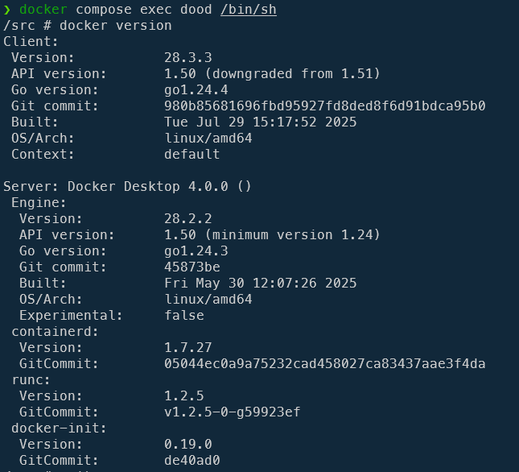

<!-- cspell:ignore phplint,dind,dood,groupid,johndoe,addgroup,adduser,getent,metin,meyay -->

<UpdateAt
  title="Recent Changes"
  updates={[
    { date: "2025-08-03", content: "Corrections based on Metin Y" },
  ]}
/>

In very exceptional situations, you may need to be able to run Docker commands from a Docker container. Wait? What?

Imagine this situation: you're running a PHP container, everything is fine and you wish to run a code quality tool like, let's start easy, `phplint` (<Link to="/blog/php-jakzal-phpqa/#php-parallel-lint">see this article for deeper info</Link>). You don't want to install phplint because you know a very cool Docker image who already contains it (think to **[jakzal/phpqa](https://hub.docker.com/r/jakzal/phpqa)**)

So, you're inside a container and you wish to run another container.

Another example: you're still inside a container and you wish to access to the list of running containers, already installed Docker images, volumes, ... (think to [portainer](https://www.portainer.io/))

Let's see in this article how to create your own Docker image, running as root or not, and configure it to allow docker requests.

We'll use the **Docker-out-of-Docker also called `DooD`** technique: mounting the host's Docker socket (`/var/run/docker.sock`) and running the Docker CLI inside the container.

<!-- truncate -->

## Creating a demo container

Like always, we'll build a fully working example.

Please create a dummy folder and jump in it: `mkdir /tmp/dood && cd $_`.

We need a `Dockerfile`, let's create it.

<Snippet filename="Dockerfile" source="./files/Dockerfile" />

We'll also use a `compose.yaml` one, please create this file too:

<Snippet filename="compose.yaml" source="./files/compose.yaml" />

## Running it as root

We'll create our Docker image and create a container with this single command: `docker compose up --detach --build`.

And, now, we'll jump in the container by running: `docker compose exec dood /bin/sh`.

By running `docker version` in the container, you can verify that Docker is well present.

Now to check if you can access to the list of images installed on your host (which is in theory impossible), please run `docker image list` and ... it works.

### Docker-out-of-Docker (DooD) is enabled; cool but why?

To check, reopen your `compose.yaml` file and put the `volumes` entry in comment as illustrated below:

<Snippet filename="compose.yaml" source="./files/compose.part2.yaml" />

If you're still in the container, please type `exit` to go back to your host console.

From there, rebuild the image and the container by running again `docker compose up --detach --build && docker compose exec dood /bin/sh`.

Once in the container's console, type `docker version` again and boum.

<Terminal>
$ docker version
Client:
 Version:           28.3.3
 API version:       1.51
 Go version:        go1.24.4
 Git commit:        980b85681696fbd95927fd8ded8f6d91bdca95b0
 Built:             Tue Jul 29 15:17:52 2025
 OS/Arch:           linux/amd64
 Context:           default
Cannot connect to the Docker daemon at unix:///var/run/docker.sock. Is the docker daemon running?
</Terminal>

It didn't work anymore.

<AlertBox variant="highlyImportant" title="DooD should be able to access to the Docker daemon">
As you can see, you should share your Docker socket (i.e. the file called `/var/run/docker.sock` on your host) with the container.
</AlertBox>

Type `exit` again, quit the container, update the `compose.yaml` file again like before (remove the commented lines) and run `docker compose up --detach --build && docker compose exec dood /bin/sh` again.

Back to the console's container, you can thus run commands like `docker ps` to get the list of running containers on the host and f.i. stop some (f.i. `docker container stop 68e41eee2efd`; only possible if Dood is correctly configured).

## Running the container as unprivileged user

It was working without too many difficulties because we were root. We've started the container as root. Just type `whoami` in the container to validate this. You can also type `id -u` to see that your user ID is `0` (root).

And you know, it's a bad idea to run containers as root so let's create a specific user.

To do this, we need to update our files.

<Snippet filename="Dockerfile" source="./files/Dockerfile.part2" />

<Snippet filename="compose.yaml" source="./files/compose.part3.yaml" />

Now, build this new image and jump in the container using, always the same, this command: `docker compose up --detach --build && docker compose exec dood /bin/sh`.

By typing `whoami` we can see that we're no more root but `johndoe` with user ID 1000 (`id -u`) and group ID 1000 (`id -g`).

Since we're still sharing our `/var/run/docker.sock` in our yaml file, we're expecting that Docker-out-of-Docker still works; right?

Let's try: `docker ps` to obtain the list of containers.

<Terminal>
$ docker ps
permission denied while trying to connect to the Docker daemon socket at unix:///var/run/docker.sock: Get "http://%2Fvar%2Frun%2Fdocker.sock/v1.51/containers/json": dial unix /var/run/docker.sock: connect: permission denied
</Terminal>

Everything seems OK but ... why?

To be able to run Dood with an unprivileged user, you should take care about this: your user should be members of the host `docker` group. And `compose.yaml` comes with an easy way to do this.

Please update your `compose.yaml` by adding the two lines below.

<Snippet filename="compose.yaml" source="./files/compose.part4.yaml" />

Jump in the container once more: `docker compose up --detach --build && docker compose exec dood /bin/sh`

And try `docker ps` again; it works. You can now have access to all Docker commands again like `docker image list`.

<AlertBox variant="caution" title="Still didn't work?">
It should work. If not, please make sure you've the latest Docker version (the one I've used for this tutorial is Docker Desktop v4.42.1).

Inside your container, please run `ls -alh /var/run/docker.sock` to look at the permissions of the Docker socket inside the container. You'll see the file is owned by the `root` user **BUT SHOULDN'T BE** owned by `root`. If you see `root` for both the user and the group, you've find why it didn't work. Your unprivileged used isn't member of the `root` group but he's well member of the `docker` group (the one having group id `1001`).

By running `ls -alh /var/run/docker.sock`, you should see `1001` (or `docker`) for the group.

</AlertBox>

### What is this group 1001?

As said, to be able to run DooD as a unprivileged user, you should be a member of the `docker` group on the host (not the `docker` group you can retrieve in the container).

One way to retrieve that ID is to run `getent group docker | cut -d: -f3`.  You'll most probably see `1001` since it's the standard ID for that group.

<AlertBox variant="note" title="">
As you've seen, I've not hardcoded the ID in the proposed yaml file but I've defined an operating system variable called `DOCKER_GROUPID` and, if that variable didn't exist, I'm using value `1001`.

</AlertBox>

So, to make the script robust, we just need to initialise the `DOCKER_GROUPID`variable before building the image:

<Terminal>
$ DOCKER_GROUPID="$(getent group docker | cut -d: -f3)" docker compose up --detach --build && docker compose exec Dood /bin/sh
</Terminal>

## Conclusion

Running Docker-out-of-Docker is a container running as root is quite easy, you just need to install `docker` while building the image and mounting your docker socket.

It's not so easy if you're using an unprivileged user but, well easy, as soon as you've found the right way: using the `group_add` property and retrieve the ID of the local `docker` group.

<AlertBox variant="note" title="">
Don't try `group_add` with `docker` (the group name) instead the ID; it won't work.

</AlertBox>

## Special thanks 🙏

Thanks to Metin Y. ([meyay](https://forums.docker.com/u/meyay/summary)) who has notified me about an error in the terminology I've used. In my first version, I referred to the technique I describe here as *Docker-in-Docker (dind)*; this was incorrect.

By mounting the host's Docker socket (`/var/run/docker.sock`), it's the **Docker-out-of-Docker** technique.
