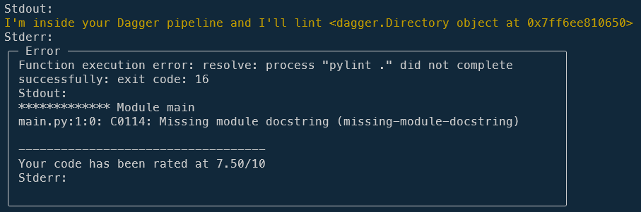

<!-- cspell:ignore pylint,pyproject,stopit,randint,workdir,pylintrc,docparams,mccabe,mypy -->
<!-- cspell:ignore hadolint,xvfz,aaaaaargh,dind,dood,usermod -->
<!-- markdownlint-disable-file MD010 -->

**Be careful, it's a bomb.**  Docker has revolutionized the world; let's not be afraid to say it loud and clear, and most probably [Dagger.io](https://dagger.io/), created by the same people as Docker, will follow in its footsteps.

Dagger.io aims to be a tool that lets you execute steps of a workflow in exactly the same way as a **CI/CD** (**Continuous Integration / Continuous Development**) system like the ones of GitHub, GitLab, Jenkins, ... does.

But what is a CI? It's a step carried out by your server once you've pushed a new version of your project.  During a CI, you can validate the syntax of your code, make sure it conforms (e.g. to formatting rules), run code quality analysis tools such as checking that you don't have any undeclared or untyped variables or dead code (e.g. a function you no longer use).

During a CI, you can also launch your unit tests and run them each time you push out a new version of your project.

The aim of the CI is to ... **crash as soon as something isn't in the expected state**; e.g. you've forgotten a `;`, you've got a violation (spaces used instead of tabs), a unit test no longer works, etc. So the aim of CI is to guarantee that your code is excellent.

<!-- truncate -->

In concrete terms: at the office, we're using GitLab and then, in each project, we've a file called `.gitlab-ci.yml` in any projects. In that file, we've foresee a few actions like running code quality tools so every time someone pushes a project, GitLab will execute these tools f.i. check that my code didn't contain no syntax errors (linting), that there is no formatting violations, no unused/untyped variables/functions/... and to execute the unit tests for my project.

This is called a `Continuous Integration` process (a `CI` in short).

That's cool but it's a pain too... Let's see why and how Dagger.io will improve all this stuff.

## Why using Dagger?

Anyone who has to set up a CI that runs on a remote server knows this: it's the exact opposite of *It's piece of cake*. The CI has to be programmed in a text file in YAML format and it's impossible to test the CI locally because it's only run when there's a push on the server (and thus only on the server).

It's extremely complicated to manage the reproducibility of the scripts because, when a CI error occurs on the server, you have to read the error log and try to understand why it occurs before trying to try to patch it (perhaps you'll need to update your yaml file), push the changes, wait, hope that it was the right correction, oh no, not the good one and you need to restart the loop and, oh no, ... and push again and ... It's a real pain and can take hours!

And, finally, you've solved the issue after having pushed for the 46th time.

## Let's build a real example

During this tutorial, we'll **daggerized** a repository i.e. we'll start from zero, create a small Python script, create a Dagger Docker image then initialize our project to use Dagger.

Let's create a temporary folder for Dagger and jump in it: `mkdir /tmp/dagger && cd $_`,

Please create there a Python script in a subfolder `src` and let's call it `src/main.py`:

<Snippet filename="src/main.py" source="./files/main.py" />

Amazing application to tell us, random, *Hello world* or *Bonjour le monde!*

### Our objectives

Every time we will push our codebase to our versioning application (like GitLab), we want to:

* Run [Pylint](https://pypi.org/project/pylint/), *Lint python scripts using Pylint - Run analyses your code without actually running it*,
* Run [Black](https://black.readthedocs.io/en/stable/), *Format the script using Black*,
* Run [Mypy](https://github.com/python/mypy/), *Mypy is a program that will type check your Python code* and
* Run [Ruff](https://github.com/astral-sh/ruff), *an extremely fast Python linter and code formatter*

These steps are fired in our CI (GitLab, Github, ...) every time we'll push our code and, to do the same actions locally, we need to create f.i. some make actions (`make lint`, `make format`, ...)

## We want Dagger

No surprise there; at some point we have to install Dagger. Install? Ouch no; we're not going to install it because, being Docker lovers, we're going to use Docker and create our Dagger image.

Please create a new subfolder called `.docker` and in that folder, a file called `Dockerfile`:

<Snippet filename=".docker/Dockerfile" source="./files/Dockerfile" />

We need to build our image so let's run `docker build -t dagger_daemon -f .docker/Dockerfile .`

## Daggerize our application

As said above, we need to create some stuff to *daggerize* our application.

To do this, we have to run the `dagger init` command and since we're using a Docker image where `dagger` is the entry point, the command to start is: `docker run -it --rm -v /var/run/docker.sock:/var/run/docker.sock -v .:/app/src dagger_daemon init --sdk=python --source=./.pipeline`

<AlertBox variant="info" title="Let's understand this long command line:">
* by using `-it` we will interact (if needed) with the container and we'll allocate a TTY terminal i.e. get the output of running command just like if we've started it on our machine,
* you've to share your local `/var/run/docker.sock` with the container because Dagger will use Docker-out-of-Docker (aka `DooD`) and for this reason, the container should be able to interact with your instance of Docker (`-v /var/run/docker.sock:/var/run/docker.sock`) and
* you've to mount your local current folder with the container (`-v .:/app/src`).
* `dagger_daemon` is the name of our image
* `init --sdk=python --source=./.pipeline` is the Dagger command to start

</AlertBox>

It'll take around two minutes to download and initialise Dagger (for the first time). By looking at your file system, you'll see, oh, the owner is `root` and not you.

<Terminal>
$ ls -alh
Permissions Size User       Group      Date Modified    Name
drwxr-xr-x     - christophe christophe 2024-12-26 16:00 .docker
drwxr-xr-x     - christophe christophe 2024-12-26 16:02 .pipeline
drwxr-xr-x     - christophe christophe 2024-12-26 16:02 src
.rw-r--r--    94 christophe christophe 2024-12-26 16:02 dagger.json
.rw-------   10k christophe christophe 2024-12-26 16:02 LICENSE
</Terminal>

Please run `sudo chown -R christophe:christophe .` (and replace my firstname by your Linux username).

Let's look at the tree structure:

<Terminal>
.
├── LICENSE
├── dagger.json
└── .pipeline
    ├── pyproject.toml
    ├── sdk
    │   ├── [...]
    ├── src
    │   └── src
    │       ├── __init__.py
    │       └── main.py
    └── [...]
</Terminal>

## Calling functions

Remember, `dagger` has been defined as our entrypoint (see our `Dockerfile`) so, to get the help scree of Dagger, simply run `docker run -it --rm -v /var/run/docker.sock:/var/run/docker.sock -v .:/app/src dagger_daemon call --help`.

You'll get the list of functions available (this first time it'll take more time since Dagger needs to build the pipeline):

<Terminal>
Setup tracing at https://dagger.cloud/traces/setup. To hide: export STOPIT=1

Call one or more functions, interconnected into a pipeline

USAGE
  dagger call [options] \<function>

FUNCTIONS
  container-echo   Returns a container that echoes whatever string argument is provided
  grep-dir         Returns lines that match a pattern in the files of the provided Directory
</Terminal>

You'll see two functions: `container-echo` and `grep-dir`.

## Create our linting function

Functions are defined in the `.pipeline/src/src/main.py` file.

Please open that file and add a new function like below:

<Snippet filename=".pipeline/src/src/main.py" source="./files/main.part2.py" />

Save the file and run `docker run -it --rm -v /var/run/docker.sock:/var/run/docker.sock -v .:/app/src dagger_daemon call --help` again. See, we've our new function:

<Terminal>
USAGE
  dagger call [options] \<function>

FUNCTIONS
  container-echo   Returns a container that echoes whatever string argument is provided
  grep-dir         Returns lines that match a pattern in the files of the provided Directory
  lint             Run Pylint on the codebase.
</Terminal>

And we also get the list of parameters for our lint function `docker run -it --rm -v /var/run/docker.sock:/var/run/docker.sock -v .:/app/src dagger_daemon call lint --help`:

<Terminal>
USAGE
  dagger call lint [arguments]

ARGUMENTS
  --source string   [required]
</Terminal>

Now, back to the `.pipeline/src/src/main.py` and replace the entire file (we don't need sample functions) with this content:

<Snippet filename=".pipeline/src/src/main.py" source="./files/main.part3.py" />

We'll thus remove the two sample functions and we'll implement our linting function. We'll also define the `src` folder as the default one so we don't need to add `--source src` anymore when calling dagger.

By running `docker run -it --rm -v /var/run/docker.sock:/var/run/docker.sock -v .:/app/src dagger_daemon call lint` we'll then ask the pipeline to run our linter (Pylint here) on our current folder.

Since it's the first time, Dagger will need to make some initializations (like installing PyLint) then we'll get the output:

Yes!, PyLint has worked and alert us about missing module docstring.

Edit `src/main.py` and add some valid module docstring (or just ignore that warning):

<Snippet filename="src/main.py" source="./files/main.part4.py" />

Running `docker run -it --rm -v /var/run/docker.sock:/var/run/docker.sock -v .:/app/src dagger_daemon call lint` again will congratulate us now with a score of 10/10.

Edit the `src/main.py` file again, f.i. make a typo by updating the line `else:` and remove the final `:` and the linter won't be happy anymore.

<AlertBox variant="info" title="">
We've successfully created our first task and we've successfully fired it on our machine.

</AlertBox>

## Create a makefile

It becomes quite difficult to remember all these `docker xxx` commands, no? Let's simplify this by creating a `makefile`.

Thanks the following `makefile`, we'll be able to just run `make build` to create our Dagger Docker image and `make lint` to run the lint function.

You'll also have a `make bash` action to jump in an interactive shell (type `exit` to quit the shell and comes back to your host console). Easy no?

And `make help` will show the Dagger help screen.

<Snippet filename="makefile" source="./files/makefile" />

## Formatting the code using Black

Edit the `.pipeline/src/src/main.py` file and add this new function:

<Snippet filename=".pipeline/src/src/main.py" source="./files/main.part5.py" />

So, from now, you can run `dagger call format` (from inside the container i.e. run `make bash` first) or `docker run -it --rm -v /var/run/docker.sock:/var/run/docker.sock -v .:/app/src dagger_daemon call format` (from your host).

## Towards the universe and infinity

Ok, we've now two tasks and we've to implement a lot more. We can do a lot of copy/paste or take time to start thinking:

1. It would be nice to not specify every time the source folder,
2. It would be nice to start all tasks at once, asynchronously
3. It would be nice to have a configuration folder where we'll store configuration files

We need to make a little change to our Docker image:

<Snippet filename=".docker/Dockerfile" source="./files/Dockerfile.part2" />

This done, run `make build` to create a fresh Docker image with `anyio` installed.

Now, we'll update the `.pipeline/src/src/main.py` file and add some more new functions:

<Snippet filename=".pipeline/src/src/main.py" source="./files/main.part6.py" />

This new file comes with a lot of changes:

We've defined two global variables called `source` and `config`. So, now, we don't pass the `source` folder to the lint function anymore (local parameter) but just need to set it once (global parameter). We've also add a `config` folder to be able to tell Dagger where our configuration files are stored.

<Snippet filename=".pipeline/src/src/main.py" source="./files/main.part7.py" />

We've a two new functions called `mypy` and `ruff` and a last one called `run_all`:

<Snippet filename=".pipeline/src/src/main.py" source="./files/main.part8.py" />

That one will start all the four functions concurrently and will wait until one fails or the four succeed.

Now, before running these functions, we need to create some configurations files.

<Snippet filename=".config/.pylintrc" source="./files/.pylintrc" />

<Snippet filename=".config/black.toml" source="./files/black.toml" />

<Snippet filename=".config/mypy.ini" source="./files/mypy.ini" />

<Snippet filename=".config/pyproject.toml" source="./files/pyproject.toml" />

<Snippet filename="makefile" source="./files/makefile.part2" />

## Our CI is ready on our dev machine

Right now, we've built a local pipeline: we've created a custom Dagger Docker image and we've daggerized an existing project.

We've defined a few functions (`lint`, `format`, `mypy` and `ruff`) and a last one `run-all` to start all functions at the same time.

We've simplified our work with `make` actions to not remember these long Docker CLI commands.

Our pipeline is working fine locally; time to implement the remote CI.

## Implementing a GitLab CI using Dagger

Let's go back to our objective: to simplify the pipeline process both at CI level (GitLab, GitHub, etc.) and locally.

We've just done the local part, let's tackle the remote CI.

For the next chapters, I'll suppose you're using a self-hosted GitLab server.

### Allowing the Gitlab runner to access to Docker

I'm not expert in GitLab runner configuration but the following configuration is working for me.

Do a SSH connection to your GitLab runner server and edit the `/etc/gitlab-runner/config.toml` file (you should be root). Just add `/var/run/docker.sock:/var/run/docker.sock` for the `volumes` property:

<Snippet filename="/etc/gitlab-runner/config.toml" source="./files/config.toml" />

Also, make sure the Linux user used by your GitLab runner (default username is `gitlab-runner`) is part of the `docker` group. This is done by running `sudo usermod -aG docker gitlab-runner` in the CLI (see [https://docs.gitlab.com/ee/ci/docker/using_docker_build.html#use-the-shell-executor](https://docs.gitlab.com/ee/ci/docker/using_docker_build.html#use-the-shell-executor)).

<AlertBox variant="info" title="">
Official Gitlab documentation about [volumes](https://docs.gitlab.com/runner/configuration/advanced-configuration.html#volumes-in-the-runnersdocker-section).

</AlertBox>

To check if it's working, run `sudo su gitlab-runner` to switch to that user and run `docker info` and `docker image list` and check if it's works. If yes, then your user is part of the Docker group.

### Configure your CI

Please create a GitLab repository, push your existing project there.

Now, please create a file called `.gitlab-ci.yml` with this content:

<Snippet filename=".gitlab-ci.yml" source="./files/.gitlab-ci.yml" />

And push the changes to GitLab. The presence of the `.gitlab-ci.yml` file will tells to GitLab to instantiate a pipeline after each commit and, here in our example, to start the four jobs.

<AlertBox variant="info" title="Docker Socket Binding">
The provided example is using the technique called **Docker Socket Binding**: we don't need to define the `DOCKER_HOST` variable for instance as we can see in [the official Dagger documentation](https://docs.dagger.io/integrations/gitlab/#docker-executor). Indeed, if not specified, `DOCKER_HOST` is set to `unix:///var/run/docker.sock` ([doc](https://docs.gitlab.com/runner/configuration/advanced-configuration.html#the-runnersdocker-section)).

Since we've shared the Docker daemon (`/var/run/docker.sock`) in our GitLab `/etc/gitlab-runner/config.toml` configuration file, we've allowed the CI to access to the socket.

</AlertBox>

But, you can also use the asynchronous mode since we've implemented a `run-all` feature:

<Snippet filename=".gitlab-ci.yml" source="./files/.gitlab-ci.yml.part2" />
