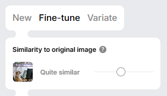
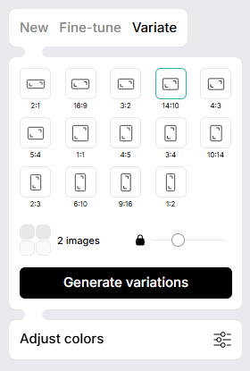

Very small article today, just to introduce [recraft.ai](https://www.recraft.ai/) (thanks Pierre for the tip) which is an image generation tool assisted by AI.

Unlike other tools like [Bing image creator](https://www.bing.com/images/create) (the one I used to illustrate my articles), recraft.ai can produce the same image but using some variations (using the fine-tune or the variate feature).

Using the editor, we can do some rotation, add text, resize the image, ...

And adding words like *Realistic photo* will generate images as if they were photos.

<!-- truncate -->

Also, unlike Bing, recraft.ai allow to specify the size of the image (horizontal, vertical, `2:1`, `4:3`, `1:2` and much more).

During my attempts, I didn't notice typos i.e. when I've asked to see f.i. a banner with some words on it; it was correct. Sometimes, for this blog and using Bing, I need to rework the image to remove/add some letters because the generator has made typos. Here; at first sight, it's OK.
