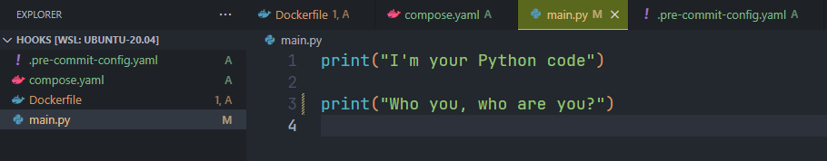

You like clean code, don't you? And you hate getting an email from your versioning tool (e.g. Github or GitLab) telling you that your last commit didn't go through, that the formatting of your code is bad; this is because you've left one space too many at the end of a line or you've used single quote instead of double (or the opposite), for example.

You've pushed your changes, already start to work on another activity, perhaps another project and boum, two hours after your last commit (*because the CI server was working on a lot of pipelines before yours*), boum, you get a *Your last commit has failed, #gnagnagna*. I hate it as much as I love clean code.

So, what should we do to avoid this?

The answer is simple! Before each push, we should run the same code analysis tools that are executed in the CI, i.e. `phplint`, `php-cs-fixer`, `phpcbf`, `phan`, `phpstan`, ... (for PHP) or `pylint`, `mypy`, `prospector`, `black`, `ruff`, ... (for Python) or `shellcheck` and `shellformat` (for Linux Bash) or ...

We should, but do we think about it every time? Unfortunately not.

Let's see how to correct this.

<!-- truncate -->

Git is supporting a feature called **[Hooks](https://git-scm.com/book/ms/v2/Customizing-Git-Git-Hooks)**. There are `pre-` and `post-` hooks. A `pre-` hook like `pre-commit` is running before a commit is done while a `post-` hook is fired once the action has been successfully fired.

So, in this article, we'll discuss about `pre-commit` hooks: we want to start some code quality tools before committing our changes to our code versioning software and, in fact, we want to abandon the commit if something is wrong.

In other words, if the code formatting of our last changes violates some standards (trailing spaces f.i.), we wish to be notified of the problem immediately; we want to be able to solve issues before pushing our changes and, this is the objective, to make sure we'll not push wrong code (badly formatted, badly written) to our versioning system.

## Which pre-commit hooks tools exists?

There are a few tools we can use like:

* [husky](https://github.com/typicode/husky); *Git hooks made easy* 🐶 *woof!*
* [pre-commit](https://github.com/pre-commit/pre-commit); *A framework for managing and maintaining multi-language pre-commit hooks*
* [grumphp](https://github.com/phpro/grumphp); *A PHP code-quality tool*
* [CaptainHook](https://github.com/captainhookphp/captainhook); *CaptainHook is a very flexible git hook manager for software developers that makes sharing git hooks with your team a breeze.*

In this article, we'll discover [pre-commit](https://github.com/pre-commit/pre-commit) because it's multi-language and really simple to install / use / configure.

## Let's play by creating a demo

We'll create a new temporary folder, run `git init` to initialise a project and create a Docker image and run a container for our demo.

First, run `mkdir /tmp/hooks && cd $_` then run `git init` to initialise our folder as a repository (we'll work offline but, yes, to use git pre-commit hooks, we need a git project).

We'll need three files, a `Dockerfile` to create our Python Docker image, a `compose.yaml` to set some settings and `main.py` as a Python example script.

<Snippets filename="Dockerfile">

```dockerfile
# syntax=docker/dockerfile:1

FROM python:3.13-slim AS base

RUN apt-get -y update \
    && apt-get install --yes --no-install-recommends git \
    && rm -rf /var/lib/apt/lists/*

WORKDIR "/app/src"

# Keep the container running
ENTRYPOINT ["tail", "-f", "/dev/null"]
```

</Snippets>

<Snippets filename="compose.yaml">

```yaml
services:
  app_python:
    build: .
    volumes:
      - .:/app/src
```

</Snippets>

<Snippets filename="main.py">

```python
print("I'm your Python code")

print('Who you, who are you?')
```

</Snippets>

We'll create our Docker image and create a container with this single command: `docker compose up --detach --build`.

And, now, we'll jump in the container by running: `docker compose exec app_python /bin/sh`.

And we can run our script:

```bash
> python main.py

I'm your Python code
Who you, who are you?
```

### Installing pre-commit

> [https://pre-commit.com/#install](https://pre-commit.com/#install)

For a Python project, it's really easy, you just need to run `pip install pre-commit`.

### Adding a configuration file

Simple too, please create a file called `.pre-commit-config.yaml` with this content:


<Snippets filename=".pre-commit-config.yaml">

```yaml
repos:
- repo: https://github.com/pre-commit/pre-commit-hooks
  rev: v2.3.0
  hooks:
  - id: check-yaml
  - id: end-of-file-fixer
  - id: trailing-whitespace
- repo: https://github.com/psf/black
  rev: 24.10.0
  hooks:
  - id: black
```

</Snippets>

### Manually fire the hook

`pre-commit` can be manually fired but you should have some files in your git local stage. In this article, we've created a few files, please run `git add .` just to put them in the git local stage.

Now, to manually start all controls defined in the yaml file simply run `pre-commit run --all-files`. The first time, it'll be slower since a few things have to be downloaded / configured.

You'll see something like this on your console:

```bash
[INFO] Initializing environment for https://github.com/pre-commit/pre-commit-hooks.
[WARNING] repo `https://github.com/pre-commit/pre-commit-hooks` uses deprecated stage names (commit, push) which will be removed in a future version.  Hint: often `pre-commit autoupdate --repo https://github.com/pre-commit/pre-commit-hooks` will fix this.  if it does not -- consider reporting an issue to that repo.
[INFO] Installing environment for https://github.com/pre-commit/pre-commit-hooks.
[INFO] Once installed this environment will be reused.
[INFO] This may take a few minutes...
Check Yaml...........................................(no files to check)Skipped
Fix End of Files.....................................(no files to check)Skipped
Trim Trailing Whitespace.............................(no files to check)Skipped
black................................................(no files to check)Skipped
# git add .
# pre-commit run --all-files
Check Yaml...............................................................Passed
Fix End of Files.........................................................Passed
Trim Trailing Whitespace.................................................Passed
black....................................................................Failed
- hook id: black
- files were modified by this hook

reformatted main.py

All done! ✨ 🍰 ✨
1 file reformatted.
```

Oh? Did you see the **reformatted main.py** line? Something was wrong with that file.

Did you've noticed my typo?

```python
print("I'm your Python code")

print('Who you, who are you?')
```

The first time I've used double quotes (in the first `print` statement) while I've used single ones in the second. So, I've (voluntary) created a code violation and the `black` tool has see it.

Now, reopen the `main.py` script:



### Install hooks

Ok, the idea wasn't to fire pre-commit hooks manually, right? Just run `pre-commit install` and, from now, every single time you'll run `git commit`, first, `pre-commit` controls will be made and only when all controls are successful (i.e. all will return an exit code of `0`), then your commit will be allowed.

:::note
If you're curious about how it works, simply show the `.git/hooks/pre-commit` file. The previous instruction has configured git to execute a small Bash script called `.git/hooks/pre-commit`.
:::

### Search for hooks

There are a lot of existing hooks and you can even create yours.

Take time to surf on [https://github.com/pre-commit/pre-commit-hooks](https://github.com/pre-commit/pre-commit-hooks) to see a few of them.

As illustrated on [https://pre-commit.com/#repository-local-hooks](https://pre-commit.com/#repository-local-hooks), you can add local hooks.

Imagine, you've already installed a tool like `prospector` (for Python) or `phpstan` (for PHP). These tools are installed on your machine (so you can call them on the command line). So, simply add a new hook like this:

<Snippets filename=".pre-commit-config.yaml">

```yaml
- repo: local
  hooks:
  - id: prospector
    name: prospector
    entry: prospector
    language: system
```

</Snippets>

You can also pass arguments:

<Snippets filename=".pre-commit-config.yaml">

```yaml
- repo: local
  hooks:
    - id: mypy # Mypy (should be installed using `pip install mypy`)
    name: mypy
    entry: mypy
    language: system
    types: [python]
    require_serial: true
    args: ["--config-file=.config/mypy.ini"]
```

</Snippets>

For a Python 3.13 project, here is my `.pre-commit-config.yaml` file:

<Snippets filename=".pre-commit-config.yaml">

```yaml
default_language_version:
  python: python3.13

repos:
  - repo: https://github.com/pre-commit/pre-commit-hooks
    rev: v5.0.0
    hooks:
      - id: check-ast # Python linter - Simply check whether files parse as valid python.
      - id: check-docstring-first # No code before the initial docstring
      - id: check-json # JSON linter   - Attempts to load all json files to verify syntax.
      - id: check-toml # TOML linter   - Attempts to load all TOML files to verify syntax.
      - id: check-xml # XML linter    - Attempts to load all XML files to verify syntax.
      - id: check-yaml # YAML linter   - Attempts to load all yaml files to verify syntax.
      - id: check-merge-conflict # Check for files that contain merge conflict strings.
      - id: end-of-file-fixer # Makes sure files end in a newline and only a newline.
      - id: file-contents-sorter
        files: \.config/*.txt$ # Sort all lines in any .config/*.txt file (like cspell.txt f.i.)
        args: [--ignore-case]
      - id: no-commit-to-branch
        args: [--branch, main] # Don't allow to push directly on the main branch
      - id: requirements-txt-fixer # Sorts entries in requirements.txt
      - id: trailing-whitespace # Trims trailing whitespace.
  - repo: https://github.com/psf/black
    rev: 24.10.0
    hooks:
      - id: black # Python black formatter
  - repo: local
    hooks:
      - id: isort # isort (should be installed using `pip install isort` or mentioned in the `requirements.txt` file)
        name: isort
        entry: isort
        language: system
        types: [python]
        require_serial: true
        args: ["--line-length 120"]
      - id: mypy # Mypy (should be installed using `pip install mypy` or mentioned in the `requirements.txt` file)
        name: mypy
        entry: mypy
        language: system
        types: [python]
        require_serial: true
        args: ["--config-file=.config/mypy.ini"]
      - id: pylint # Pylint (should be installed using `pip install pylint` or mentioned in the `requirements.txt` file)
        name: pylint
        entry: pylint
        language: system
        types: [python]
        require_serial: true
        args: ["--rcfile=.config/.pylintrc"]
```

</Snippets>

#### A few more  hooks

* [Code spell](https://github.com/codespell-project/codespell/blob/main/.pre-commit-config.yaml#L70), *Check code for common misspellings*
* [Git leaks](https://github.com/gitleaks/gitleaks/blob/master/.pre-commit-hooks.yaml), *Find secrets with Gitleaks*
* [Git lint](https://github.com/jorisroovers/gitlint), *Linting for your git commit messages*
* [Markdown format](https://github.com/hukkin/mdformat/blob/master/.pre-commit-config.yaml), *CommonMark compliant Markdown formatter*
* [Markdownlint](https://github.com/markdownlint/markdownlint/blob/main/.pre-commit-hooks.yaml), *Markdown lint tool*
* [Ruff](https://github.com/astral-sh/ruff-pre-commit/blob/main/.pre-commit-hooks.yaml), *A pre-commit hook for Ruff.*
* [Shell check](https://github.com/shellcheck-py/shellcheck-py?tab=readme-ov-file#as-a-pre-commit-hook), *python3/pip3 wrapper for installing shellcheck*
* [Trufflehog](https://github.com/trufflesecurity/trufflehog/blob/main/.pre-commit-config.yaml), *Find, verify, and analyze leaked credentials*

and even more, search on [https://sourcegraph.com/search](https://sourcegraph.com/search) with queries like `context:global file:^\.pre-commit-hooks\.yaml$ "types: [python]"` f.i. ([direct link](https://sourcegraph.com/search?q=context:global+file:%5E%5C.pre-commit-hooks%5C.yaml%24+%22types:+%5Bpython%5D%22&patternType=keyword&sm=0))

## Tip: --no-verify

In some situation, you've to push your changes even if there are some code violation. Let's say, it's your last hour before three weeks holiday and you're working alone on a branch like `feat-user-profile`. You wish to push your changes and enjoy a break.

In that situation, you can add the `--no-verify` flag f.i. `git commit -m "wip: not yet finished" --no-verify`. And, then, pre-commit hooks won't be executed so your changes will be committed.

:::caution
Only use this flag if you know exactly what you're doing. It would be a very bad idea to do this f.i. to the `dev` branch if you're working in a team.
:::
