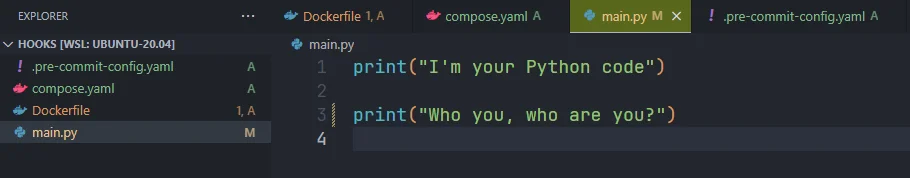

<TLDR>
Avoid failing CI/CD pipelines by catching errors before you commit. This article explains how to use Git pre-commit hooks to enforce code quality standards locally. It provides a practical guide to setting up and using the `pre-commit` framework, a versatile tool for managing multi-language hooks. You'll learn how to configure hooks for a Python project to automatically check for issues like inconsistent formatting, and how to install and run them. The article also covers how to find more hooks and when it's appropriate to bypass them.
</TLDR>

You like clean code, don't you? And you hate getting an email from your versioning tool (e.g. Github or GitLab) telling you that your last commit didn't go through, that the formatting of your code is bad; this is because you've left one space too many at the end of a line or you've used single quote instead of double (or the opposite), for example.

You've pushed your changes, already started to work on another activity, perhaps another project and boom, two hours after your last commit (*because the CI server was working on a lot of pipelines before yours*), boom, you get a *Your last commit has failed, #gnagnagna*. I hate it as much as I love clean code.

So, what should we do to avoid this?

The answer is simple! Before each push, we should run the same code analysis tools that are executed in the CI, i.e. `phplint`, `php-cs-fixer`, `phpcbf`, `phan`, `phpstan`, ... (for PHP, all bundled in the <Link to="/blog/php-jakzal-phpqa">jakzal/phpqa Docker image</Link>) or `pylint`, `mypy`, `prospector`, `black`, `ruff`, ... (for Python, see <Link to="/blog/python-qa">Python - Code Quality tools</Link>) or `shellcheck` and `shellformat` (for Linux Bash) or ...

We should, but do we think about it every time? Unfortunately not.

Let's see how to correct this.

<!-- truncate -->

## The Result: A Commit, Reformatted Before It Even Happens

Here is `pre-commit` catching (and fixing) a formatting violation, on a demo project you'll build below:

<Terminal>
$ pre-commit run --all-files
</Terminal>

<Terminal typewriter wrap={false} source="./files/terminal-1.txt" />

Did you see the **reformatted main.py** line? A quoting inconsistency (`"double"` vs `'single'` quotes) got silently fixed by `black`, right there in the local stage:



No CI run, no email two hours later — the violation never leaves your machine.

## Why It Works

Git ships two hook stages, `pre-` and `post-`; a `pre-commit` hook runs *before* the commit is created and can abandon it entirely if something fails.

Among the tools that build on this ([husky](https://github.com/typicode/husky), [pre-commit](https://github.com/pre-commit/pre-commit), [grumphp](https://github.com/phpro/grumphp), [CaptainHook](https://github.com/captainhookphp/captainhook)), this article uses **pre-commit**:

- It's multi-language — PHP, Python, Bash, whatever the project needs — one config file.
- It runs the same tools your CI already runs (`black`, `pylint`, `phpstan`, ...), just earlier and for free, with no runner to wait for.
- Once installed, it re-checks automatically on every `git commit` — nothing to remember, it's enforced.

## Installation

We'll create a new temporary folder, run `git init` to initialise a project and create a Docker image and run a container for our demo.

First, create a temporary folder and jump into it, then initialise it as a git repository (we'll work offline but, yes, to use git pre-commit hooks, we need a git project).

<Terminal>
$ mkdir /tmp/hooks && cd $_
$ git init
</Terminal>

We'll need three files, a `Dockerfile` to create our Python Docker image, a `compose.yaml` to set some settings and `main.py` as a Python example script.

<Snippet filename="Dockerfile" source="./files/Dockerfile" />

<Snippet filename="compose.yaml" source="./files/compose.yaml" />

<Snippet filename="main.py" source="./files/main.py" />

We'll create our Docker image and create a container with this single command: `docker compose up --detach --build`.

And, now, we'll jump in the container by running: `docker compose exec app_python /bin/sh`.

And we can run our script:

<Terminal typewriter>
$ python main.py

I'm your Python code
Who you, who are you?
</Terminal>

### Installing pre-commit

> [https://pre-commit.com/#install](https://pre-commit.com/#install)

For a Python project, it's really easy, you just need to run `pip install pre-commit`.

### Adding a configuration file

Simple too, please create a file called `.pre-commit-config.yaml` with this content:

<Snippet filename=".pre-commit-config.yaml" source="./files/.pre-commit-config.yaml" />

### Manually fire the hook

`pre-commit` can be manually fired but you should have some files in your git local stage. In this article, we've created a few files, please run `git add .` just to put them in the git local stage.

Now, to manually start all controls defined in the yaml file simply run `pre-commit run --all-files` — that's the exact command and output shown at the top of this article.

Did you notice my typo?

```python
print("I'm your Python code")

print('Who you, who are you?')
```

The first time I've used double quotes (in the first `print` statement) while I've used single ones in the second. So, I've (voluntary) created a code violation and the `black` tool has see it and reformatted `main.py`, exactly as shown above.

## More Demos

### Install hooks

Ok, the idea wasn't to fire pre-commit hooks manually, right? Just run `pre-commit install` and, from now, every single time you'll run `git commit`, first, `pre-commit` controls will be made and only when all controls are successful (i.e. all will return an exit code of `0`), then your commit will be allowed.

### A few more hooks

There are a lot of existing hooks and you can even create yours:

- [Code spell](https://github.com/codespell-project/codespell/blob/main/.pre-commit-config.yaml#L70), *Check code for common misspellings*
- [Git leaks](https://github.com/gitleaks/gitleaks/blob/master/.pre-commit-hooks.yaml), *Find secrets with Gitleaks*
- [Git lint](https://github.com/jorisroovers/gitlint), *Linting for your git commit messages*
- [Markdown format](https://github.com/hukkin/mdformat/blob/master/.pre-commit-config.yaml), *CommonMark compliant Markdown formatter*
- [Markdownlint](https://github.com/markdownlint/markdownlint/blob/main/.pre-commit-hooks.yaml), *Markdown lint tool*
- [Ruff](https://github.com/astral-sh/ruff-pre-commit/blob/main/.pre-commit-hooks.yaml), *A pre-commit hook for Ruff.*
- [Shell check](https://github.com/shellcheck-py/shellcheck-py?tab=readme-ov-file#as-a-pre-commit-hook), *python3/pip3 wrapper for installing shellcheck*
- [Trufflehog](https://github.com/trufflesecurity/trufflehog/blob/main/.pre-commit-config.yaml), *Find, verify, and analyze leaked credentials*

### A ready-made Python 3.13 config

For a Python 3.13 project, here is my `.pre-commit-config.yaml` file:

<Snippet filename=".pre-commit-config.yaml" source="./files/.pre-commit-config.yaml.part4" />

## Under the Hood (skip this if you just want to use it)

<AlertBox variant="note">
If you're curious about how it works, simply show the `.git/hooks/pre-commit` file. The `pre-commit install` instruction has configured git to execute a small Bash script called `.git/hooks/pre-commit`.

</AlertBox>

### Search for hooks and write your own

Take time to surf on [https://github.com/pre-commit/pre-commit-hooks](https://github.com/pre-commit/pre-commit-hooks) to see a few of them, or search on [https://sourcegraph.com/search](https://sourcegraph.com/search) with queries like `context:global file:^\.pre-commit-hooks\.yaml$ "types: [python]"` f.i. ([direct link](https://sourcegraph.com/search?q=context:global+file:%5E%5C.pre-commit-hooks%5C.yaml%24+%22types:+%5Bpython%5D%22&patternType=keyword&sm=0)).

As illustrated on [https://pre-commit.com/#repository-local-hooks](https://pre-commit.com/#repository-local-hooks), you can add local hooks.

Imagine, you've already installed a tool like `prospector` (for Python) or `phpstan` (for PHP). These tools are installed on your machine (so you can call them on the command line). So, simply add a new hook like this:

<Snippet filename=".pre-commit-config.yaml" source="./files/.pre-commit-config.yaml.part2" />

You can also pass arguments:

<Snippet filename=".pre-commit-config.yaml" source="./files/.pre-commit-config.yaml.part3" />

## Tip: --no-verify

In some situation, you've to push your changes even if there are some code violation. Let's say, it's your last hour before three weeks holiday and you're working alone on a branch like `feat-user-profile`. You wish to push your changes and enjoy a break.

In that situation, you can add the `--no-verify` flag f.i. `git commit -m "wip: not yet finished" --no-verify`. And, then, pre-commit hooks won't be executed so your changes will be committed.

<AlertBox variant="highlyImportant" title="The --no-verify flag">
Only use this flag if you know exactly what you're doing. It would be a very bad idea to do this f.i. to the `dev` branch if you're working in a team.
</AlertBox>

## Conclusion

Those failed-CI emails from the introduction stop happening once the same checks run locally, before the commit exists — `pre-commit` turns "wait for the server to tell you" into "know immediately." Install it once (`pre-commit install`) and every future commit is covered, in any language your project mixes.

Keep `--no-verify` in your back pocket for the rare deliberate exception, and see <Link to="/blog/python-qa">Python - Code Quality tools</Link> for the tools this article's demo hooks are built on.
