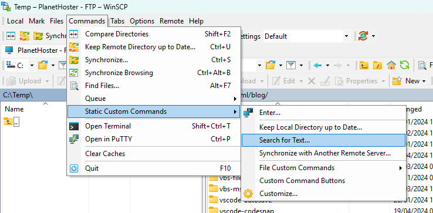
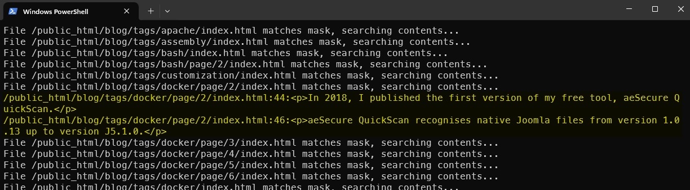
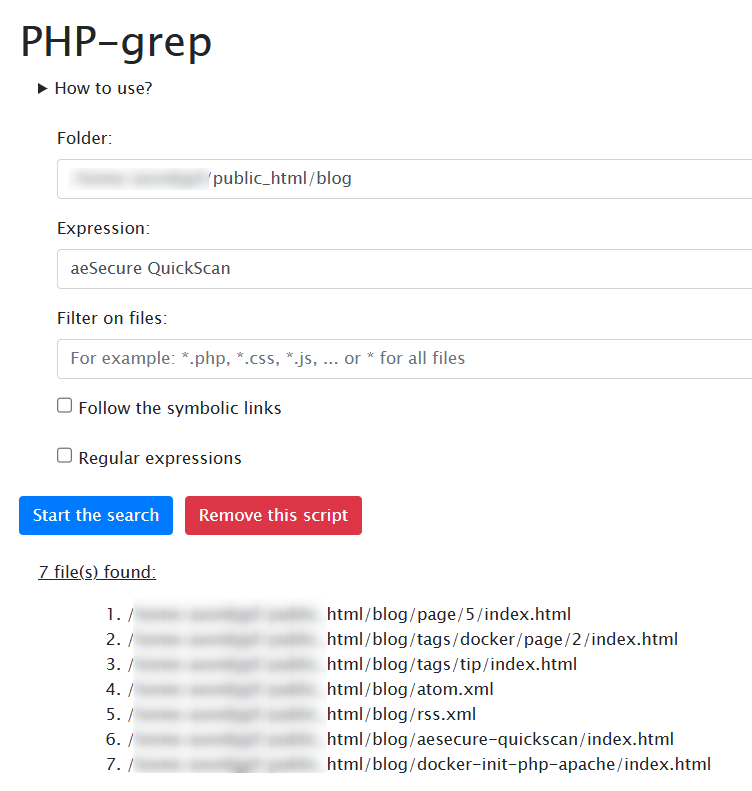

Did you know that using [WinSCP](https://winscp.net/), you can run a search on your FTP to find all the documents containing a given string? It's native in WinSCP; nothing more to install but...

However, it's insanely slow; let's see how we can do it better and almost instantaneous.

<!-- truncate -->

## WinSCP - Search for Text

Probably you never had noticed (it was my case), you can start searching files on your FTP server using WinSCP.

To do this, go to the `Commands` menu, then `Static custom` commands and finally `Search for Text...`.  Type your search pattern and press <kbd>Enter</kbd>.

A new Powershell prompt will be started and you'll see the list of scanned files.

<AlertBox variant="info" title="It's a Powershell script">
WinSCP will, in fact, start a `.ps1` script located here: `C:\Program Files (x86)\WinSCP\Extensions\SearchText.WinSCPextension.ps1`. Feel free to update the file to match your needs.

</AlertBox>

It's terribly slow and you'll get a huge list with all your files; not only the ones where the search pattern is retrieved. This function has the merit of exciting, but it's not much.

## php_grep

Time flies... In 2016, I developed an ultra-fast little script called [php_grep](https://github.com/cavo789/php_grep) that scans every file present and, using a small regular expression, finds the files containing the search pattern and displays its location if the search is successful.

You just need to download a copy of my script (a single PHP page), copy the script on your FTP server and access it using a URL. Really easy.

This done, you'll get an interface where you can type, for sure, the search expression but also restricts the search to f.i. `.html` files.

More info on [https://github.com/cavo789/php_grep](https://github.com/cavo789/php_grep)
