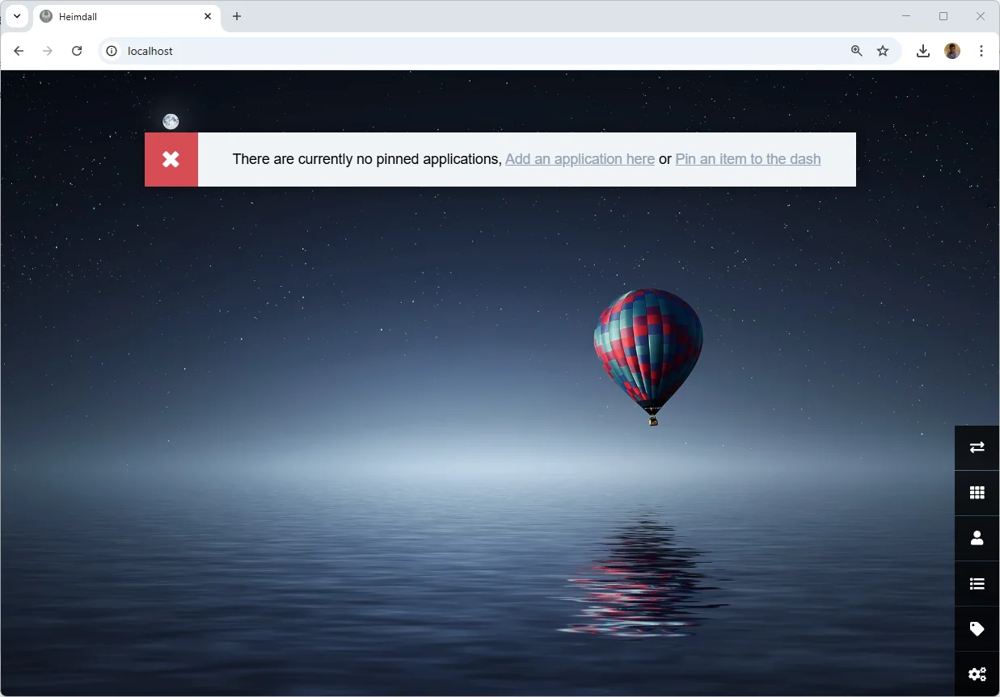

<!-- cspell:ignore puid,pgid,Bitwarden -->

> [https://heimdall.site/](https://heimdall.site/)

I've never been a big fan of browser's bookmarks and in fact I have almost none. And, quite logically, I almost never display the favorite bar.

I only visit a few sites on a regular basis and my browser history remembers them; otherwise a famous search engine remembers them for me.

However, I'm not averse to a personalized homepage and I'm quite happy with Heimdall at the moment.

<!-- truncate -->

Heimdall is a web application you can self-hosted (and it's a piece of cake using Docker) on your computer.

Here is the official demo:

You will define the look&feel of your homepage by specifying which links you want to have immediate access to and, for others, you will classify them according to folders.  Nothing too complicated.

But it does give you a much nicer way of accessing your site than the outdated bookmarks management.  It's perhaps one of the things that hasn't changed in thirty years.

## Creating your dashboard

Please create a dummy folder and jump in it: `mkdir ~/tools/dashboard && cd $_`.

In that folder, please create a file called `compose.yaml` with the following content (refers to [official Docker Hub page](https://hub.docker.com/r/linuxserver/heimdall/) for the latest version):

<Snippet filename="compose.yaml" source="./files/compose.yaml" />

<AlertBox variant="note" title="">
In the code here above, I've preferred the syntax `PUID=${USER_ID:-1000}` and `PGID=${GROUP_ID:-1000}` instead of just hardcoding `1000`: on my computer, my Linux user id is `1002`; not `1000` so I prefer to use a variable and, if the variable isn't defined, then use `1000` as default. Same for the group id.
</AlertBox>

## Running the dashboard

Once the `compose.yaml` file has been created, just run this command: `USER_ID=$(id -u) GROUP_ID=$(id -g) docker compose up --build --detach`.

This command will define our two `USER_ID` and `GROUP_ID` variables, initialise them to your own values then run the container.

<AlertBox variant="note" title="">
If you've hardcoded IDs in the `compose.yaml` file to, f.i. `1000` (because you know it's your IDs); then the command becomes shorter: `docker compose up --build --detach`

</AlertBox>

## First run

Once you've fired the `docker compose up --build --detach` command, you've already created the container i.e. you can already surf to `http://localhost` to see it in action.

Let's play, click on the last button bottom right (the settings icon) and under `Appearance`, let's upload a new background image.

It's a lot more fun, isn't it?

### Saving the configuration on disk

Did you've noticed that, in the `compose.yaml` file there is a section called `volumes` with the following configuration?

<Snippet filename="compose.yaml" source="./files/compose.part2.yaml" />

It means that the `config` folder of Heimdall will be stored on your disk; in a folder called `config` too.

I can check this by running `ls -alh` on my host:

<Terminal>
Permissions Size User       Group      Date Modified    Name
drwxr-xr-x     - christophe christophe 2025-01-26 10:36 config
.rw-r--r--   284 christophe christophe 2025-01-26 10:36 compose.yaml
</Terminal>

And, thus, everything I'll do in Heimdall will be saved on my computer. So, it means, if I've to stop and remove the Docker container, by running it again, I'll retrieve all my settings.

### Adding some links

I suggest that, before adding new links, first click on the Tags icon (the fifth icons bottom right) because you'll organize your links using tags and you have to create tags before.

Add so many tags you want. For this tutorial, I'll just create one.

When finished, click on the `Cancel` button top right or click on the fourth button bottom right (called `Application list`)

Create a new application. You can choose between an `Application type` or a `Website`. In my current use, I always choice `Website`. I fill then the URL and click on `Go`.

Heimdall will extract the favicon in different sizes. I click on the one I wish.

Automatically, Heimdall has filled in some properties in the bottom part of the screen. I'll remove `Home dashboard` from the `Tags` area and, instead, type `Docker` i.e. the tag I've previously created.

Once saved, I'll get my new homepage:

We can see that tags are represented as a folder. If I click on it, I'll *enter* in the *folder* and see all applications having this tag.

I can, too, add applications that will appear immediately on the homepage (like shortcuts on your desktop). To do this, create a new application and keep `Home dashboard` in the list of tags.

Let's explore that `Application Type` feature:

It's just something like a snippet. If I select `Bitwarden` from there, Heimdall will do basic initializations; he'll fill in the `Application name` textbox and the icon. Ok, why not.

I'll point the URL to `https://vault.bitwarden.com/#/login` and I'll keep `Home dashboard` as tag.

Here is the dashboard I'm using at work. Since it's so easy to add new items; I'm doing changes to it as soon as I'm working on a new project.

### More customizations

By clicking on the last icon bottom right, you can customize a few Heimdall. You can display f.i. a search engine which is nice.

You can customize the CSS and add some JS too.

## Continue your journey

Visit the official site [https://heimdall.site/](https://heimdall.site/) to get updates and docs.

Get inspirations by searching **dashboard heimdall homepage** on [Google Search images](https://www.google.com/search?sca_esv=e645136bb336bc61&q=dashboard+heimdall+homepage&udm=2).
