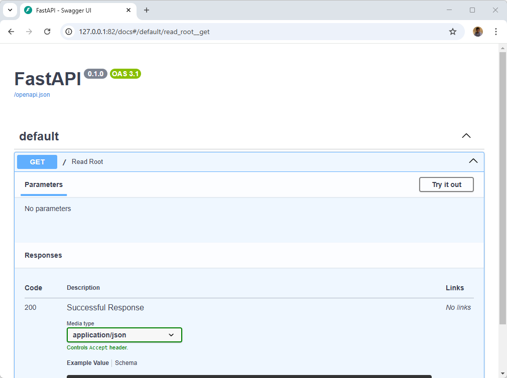
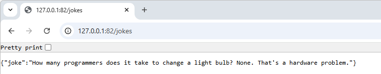
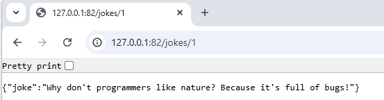

> TLDR: one minute is the time you'll need to copy/paste two files' content and to run one Docker statement.

Sounds crazy but it's TRUE. You'll just need one minute to create the example provided here below i.e. create your project's directory, create two files and run two Docker statements and ... it's done.

As PHP programmer, when I've taken time to read a blog article about FastAPI I thought **Nodidju ! Ç' n'est nén pussibe** (*For Christ's sake! It can't be true*).

With just two files, we'll build our own Docker image with Python and FastAPI installed and to code our REST API application. No more than two!

Impossible to not try immediately and ... wow ... that's TRUE!

<!-- truncate -->

## Creating our first API

Like always, we'll build a fully working example. It couldn't be simpler; you'll see.

Please create a dummy folder and jump in it: `mkdir /tmp/fastapi && cd $_`.

In that folder, please create a new file called `Dockerfile` with the following content:

<Snippet filename="Dockerfile" source="./files/Dockerfile" />

The final image size will be about 184MB i.e. almost nothing.

As you've seen, we need a file called `main.py`; let's create it:

<Snippet filename="main.py" source="./files/main.py" />

This very straightforward code defines a route called `/`. It's a `GET` method and we'll return a JSON object:

```json
{
  "Hello": "World"
}
```

You know what? It's already done.

## Running our API

We need to build our Docker image and run it:

<Terminal>
$ docker build -t python-fastapi . && docker run -p 82:82 python-fastapi
</Terminal>

Once done, just surf to `http://127.0.0.1:82` and you'll obtain your first JSON answer; crazy no?


## Automated documentation of your API

And it's just the beginning: FastAPI comes with a self-documented API based on the OpenAPI schema.

Please jump to `http://127.0.0.1:82/docs` and you'll see it in action:



There is an second, alternative template called ReDoc. You can access it using the `redoc` endpoint i.e. `http://127.0.0.1/redoc`:


## Let's play - Creating a joke generator

We'll update build a joke generator script. Our objective will be to get a random joke or a specific one (like *Give me the third joke you know*).

For this, we'll update our `main.py` script and because we'll probably make more than one change, we'll mount our host folder to the container.

Why? Mounting our folder inside the container will allow us to make changes to the script and just refresh the web page to see the change.

The only thing we need to do is to run our container like this: `docker run -v .:/app -p 82:82 python-fastapi` ... but it didn't work as expected.

<AlertBox variant="info" title="FastAPI is using Uvicorn under the hood">
Uvicorn is a web server implementation for Python. Uvicorn has a built-in cache mechanism so even if we've updated the source of our `main.py` script, we'll still get the old version.

We should start Uvicorn with a "hot reload" mechanism.

</AlertBox>

### Recreating the Docker image for hot reload

First stop the running container: go back to your console and press <kbd>CTRL</kbd>+<kbd>C</kbd> to stop the running container. We'll also remove the container. You can do this by going to `Docker Desktop`; click on the `Containers` menu and kill your *Python - Fastapi* container. Remove also the image called `python-fastapi`.

<AlertBox variant="note" title="">
`python-fastapi` is the name of the Docker image we've built earlier.

</AlertBox>

If you prefer the command line, you can achieve the same result by running these two commands:

<Terminal>
$ docker rm $(docker ps -aq --filter "ancestor=python-fastapi")

$ docker rmi python-fastapi --force

</Terminal>

Now, please copy/paste the following content to your existing `Dockerfile`:

<Snippet filename="Dockerfile" source="./files/Dockerfile.part2" />

Rebuild the image and run a new container by running these commands:

OK, we'll run the container again but, now, with a volume:

<Terminal>
$ docker build -t python-fastapi . && docker run -v .:/app -p 82:82 python-fastapi
</Terminal>

Now with a Docker image with hot reload and we've mounted our folder in the container.

Please edit your `main.py` script like this:

<Snippet filename="main.py" source="./files/main.part2.py" />

Refresh your web page, you'll see Hello Belgium!.  Change your `main.py` and replace `Belgium!` by `France`. Reload your web page; you'll see Hello France. So, nice, we've a hot reload and we can really start to play.

### Our joke generator

We'll update our `main.py` script like this:

<Snippet filename="main.py" source="./files/main.part3.py" />

You immediately see it I think:

* I've defined an array with five, hardcoded, jokes;
* I've defined a new route called `/jokes` and that one will display a random joke
* And finally I've defined a `jokes/{joke_id}` to be able to target a specific joke (like "Give me the second joke you know").

<AlertBox variant="info" title="Use an external file instead of hardcoding jokes">
As an exercise; just remove the initialisation part of the  `jokes` array and, instead, read jokes from a text file. It would be really easy to do.

</AlertBox>

Go back to your browser and surf to the `jokes` endpoint (`http://127.0.0.1:82/jokes`) and, hop, you've a random joke.



Just refresh the page; again and again. Every time you'll get a random joke (from a list of 5).

If you want a specific one, just put an ID after like `http://127.0.0.1:82/jokes/1`



<AlertBox variant="note" title="">
Please note that the array start at position 0 so the first joke is this one: `http://127.0.0.1:82/jokes/0`.

</AlertBox>

#### Our jokes endpoints are documented automatically

And looking back to the documentation (`http://127.0.0.1:82/docs`); we've now three routes and, take a look, the Python docstring is used to describe the route.


Really, really impressive!

<AlertBox variant="info" title="Docs are interactive">
And, more impressive, you can play directly from the documentation i.e. you can run the `jokes` endpoint. There is a button *Try it out* then *Execute* to see the endpoint in action.

More info [https://fastapi.tiangolo.com/tutorial/first-steps/#interactive-api-docs](https://fastapi.tiangolo.com/tutorial/first-steps/#interactive-api-docs)

</AlertBox>

## Discover FastAPI

Don't wait any longer, go to [https://fastapi.tiangolo.com/](https://fastapi.tiangolo.com/) to see more examples.

Also read the long tutorial on [Real Python - Using FastAPI to Build Python Web APIs](https://realpython.com/fastapi-python-web-apis/).
