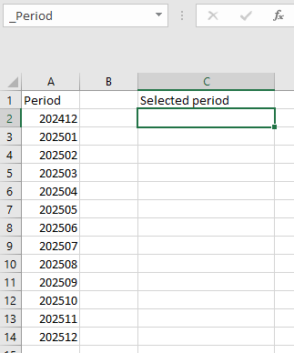
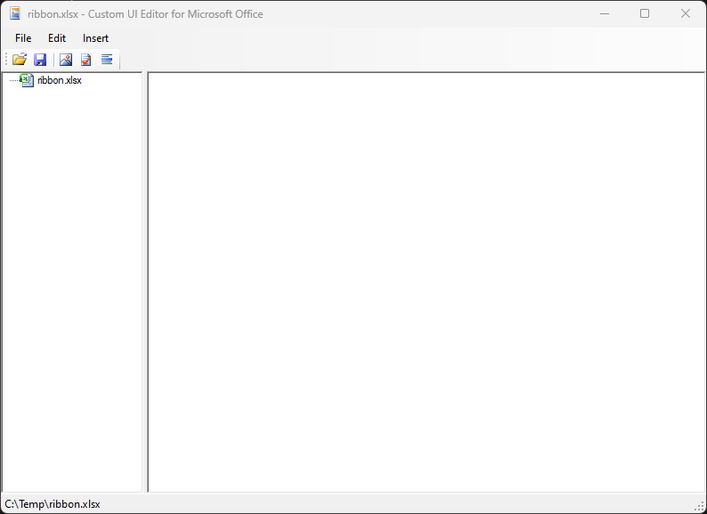
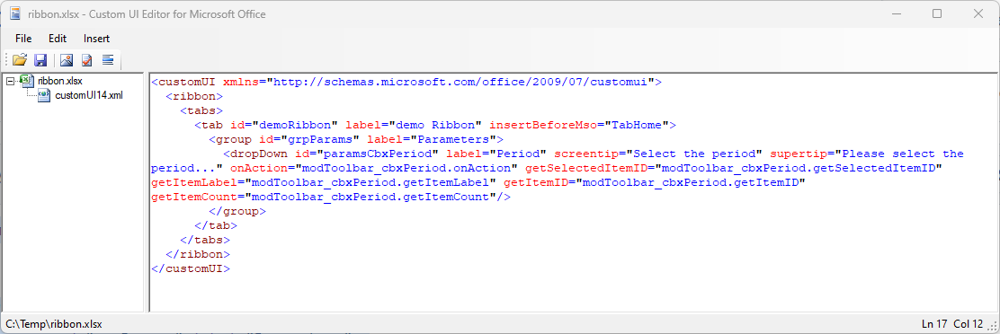
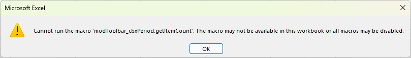
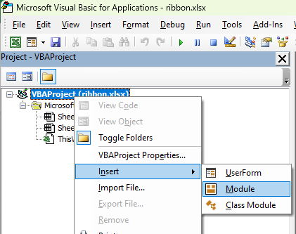
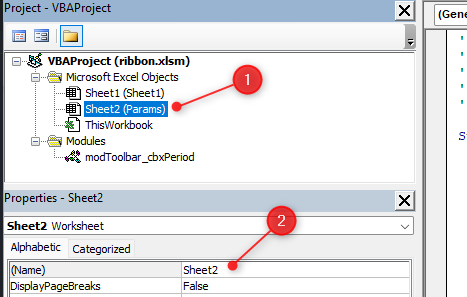
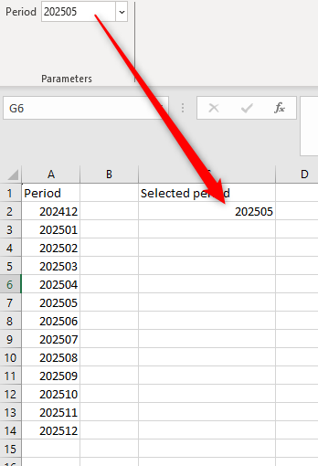

In this article, we'll see how, very easily, we can load an Excel range into a ribbon and display it inside a dropdown.

The idea is to provide a list of values in a ribbon but to not have to hardcode values in the list but, just, to link to a range, anywhere in your workbook.

I've used this technique in many of my Excel application's (i.e. Excel having VBA code).

For this blog post, we'll create a list of periods (YYYYMM) in a worksheet and load that list in our custom ribbon.

In this way, we could offer a nicer user experience by proposing a list and executing, for example, a query to a database to obtain the data for this period (or anything else).

<!-- truncate -->

## Let's play

First, create an empty workbook. Create then a new sheet called f.i. `Params` with a list of values. For this article, let's create a list of periods:

Nothing difficult right now. To be flexible, please select the range and name it: `_rngParamsPeriod`. This is much better to hardcode a range like `$A$2:$A$14` isn't it?

Second things to do is to foresee a cell in your sheet where the selected value will be written i.e. when the user will select a value from the list, we'll ask Excel to put the selected value there. To do this, just click on the cell where you wish to see the selected period and name that cell `_Period`. On the image below, I'll select cell `$C$2` on the same sheet but it can be else where.

Time to save for the first time your Excel file let's say in `c:\temp\ribbon.xlsx`, then close the workbook.

## Adding a ribbon

Time to add our ribbon. To do this, just download this free tool: [https://bettersolutions.com/vba/ribbon/custom-ui-editor-download.htm](https://bettersolutions.com/vba/ribbon/custom-ui-editor-download.htm). You'll find an executable called `CustomUIEditor.exe`. Double-click on it to start the editor then open your `c:\temp\ribbon.xlsx` file:

Click on the Insert menu then select `Office 2010 Custom UI Part`.

Paste the XML below in the editor window:

<Snippet filename="customui.xml" source="./files/customui.xml" />

You'll then have this:

Save your changes and quit the editor.

## Time to add our VBA code

From your explorer, double-click on your `c:\temp\ribbon.xlsx` file to start Excel and open the workbook again.

You'll get an error message and it's perfectly normal: we still need to add some VBA code so just press on **Ok**.

<AlertBox variant="info" title="">
In our ribbon, we wrote, among other things, the following: `getItemCount="modToolbar_cbxPeriod.getItemCount"`. So, Excel is trying to run a function called `getItemCount` from a module called `modToolbar_cbxPeriod` and ... we don't have it yet.

</AlertBox>

Press <kbd>ALT</kbd>-<kbd>F11</kbd> to open the VBE editor

As illustrated below, right-click on the `VBEProject` project and insert a new module.

This done, click on the added module and bottom left, you can give it a name, f.i. `modToolbar_cbxPeriod`.

In the right, main, part of the screen, please paste this code:

<Snippet filename="module.bas" source="./files/module.bas" />

We're almost done: we need to give a name to the sheet where the range is located. If you still remember the beginning of this blog post, we've added the range in a sheet called `Params` so, now in the VBE editor, just select the `Params` sheet as illustrated below (see 1.) and name the sheet `shParams` (see 2).

<AlertBox variant="caution" title="You should now use the .xlsm extension">
Save the Excel workbook but, this time, with the `.xlsm` extension since the workbook contains VBA code.

</AlertBox>

Time to test our feature: close the workbook and re-open it again and, this time, your list has been populated and by selecting a value from the list, the value will be injected in your worksheet; ready to be used.

<Link to="/blog/tags/ribbon">Want to keep playing with ribbons? Check out my other articles on the subject.</Link>
