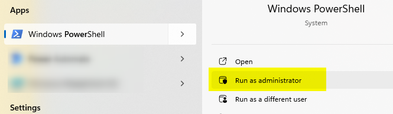
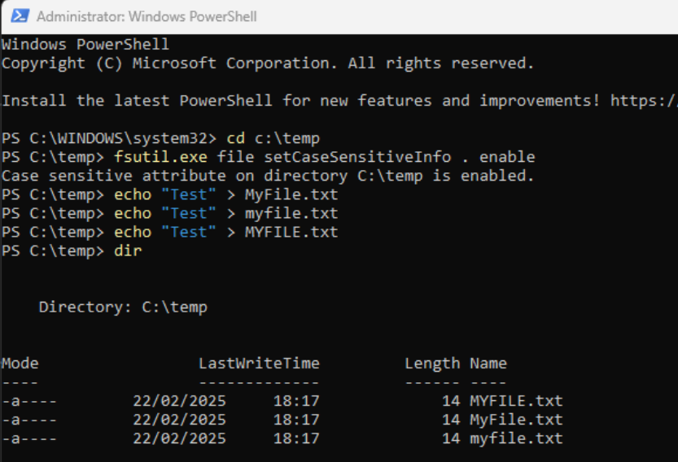

This is just ... for fun.

As you know, MS DOS didn't make any differences between `MyFile.txt`, `myfile.txt`, `MYFILE.txt` since DOS isn't case sensitive.

If you don't believe me, just start notepad, type a few characters and save your work once as `MyFile.txt` then as `myfile.txt` then as `MYFILE.txt`. Then look to your folder, how many documents did you have ? Just one.

Under Linux, you would have had three files; not under DOS.

What if we asked DOS to change its ways?

<!-- truncate -->

To do this, you'll need to start `Windows PowerShell` as an admin.

Then jump in the folder where you want to enable case sensitivity. Let's say in C:\Temp.

In your PowerShell console, now start `fsutil.exe file setCaseSensitiveInfo . enable` and press <kbd>Enter</kbd>. After a few seconds, the change will be made.

You can now use `MyFile.txt`, `myfile.txt` or `MYFILE.txt` as filenames; you'll have three files now; just like under Linux.

If you don't believe me:

To revert your change, run `fsutil.exe file setCaseSensitiveInfo . disable` but, first, you'll have to remove at least two files because DOS will prevent to disable the feature if this will give conflicts.
