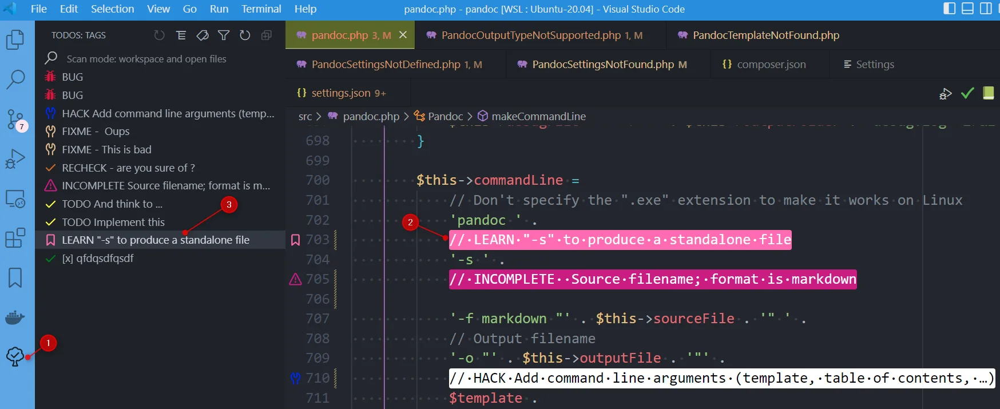

When you're working on a large codebase, soon or later you'll find some annotations like `@TODO` or `// TODO` put there by people (perhaps you) as a reminder for "Don't forget to (do something)...". And, for sure, these todos remain there months or years because, yup, the programmer forgot they were there.

Personally, I sometimes work on code and comment on the call to a particular method or block.  Often during a debugging session (for example on Linux Bash scripts) but, danger, don't forget to remove the comments and return the code to its original state. In that situation, I add a comment like `// TEMPORARY` just before the first commented line.

The idea behind the `Todo Tree` vscode addon (you can find the download page [https://marketplace.visualstudio.com/items?itemName=Gruntfuggly.todo-tree](https://marketplace.visualstudio.com/items?itemName=Gruntfuggly.todo-tree)) is to summarize such annotations and display a dashboard with all `TODOS`, `TOFIX`, ... and your owns too.

<!-- truncate -->

Once the addon has been installed, you'll get a new icon in your left sidebar (see indicator 1. on the image below). By clicking on it, you'll get items like `BUG`, `CHECK`, `FIXME`, `TODO`, ... and by clicking on an item you'll be directly redirected to where the todo is located in your codebase.

Thanks to this summary, you'll never forget anymore your todos, temporary hack, things you should still fix, ...

I recommend reading the [https://dev.to/koustav/how-a-vs-code-extension-todo-tree-can-make-your-coding-easier-todo-tree-configuration-and-use-cases-11kc](https://dev.to/koustav/how-a-vs-code-extension-todo-tree-can-make-your-coding-easier-todo-tree-configuration-and-use-cases-11kc) article to learn more about it.

Really nice addon to no more forget your TODOs, TOFIX, TEMPORARY, ... annotations.
