<TLDR>
This detailed, step-by-step tutorial teaches you how to connect Microsoft Excel to a SQL Server database using VBA. It covers everything from setting up a SQL Server instance with Docker and creating a sample database to writing the VBA code to execute queries and import data into your spreadsheet. You will learn how to configure the connection, use a custom VBA class to handle data retrieval, and output the results directly into your worksheet, with or without a live connection for refreshing the data.
</TLDR>

In April 2024, I wrote a small <Link to="/blog/vba-excel-sql-server">blog post</Link> about a VBA script that will connect to a MS SQL database, run a SELECT query to retrieve data and put them in an Excel worksheet.

Let's rewrite this article in a full tutorial. We'll install run a SQL Server database using Docker, download MS SQL Server Management Studio, connect to our SQL Server, create a new database with dummy data and, finally, in Excel, retrieve the list of our customers.

<!-- truncate -->

## Download SQL Server and create a dummy database

You can skip this step if you already have a SQL Server instance where you can connect to.

Read the full blog post <Link to="/blog/docker-mssql-server">Play with Microsoft SQL Server 2022 using Docker</Link> for more information about how to run your own SQL Server instance.

In short:

* Start a console (can be DOS, PowerShell or Linux),
* Run `docker run -e "ACCEPT_EULA=Y" -e "SA_PASSWORD=2Secure*Password2" -p 1433:1433 --name sqlserverdb -h mysqlserver -d mcr.microsoft.com/mssql/server:2022-latest` to download SQL server and run an instance of it in a Docker container,
* Download [SQL Server Management Studio](https://learn.microsoft.com/en-us/ssms/download-sql-server-management-studio-ssms?view=sql-server-ver16#download-ssms) if you don't have it yet. It's free.
* Once installed, start SQL Server Management Studio.

Use the value below for the authentication:
    * Server name: `localhost,1433`
    * Authentication: `SQL Server Authentication`
    * Login: `SA`
    * Password: `2Secure*Password2`

You're now in SSMS. We'll create a dummy database. Using some AI, I've asked for a script, here it is:

<Snippet filename="create_db.sql" source="./files/create_db.sql" />

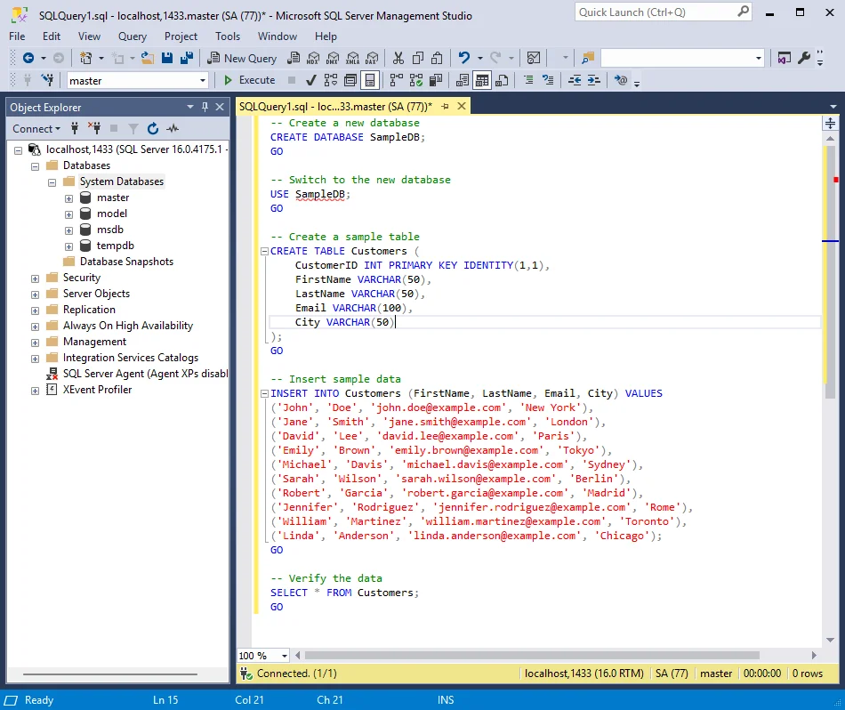

We just need to click on the `Execute` button or press <kbd>F5</kbd> to run it i.e. to create our `SampleDB` database.

Now, right on the `Databases` node (in the top left tree-view) and you'll see, we've now our DB:

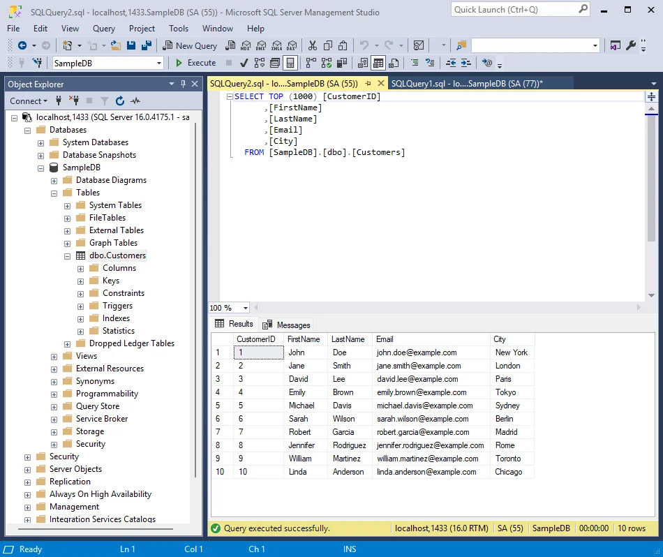

## The Excel part

Surf to [https://github.com/cavo789/vba_excel_sql](https://github.com/cavo789/vba_excel_sql) to retrieve my VBA code. That code is a VBA Class for Excel that makes really easy to access records stored in SQL server and output these data in an Excel sheet, keeping or not the connection alive (so you can do a Refresh at any time).

Please start Excel and create a new workbook.

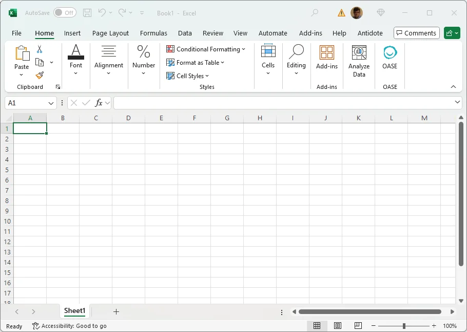

Press <kbd>ALT</kbd>+<kbd>F11</kbd> to open the VBE interface.

Right-click on *Microsoft Excel Objects* in the left *Project - VBAProject* pane and insert a new class.

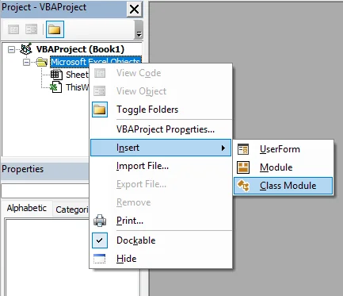

Go to [https://github.com/cavo789/vba_excel_sql/blob/master/src/SQL2Excel.xlsm/clsData.cls](https://github.com/cavo789/vba_excel_sql/blob/master/src/SQL2Excel.xlsm/clsData.cls) and click on the *Copy raw file* button

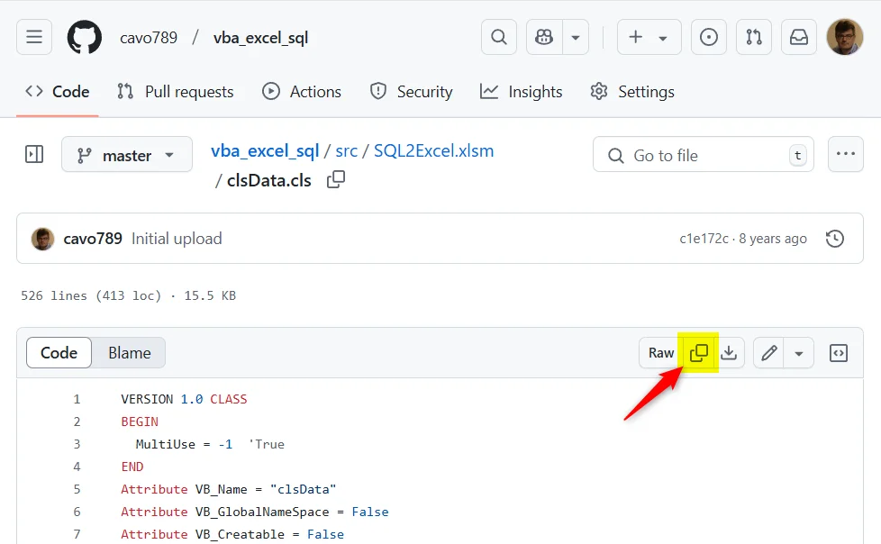

Paste the content in the VBE editor and remove the first lines as displayed below.
Also, see in the bottom left *Properties* pane, click on the *(Name)* field and type `clsData` as new name.

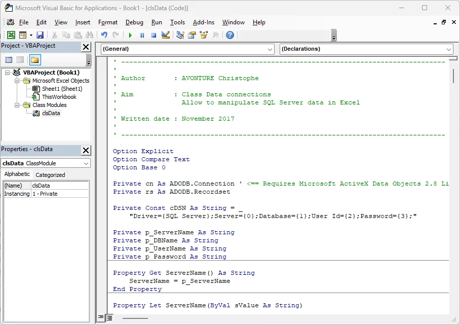

Now, please create a new module.

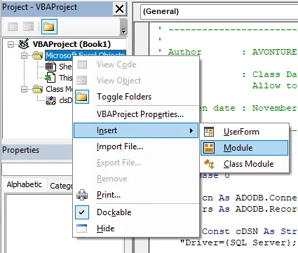

Go to [https://github.com/cavo789/vba_excel_sql/blob/master/src/SQL2Excel.xlsm/test.bas](https://github.com/cavo789/vba_excel_sql/blob/master/src/SQL2Excel.xlsm/test.bas) and click on the *Copy raw file* button.

Paste the content in the VBE editor and remove the first line as displayed below. Also, in the bottom left *Properties* page, click on the *(Name)* field and type `test` as new name.

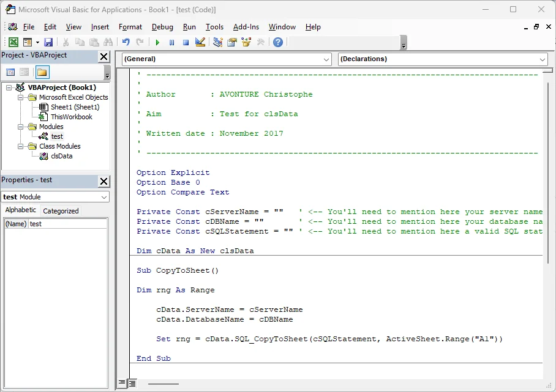

Still in the `test` module, pay attention to the very first lines:

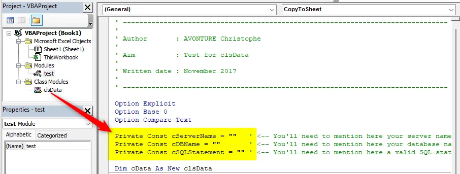

You'll need to update these values to match yours. If you've created the SQL Server instance as explained here above, please use these values:

<Snippet filename="clsData.bas" source="./files/clsData.bas" />

Still in the VBA, please click on the `Tools` menu then select `References`

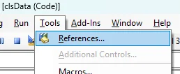

In the list, scroll down until you find `Microsoft ActiveX Data Objects 2.8 Library` and once retrieved, please select it.

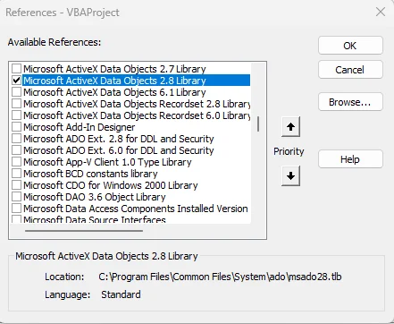

### Let's play with CopyToSheet

Still in the VBE interface, please select the `test` module and scroll down until the `CopyToSheet` subroutine.

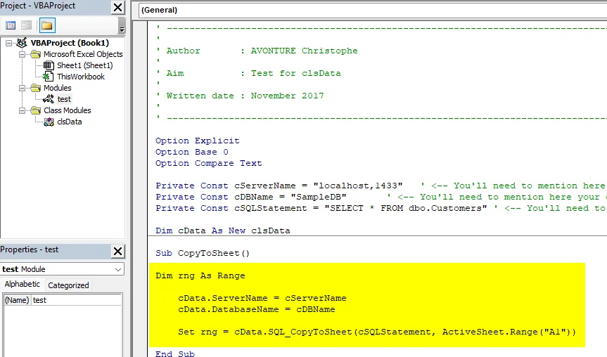

<AlertBox variant="caution" title="We need to provide our SQL Server credentials">
As illustrated on the image above, no username or password has been provided. Like this, the connection will be made using our Windows account but, in this article, we haven't made the required configuration for this.

Nevertheless, we've a SQL account called `SA` so we'll use it.

</AlertBox>

Please update the subroutine and add two lines:

<Snippet filename="module.bas" source="./files/module.bas" />

We're ready. Put your cursor in the `CopyToSheet` function, anywhere and press <kbd>F5</kbd> to execute it.

Nothing has happened? Are you sure?

Please switch from the VBE interface to your Excel worksheet and tadaaa

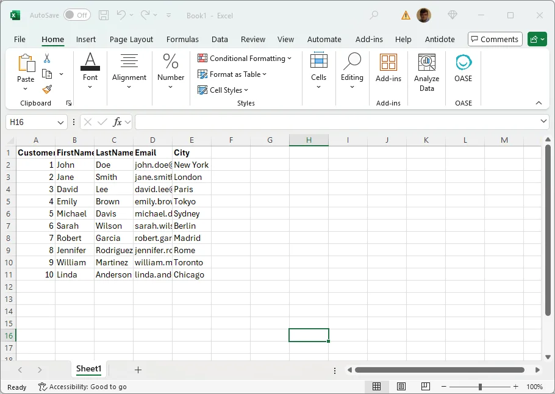

## The list of features

### CopyToSheet subroutine

#### Description

Get a recordset from the database and output it into a sheet. This function makes a copy not a link => there is no link with the database, no way to make a refresh.

#### Advantages

Fast

#### Inconvenient

Don't keep any link with the DB, records are copied to Excel

Sample code:

<Snippet filename="module.bas" source="./files/module.part2.bas" />

### AddQueryTable subroutine

#### Description

Create a query table in a sheet : create the connection, the query table, give it a name and get data.

#### Advantages

Keep the connection alive. The end user will be able to make a Data -> Refresh to obtain an update of the sheet.
If the user doesn't have access to the database, the records will well be visible but without any chance to refresh them

#### Inconvenient

If the parameter bPersist is set to True, the connection string will be in plain text in the file (=> avoid this if you're using a login / password).

#### Parameters

* `sSQL` : Instruction to use (a valid SQL statement like `SELECT ... FROM ...` or `EXEC usp_xxxx`)
* `sQueryName` : Internal name that will be given to the querytable
* `rngTarget` : Destination of the returned recordset (f.i. `Sheet1!$A$1`)
* `bPersist` : If true, the connection string will be stored and, then, the user will be able to make a refresh of the query

<AlertBox variant="danger" title="">
IF USERNAME AND PASSWORD HAVE BEEN SUPPLIED, THIS INFORMATION WILL BE SAVED IN CLEAR IN THE CONNECTION STRING !

</AlertBox>

Sample code

<Snippet filename="module.bas" source="./files/module.part3.bas" />

### RunSQLAndExportNewWorkbook subroutine

#### Description

This function will call the AddQueryTable function of this class but first will create a new workbook, get the data and format the sheet (add a title, display the "Last extracted date" date/time in the report, add autofiltering, page setup and more.

The obtained workbook will be ready to be sent to someone.

#### Parameters

* `sSQL` : Instruction to use (a valid SQL statement like `SELECT ... FROM ...` or `EXEC usp_xxxx`)
* `sReportTitle` : Title for the sheet
* `bPersist` : If true, the connection string will be stored and, then, the user will be able to make a refresh of the query

<AlertBox variant="danger" title="">
IF USERNAME AND PASSWORD HAVE BEEN SUPPLIED, THIS INFORMATION WILL BE SAVED IN CLEAR IN THE CONNECTION STRING !

</AlertBox>

Sample code

<Snippet filename="module.bas" source="./files/module.part4.bas" />
