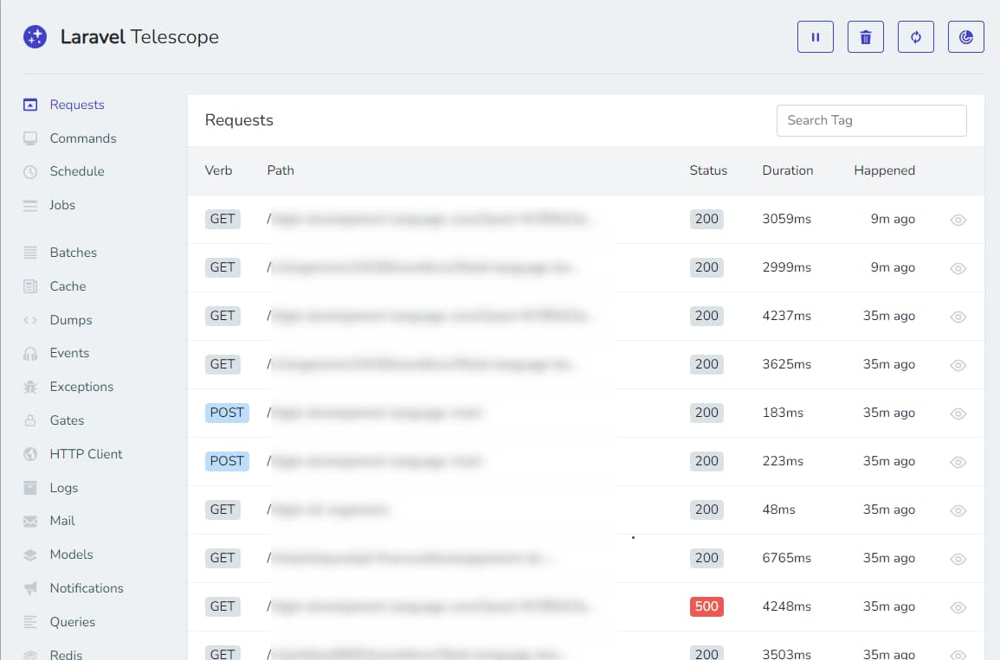

I don't work as often with Laravel (one of the most famous PHP frameworks) so I'm losing my reflexes a bit when it comes to debugging the code, e.g. when it comes to finding the queries that have been executed, the exceptions that have been thrown, the list of keys that have been created or read from the Redis cache, etc.

By installing [Laravel Telescope](https://laravel.com/docs/master/telescope), we can get realtime information about cache, logs, queries and models, exceptions, ... and this will help a lot to understand how the application is working and what is running.

Telescope is a great help for debugging and understanding your application, and installs like a dev dependency.

The last time I developed a Laravel application and installed it on the test server, I was able to follow what my user was doing in real time, see the exceptions he encountered and correct them ... even before he reported them to me.

Thanks to Telescope, not only did I have a perfect view of what was being collected, but I also had all the context: the user didn't have to tell me ‘That doesn't work...’. (without any details); I had everything at hand.

<!-- truncate -->

For an eloquent model f.i. we'll retrieve in Telescope (the default URL is `http://your_site/telescope`), we'll get the raw SQL so it's easy to copy/paste and run directly in pgadmin f.i.

For Redis cache f.i., we'll see keys and if they were retrieved (`hits`) or created (`set`).

Laravel Telescope can also be installed on a test server to see what the user is doing and get the full context on each request so when an exception was fired, we can retrieve it in the log, the exception message, the post data, the used URL and much more.

Telescope is a really big improvement about debugging a Laravel application. Consult the [official documentation](https://laravel.com/docs/master/telescope) to learn how to install and use it.
