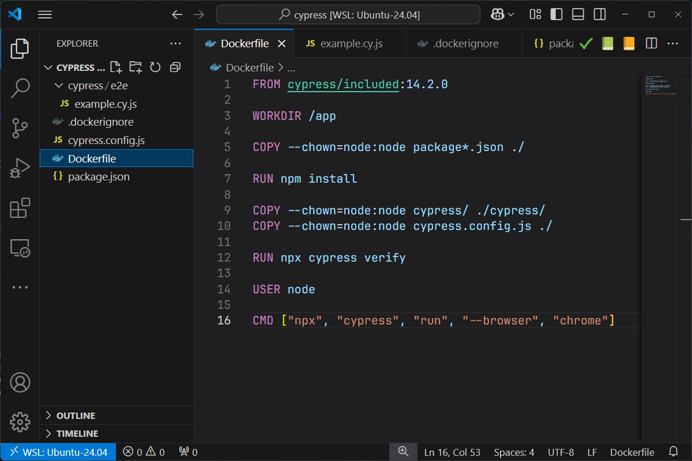
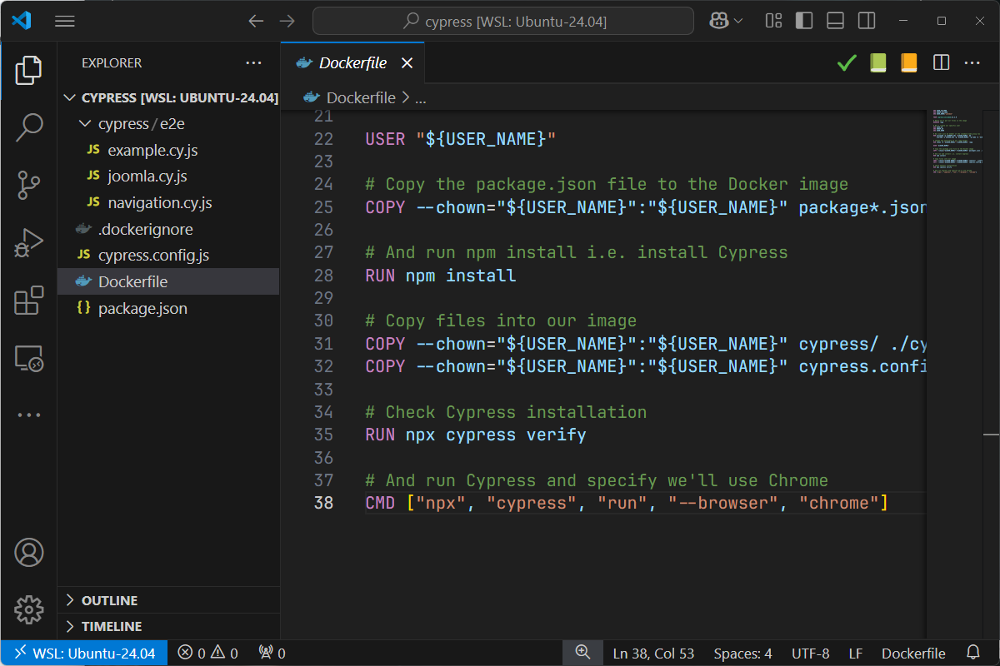

You've created a website for yourself or for a client, and how can you be sure that it will works?  OK, at the time you were working on it, of course it was working; the search form, the contact form, the various links were all functional, but how can you be sure of this over time? Wouldn't it be useful to have a procedure that would allow you to run several so-called ‘functional’ tests to check that everything is still working?  This could be part of the maintenance contract you offer your customer. 

What tool should you use for this type of requirement?

Cypress is a front-end testing tool that empowers developers to automate functional tests directly within the browser. It enables actions like navigating web pages, interacting with elements, submitting forms, and asserting content or URL changes, streamlining end-to-end and integration testing.

In june 2024, I've written an article about a PHP functional test tool called [Behat](/blog/behat-introduction), let's see how to proceed with Cypress which is a Javascript tool.

<!-- truncate -->

:::warning Spoiler alert
It's really easy to use Cypress and writing tests is pretty straightforward.  Unlike Behat, which requires a lot more skill and a lot more work to set up, Cypress is quick to get to grips with; troubleshooting is greatly simplified by taking screenshots as soon as an error is encountered and Cypress takes care of waiting for a page to load completely, unlike Behat.
:::

## Let's create some files and run a first test

Create a temporary directory like `mkdir -p /tmp/cypress && cd $_`.

Create the `package.json` file with the following content. The objective is to mention we need the `cypress` dependency and we'll define to commands, `open` and `run`.

<Snippets filename="package.json">

```json
{
    "name": "cypress_sandbox",
    "version": "1.0.0",
    "description": "Playing with cypress",
    "scripts": {
      "cypress:open": "cypress open",
      "cypress:run": "cypress run"
    },
    "devDependencies": {
      "cypress": "^12.17.4"
    }
}
```

</Snippets>

We also need a configuration file and that one has to be called `cypress.config.js`. Create that file with the content below.

In short, we'll define the URL to our local cypress engine to `http://localhost:3100`, we'll inform override the default port `3000` to `3100` and we'll specify we don't use a cypress support configuration file.

<Snippets filename="cypress.config.js">

```javascript
const { defineConfig } = require('cypress');

module.exports = defineConfig({
  e2e: {
    baseUrl: 'http://localhost:3100',
    port: 3100,
    supportFile: false,
  },
});
```

</Snippets>

Let's create a very stupid first test: we'll visit my blog and check that, somewhere, my full name appears:

<Snippets filename="cypress/e2e/example.cy.js">

```javascript
describe('Testing my blog', () => {
    it('Check my last name is somewhere', () => {
      cy.visit('https://www.avonture.be')
      cy.contains('Christophe Avonture')
    })
})
```

</Snippets>

An optional file to create is `.dockerignore`, it will tell Docker to not copy some files in our Docker image. In our tutorial here we don't really need it but it's always a good idea to have such file as a reminder to not forget that Docker can skip files with copying files and directories when building an image.

<Snippets filename=".dockerignore">

```text
node_modules
Dockerfile
.dockerignore
```

</Snippets>

Finally, last file to create, we'll create our own Docker image:

<Snippets filename="Dockerfile">

```Dockerfile
FROM cypress/included:14.2.0

WORKDIR /app

COPY --chown=node:node package*.json ./

RUN npm install

COPY --chown=node:node cypress/ ./cypress/
COPY --chown=node:node cypress.config.js ./

RUN npx cypress verify

USER node

CMD ["npx", "cypress", "run", "--browser", "chrome"]
```

</Snippets>

If we look in VSCode our current project, it will look like this:



To create our image and run Cypress, jump in a console and run this command: `clear ; docker build -t cypress-test . && docker run --rm cypress-test`.

If everything is running fine, you'll get this output:


:::success 
Right now, you've copied a few files, build a Docker image and run Cypress in a container and you've got a *All specs passed!* message.

If we take a few seconds to think about it, we've already created a first functional test, which is to make sure that our site is online and that the HTML content contains a set of words that we expect to find there.  If our site is generated by a CMS, for example, the fact that the test passes already proves that the whole database and PHP part has worked perfectly. A small test for us, a big step for our confidence in our web host.
:::

## Synchronize files between our host and the container

Nice, let's add a new test but, first, a question: *did we need to build our Docker image again and again?* For sure, no! If we don't have to update the `Dockerfile` or any settings, it's not needed.

But, so far, in our `Dockerfile`, we've used `COPY` statements to put our tests directly in the Docker image. That's not a problem at all; we simply need to tell Docker to ignore the files and used the ones on our host.

It's simple.

First, let's create a second test:

<Snippets filename="cypress/e2e/navigation.cy.js">

```javascript
describe('Navigation Test', () => {
    it('should navigate to the tags page', () => {
      cy.visit('https://www.avonture.be');
  
      cy.contains('a', 'Tags').click();
  
      cy.url().should('include', '/tags');
  
      cy.get('h1').should('contain', 'Tags');
    });
});
```

</Snippets>

In short, we want to go to the homepage then click on the **Tags** menu navigation item. We expect then that the URL of the new page will contain `/tags` and, too, we expect the new page HTML content will have a `h1` element with the word `Tags`.

And to run this new test, simply run `docker run --rm -v ./cypress:/app/cypress cypress-test`.

As you can see, it's working.


:::tip Mounting a volume
So, by using `-v ./cypress:/app/cypress`, we'll mount the folder `cypress` from our host in the `/app/cypress` folder in the container. By updating a test on our host, Docker will replicate the change in the container.
:::

### Retrieve screenshots

Ok, let's create a third test and this time we'll cause an error.

Please create a third file. 

:::caution
If you pay close attention, you'll notice that there's a spelling mistake, which is deliberate.
:::

<Snippets filename="cypress/e2e/joomla.cy.js">

```javascript
describe('Joomla Test', () => {
    it('use tags and display Joomla posts', () => {
      cy.visit('https://www.avonture.be');
  
      // Find the "TAGS" link and click it. Adjust the selector if needed.
      cy.contains('a', 'Tags').click();
  
      // Assert that the URL includes '/tags'.
      cy.contains('a', 'jomla').click();
    });
});
```

</Snippets>

Let's run Cypress once more: `docker run --rm -v ./cypress:/app/cypress cypress-test`.

When an error occurs, Cypress will take a screenshot as we can see on the image below:


As you can see on the image, Cypress has taken a screenshot and saved it in folder `/app/cypress/screenshots/`. That folder is inside the container and this is useless: we want to get it on our disk.

To do this, we'll need to update our Docker image to create a new user so, at the end, we'll be able to share our local host with the running Cypress instance and put on our disk screenshots created by Cypress.

Please replace your existing Dockerfile with this one:

<Snippets filename="Dockerfile">

```Dockerfile
ARG USER_ID=1000
ARG GROUP_ID=1000
ARG USER_NAME="johndoe"

FROM cypress/included:14.2.0

# Where we'll put our files in the image
WORKDIR /app

# We'll create our specific user
ARG USER_ID
ARG GROUP_ID
ARG USER_NAME

# Our user will be member of the standard node group too
RUN groupadd -g ${GROUP_ID} "${USER_NAME}" && \
    useradd -u ${USER_ID} -g "${USER_NAME}" -g node -m "${USER_NAME}"

# Change the ownership of our /app folder
RUN chown -R "${USER_NAME}":"${USER_NAME}" /app

USER "${USER_NAME}"

# Copy the package.json file to the Docker image
COPY --chown="${USER_NAME}":"${USER_NAME}" package*.json ./

# And run npm install i.e. install Cypress
RUN npm install

# Copy files into our image
COPY --chown="${USER_NAME}":"${USER_NAME}" cypress/ ./cypress/
COPY --chown="${USER_NAME}":"${USER_NAME}" cypress.config.js ./

# Check Cypress installation
RUN npx cypress verify

# And run Cypress and specify we'll use Chrome
CMD ["npx", "cypress", "run", "--browser", "chrome"]

```

</Snippets>

The script before will create a user called `johndoe` in the image (name didn't matter here) but, the most important thing is that the user will have a specific UID / GID.  

These parameters are build arguments and we've to initialise them like this: `clear ; docker build --build-arg USER_ID=$(id -u) --build-arg GROUP_ID=$(id -g) -t cypress-test .`

:::tip
The commands `id -u` and `id -g` will return the ID of our user (most probably `1000`) and his group ID (here too, more probably `1000`).
:::

It tells Docker to use our own user id and group id (the one we're using on our host) when building the image. So, in short, `johndoe` will be us i.e. if Docker create a file on our disk, the file will be owned by the user having the same UID / GID and thus, we.

Now, this thing explained, we can run the full command like this: `clear ; docker build --build-arg USER_ID=$(id -u) --build-arg GROUP_ID=$(id -g) -t cypress-test . && docker run --rm -v ./cypress:/app/cypress cypress-test`.

We're still mounting our current `cypress` folder with the container thanks the `-v ./cypress:/app/cypress` flag but it's **a two-way direction**. Now, files created by Cypress in the container (in folder `/app/cypress`) will be copied on our disk too. And because we've taken time to create a specific user in the Docker image, it means files created by Docker will be owned by us.

Our current workspace looks like this in VSCode:



By running `docker run --rm -v ./cypress:/app/cypress cypress-test` once more, now, we can see changes:


Cypress has taken a screenshot and save it on our disk. Now, it's really clear, by looking at the image, that the error concern the check `-contains a, jomla` on the Tags page. Uh oh, there is a typo.

Edit the file `cypress/e2e/joomla.cy.js` and solve the typo by typing `cy.contains('a', 'joomla').click();`. Run Cypress once more, the error is now solved and the screenshot has disappeared.

## Conclusion

The idea of this tutorial is to keep things simple, so we won't go any further here. 

If you are a French-speaking visitor, jump to [Openclassrooms](https://openclassrooms.com/fr/courses/8157231-automatisez-des-tests-fonctionnels-pour-le-web-avec-cypress), there is a very nice tutorial about Cypress.
