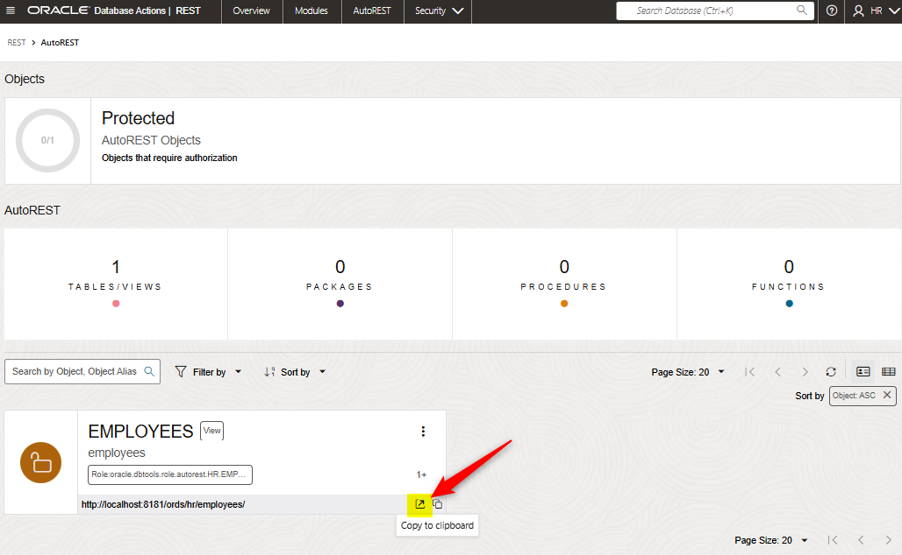

<!-- cspell:ignore ords,ORCLPDB,sqlplus,sysdba,hr,admin,TABLESPACE,AUTOREST,instring -->

In a previous article ([Running Oracle Database Server as a Docker container](/blog/docker-oracle-database-server)), we've created a Docker container called `oracle-db` where a Human Resources database is running.

In this article we'll partially expose the database on the web using OpenAPI so, in short, we'll allow allowed people to access to, f.i., `http://oursite/api/employees` to get the list of all employees.

Exactly the same way we've done with PostgREST (see my [Don't query your PostgreSQL db anymore, prefer PostgREST](/blog/docker-postgrest)) but, this time, with an Oracle database.

And the magic will happen thanks **[Oracle REST Data Services](https://www.oracle.com/database/technologies/appdev/rest.html)** aka **ords**.

<!-- truncate -->

In the previous article ([Running Oracle Database Server as a Docker container](/blog/docker-oracle-database-server)), we've created a Docker container called `oracle-db` where a Human Resources database is running.

Please read that article and follow steps so, before continuing here, you've a running Docker container like describe below.

## Some prerequisites

* You've a running Docker container called `oracle-db`,
* The container is thus running on your `localhost`,
* The port number to access your database is `1521`,
* The credentials to use is `SYS` (or `SYSTEM`) and `admin` for the password,
* The container contains a database called `ORCLPDB1` (also called service name) which is the Human Resources sample of Oracle (refer to the mentioned article) and
* Our database `oracle-db` is running on a network called `oracle`.

## Download a Docker image for Oracle REST Data Services

Unlike the Docker Oracle Database Server image, we don't need any credentials for downloading the official [Oracle ORDS]((https://container-registry.oracle.com/ords/ocr/ba/database/ords-developer)) image.

Simply run `docker pull container-registry.oracle.com/database/ords-developer:latest` to get it. It's a 2.2 GB file size image.

```bash
docker pull container-registry.oracle.com/database/ords-developer:latest
```

## Create an Oracle ORDS container

We'll need to proceed step-by-step.

### Create a volume for the ORDS configuration

ORDS requires two folders, one for what he called **his secrets** and one for **his configuration files**. Let's use a Docker self managed volume for the configuration files so please run `docker volume create ords_config` in your console.

### Configure the connection string

In order to be able to start ORDS, the official doc states we need to create a file called `conn_string.txt` with our connection string. In our use case, here is the file we need to create:

```bash
mkdir -p ords_secrets
chmod 777 ords_secrets
echo 'CONN_STRING=SYS/admin@oracle-db:1521/ORCLPDB1' > ords_secrets/conn_string.txt
```

:::tip
If you've a doubt about which value has to be used as `service_name`; start a sqlplus console (`docker exec -it oracle-db sqlplus sys/admin@ORCLPDB1 as sysdba`) and run `SELECT global_name FROM global_name;` in SQL*Plus.


:::

The official ORDS Docker image comes with APEX (which is the abbreviation for *Oracle Application Express*).

Based on the documentation, *Oracle Application Express (APEX) is a low-code development platform that enables you to build scalable, secure enterprise apps, with world-class features, that can be deployed anywhere. See [https://apex.oracle.com/](https://apex.oracle.com/) for more information.*

For our needs, we just want ORDS; we don't need APEX. For this purpose, we'll initialise the `IGNORE_APEX` OS variable to `TRUE`.

### Create the container

To create our ORDS (without APEX) container; please run:

```bash
docker run -d --rm \
    --name oracle-ords \
    --network oracle \
    -p 8181:8181 \
    -e IGNORE_APEX=TRUE \
    -v ./ords_secrets/:/opt/oracle/variables \
    -v ords_config:/etc/ords/config/ \
    container-registry.oracle.com/database/ords-developer:latest
```

:::info The `docker run` explained

* `-d`: the ORDS will run as a daemon service,
* `--rm`: once the service is terminated, the Docker container will be removed,
* `--network`: we should run ORDS on the same network than our database; i.e. `oracle`
* `-p 8181:8181`: we've to map the intern port 8181 used by ORDS on our host and, for simplicity, we'll expose the port 8181 also,
* `-e IGNORE_APEX=TRUE`: as mentioned, we want ORDS; not APEX so tells Docker to not install APEX,
* `-v ./ords_secrets/:/opt/oracle/variables`: as stated in the documentation, we need to provide a file called `conn_string.txt` and to map that file in the `/opt/oracle/variables` inside the container and, finally,
* `-v ords_config:/etc/ords/config/`: we'll use a self-managed Docker volume to keep the configuration files of ORDS.
:::

That command will add the ORDS layer in your database (based on the connection string; which is `ORCLPDB1` for us).


:::caution On subsequent runs, we shouldn't provide connection string anymore.
Once ORDS has been installed as done here above, if you need to rerun the ORDS container, we should no more provide the secret so we have to remove the `-v ./ords_secrets/:/opt/oracle/variables` flag.

If you need to run the container once more; here is the command line:

```bash
docker run -d --rm \
    --name oracle-ords \
    --network oracle \
    -p 8181:8181 \
    -v ords_config:/etc/ords/config/ \
    container-registry.oracle.com/database/ords-developer:latest
```

:::

### We need to create our user in our database

Before being able to use ORDS and access to objects using an HTTP request, we should create a new user in our database and give him some rights.

Run `docker exec -it oracle-db sqlplus sys/admin@ORCLPDB1 as sysdba` to start a SQL*Plus console and connect to the PDB database.

We need to create a user for ORDS; let's say user `hr`. Please run this statement: `CREATE USER hr IDENTIFIED BY admin;`

Then grant permissions: `GRANT CONNECT, RESOURCE, UNLIMITED TABLESPACE TO hr;`


Once created, we need to exit the console (started using the `sys` user) and reconnect with our user.

Type thus `exit` to quit the sqlplus console and run `docker exec -it oracle-db sqlplus hr/admin@ORCLPDB1`.

Once back in the sqlplus console (logged in as user `hr`), please run : `EXECUTE ORDS.ENABLE_SCHEMA;`.


*(read [ORDS 101: Enabling Oracle Schemas for HTTPS/REST](https://www.thatjeffsmith.com/archive/2023/09/ords-101-enabling-oracle-schemas-for-https-rest/) if you want deeper info)*

:::caution
If you get an error at this level, it means ORDS wasn't installed in your database. Please read again the **Installing ORDS on your DB** chapter.
:::

#### Start ORDS web interface

At this stage, we've installed ORDS, configured our database to use it and we've created a user called `hr`. We can surf to `http://localhost:8181/ords` and connect to the ORDS dashboard:


:::note
APEX wasn't installed and thus disabled
:::

Use `hr` and `admin`, our custom user, for the login page:


Right now, we can ask ORDS to see the list of objects already accessible; simply surf to `http://localhost:8181/ords/hr/open-api-catalog/` to get ... an empty list.

This is normal since we should specify which object (a table, a view, a stored procedure) can be accessible or not. But, yes, by accessing `http://localhost:8181/ords/hr/open-api-catalog/` and getting a JSON answer; we can confirm ORDS is running fine.

The `http://localhost:8181/ords/hr/open-api-catalog/` page is called the **Schema Metadata** ([documentation](https://docs.oracle.com/en/database/oracle/oracle-rest-data-services/21.4/aelig/developing-REST-applications.html#GUID-55736274-502E-4511-B232-829924334FA2)).

#### REST enable database objects

So, we need to enable each object one by one. The easier way is to use [Oracle SQL Developer](https://www.oracle.com/be/database/sqldeveloper). If you don't have it, just download it for free.


Create a new connection with these settings:

* `Name`: `Human Resources - ORDS` (or anything else)
* `Username`: `hr`,
* `Role`: `default`,
* `Password`: `admin`,
* `Hostname`: `127.0.0.1`,
* `Port`: `1521` and
* `Service name`: `orclpdb1`


Click on the `Save` button then on the `Connect` one.

Just after the login, by clicking on the list of tables or views, there is nothing.

This is normal, we've just created our `hr` user and the associated `hr` schema and we don't have objects in that schema.


##### Adding an employee view in our hr schema

Let's connect to our database and display the list of employees: please run `docker exec -it oracle-db sqlplus sys/admin@ORCLPDB1 as sysdba`; then `SELECT EMPLOYEE_ID, FIRST_NAME, LAST_NAME, EMAIL FROM SYSTEM.EMPLOYEES;`.


Now, we're sure we've access to the table, let's create a view in our `hr` schema to display the table content:

* run `GRANT SELECT ON SYSTEM.EMPLOYEES TO hr;` and
* create the view by running `CREATE VIEW HR.EMPLOYEES AS SELECT EMPLOYEE_ID, FIRST_NAME, LAST_NAME, EMAIL, PHONE_NUMBER, HIRE_DATE, JOB_ID, SALARY, COMMISSION_PCT, MANAGER_ID, DEPARTMENT_ID FROM SYSTEM.EMPLOYEES;`.

If we wish to check our view:

* Type `exit` in the sqlplus console since you're connected as `sys`,
* In the Linux console, run `docker exec -it oracle-db sqlplus hr/admin@ORCLPDB1` to connect as `hr` then
* run `SELECT * FROM HR.EMPLOYEES;`.

As you can see, you'll obtain the list of employees.

So, at this stage, we've added a view called `employees` in our `hr` schema and it works.

:::caution Don't use SELECT * FROM
It's a very bad practice to use `SELECT * FROM ...`, always make sure to select the needed fields.
:::

Go back to the Oracle SQL Developer interface, right-click on the `Views` node and choice `Refresh`.

You'll see the added view:


Right-click on the `EMPLOYEES` view and click on `Enable REST Service...`.


Make sure to check the `Enable object` checkbox, give a name to your object and, for this small tutorial, uncheck the `Authorization required` checkbox.


Click on the `Next` button and just pay attention on the `SQL` tab:


You'll get the DDL to run in a console if you want to REST enable the table by code; not by using the GUI.

The last part is to jump now in the ORDS website (`http://localhost:8181/ords/hr/_sdw/?nav=rest-workshop`). Please refresh the page and you'll now see you've one object in the `AUTOREST` area:

.

Click on that area and you'll see the object (which is a view) we'll REST enabled previously:



Look at the *Open in a new tab* icon on the image above. Click on that button and you'll get your records as a JSON response:


The `http://localhost:8181/ords/hr/employees/` is called the **Object Data** ([documentation](https://docs.oracle.com/en/database/oracle/oracle-rest-data-services/21.4/aelig/developing-REST-applications.html#GUID-0B17836D-E5B5-4B45-A9DA-0ABF62426EDF))

Since it's nothing more than a URL, you can use it with any tools you want, f.i. using `curl`. The command to run is `curl http://localhost:8181/ords/hr/employees/ | jq`.


###### And what about the OpenAPI catalog

Please go back to your browser and access `http://localhost:8181/ords/hr/open-api-catalog/` again.

This time, you'll see that you've one item called `EMPLOYEES`.

If you want to get the description of that *resource*, the page `http://localhost:8181/ords/hr/open-api-catalog/employees/` can be visited to get f.i. the list of fields exposed.

That page is called the **Object Metadata** ([documentation](https://docs.oracle.com/en/database/oracle/oracle-rest-data-services/21.4/aelig/developing-REST-applications.html#GUID-B870CF7E-4A19-4646-ACB4-84CC9FD5967E))

Let's create a new view for the fun:

* Run `docker exec -it oracle-db sqlplus sys/admin@ORCLPDB1 as sysdba` then
* In the SQL console, please run `GRANT SELECT ON SYSTEM.DEPARTMENTS TO HR;` followed by
* `CREATE VIEW HR.DEPARTMENTS AS SELECT DEPARTMENT_ID, DEPARTMENT_NAME, MANAGER_ID, LOCATION_ID FROM SYSTEM.DEPARTMENTS;` and
* Jump in the Oracle SQL Developer interface, refresh the list of view, right-click on the new `departments` view

Now, by refreshing `http://localhost:8181/ords/hr/open-api-catalog/` again, you'll see you've now a second item called `DEPARTMENTS`.


##### Working with REST

Go to `http://localhost:8181/ords/hr/_sdw/?nav=rest-workshop` or, from the hamburger menu, click on the `REST` item.


### Using paging, filtering and ordering options on the querystring

When accessing to an endpoint (like `http://localhost:8181/ords/hr/employees/`), we can manipulate the URL to add parameters like paging, filtering or ordering options.

These are called **JSON QBE** for JSON query-by-example.

See the official documentation: [https://docs.oracle.com/en/database/oracle/simple-oracle-document-access/adsdi/overview-soda-filter-specifications-qbes.html](https://docs.oracle.com/en/database/oracle/simple-oracle-document-access/adsdi/overview-soda-filter-specifications-qbes.html)

#### Pagination

> [Doc](https://docs.oracle.com/en/database/oracle/oracle-rest-data-services/21.4/aelig/developing-REST-applications.html#GUID-6B5B51E6-0F35-4FB6-B271-FCC31E835347)

Unless specific configuration, ORDS will use pagination i.e will limit the list of records to 25 rows.

So, if you've more than 25 employees, the endpoint `http://localhost:8181/ords/hr/employees/`

By accessing a "full" page like `http://localhost:8181/ords/hr/employees/`, we'll in fact just receive a specific number of records (as configured in ORDS). At the end of the JSON answer, there will be navigation links:


As you can see on the image; the JSON answer will provide a list of records (in an `items` so-called array) then a few properties like `hasMore` (true/false), `limit` i.e. the number of rows in each call, `offset` is the "page" (when 0 the first 25 rows are displayed, when 1 then rows 26 till 50, ...), `count` is the number of rows in the answer.

So, while `hasMore` is `true`, there are still records to obtain with a subsequent request.

There are two parameters to control paging of result data: `offset` and `limit`.

So we can run multiple requests like `http://localhost:8181/ords/hr/employees/?offset=25`, `http://localhost:8181/ords/hr/employees/?offset=50` and so on.

We can define the number of records by page using the `limit` querystring parameter: `http://localhost:8181/ords/hr/employees/?limit=100`.

:::note
The official documentation strongly discourages to remove the limit (and thus ask all records at once). For this reason there is no way to remove the limit. If you really wish to get the full list, try with a very high number like `limit=1000000` (one million).
:::

#### Filtering

The general syntax is using `/?=q{"column":{"$eq":"value"}}`.

##### Greater than

For instance, who earn more than 20,000€ as salary? `http://localhost:8181/ords/hr/employees/?q={"salary":{"$gt":20000}}` will apply a filter on `salary > 20000`.


##### Equal

To find all employees called `Steven`: `http://localhost:8181/ords/hr/employees/?q={"first_name":{"$eq":"Steven"}}`


##### Instring / contains / like

Employees with the pattern `alex` in their first name: `http://localhost:8181/ords/hr/employees/?q={"first_name":{"$instr":"alex"}}` (will match f.i. `Alexander` or `Alexis`).


Who is working as ICT? Here the like operator will be the one to use: `http://localhost:8181/ords/hr/employees/?q={"job_id":{"$like":"IT_%"}}` (`IT_%` means *starts with*)


##### Complex filtering

We can also use AND like in this example: `http://localhost:8181/ords/hr/employees/?q={"first_name":{"$instr":"alex"},"salary":{"$gt":5000}}` i.e. retrieve all people having `alex` in their first name and earning more than 5,000€


:::info Using complex filtering
The following URL `http://localhost:8181/ords/hr/employees/?q={"job_id":{"$like":"%CLERK"},"salary":{"$gt":2899},"hire_date":{"$gt":{"$date":"2016-12-31T12:59:59Z"}}}` will return every employee who:

* working as clerk (`job_id` ending by the `CLERK` word),
* having a salary greater then 2,899€ and
* hired as from 1st January 2017.


#### Sorting

The general syntax is using `/?=q{"$orderby":{"fieldname1":"asc","fieldname2":"desc"}}`.

To sort on the first name desc and, then based on the salary (the higher first): `http://localhost:8181/ords/hr/employees/?q={"$orderby":{"first_name":"desc","salary":"desc"}}`.


### Swagger

ORDS can generate an `openapi.json` file to use with Swagger. Read more [Manage & Monitor Oracle Database with REST APIs](https://www.thatjeffsmith.com/archive/2022/08/manage-monitor-your-oracle-database-with-rest-apis/)

## More lectures

* [ORDS best practices topics (www.oracle.com)](https://www.oracle.com/database/technologies/appdev/rest/best-practices/)
* [Installation, Configuration, and Development Guide (docs.oracle.com)](https://docs.oracle.com/en/database/oracle/oracle-rest-data-services/21.4/aelig/toc.htm#GUID-A1CD111F-724B-4E91-8202-FA899EE521F1)
* [Jeff Smith blog - Articles about ORDS](https://www.thatjeffsmith.com/archive/tag/ords/)
  * [Adding HTTP(S) Access Logs for ORDS Standalone](https://www.thatjeffsmith.com/archive/2022/09/adding-https-access-logs-to-ords-standalone/)
