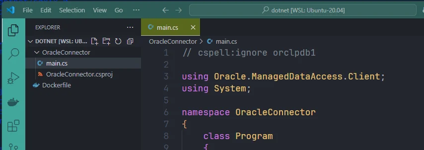
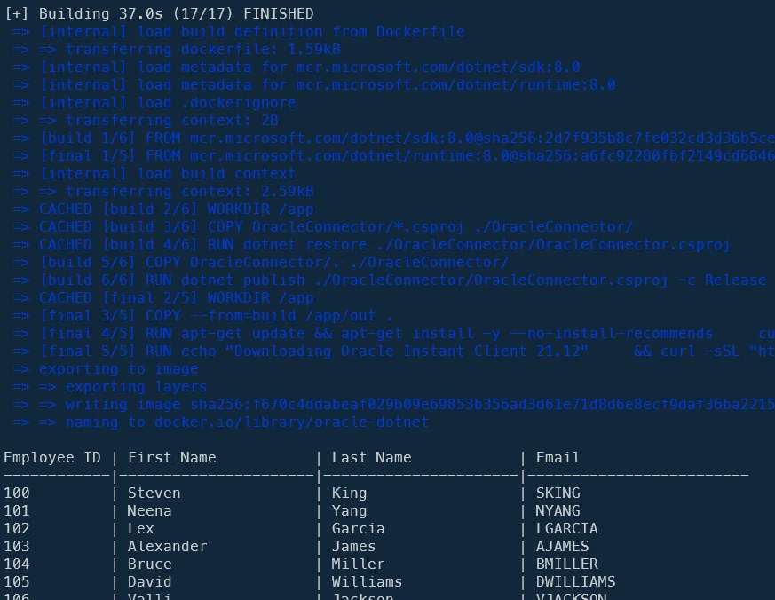
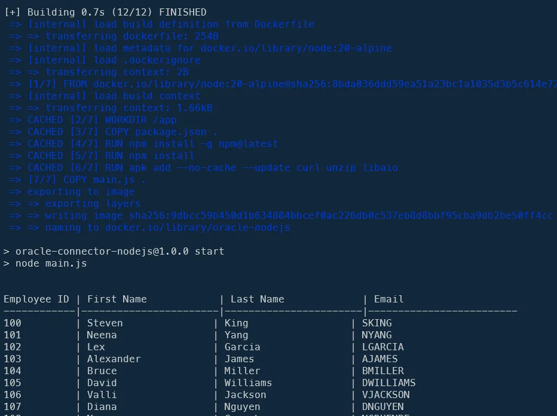
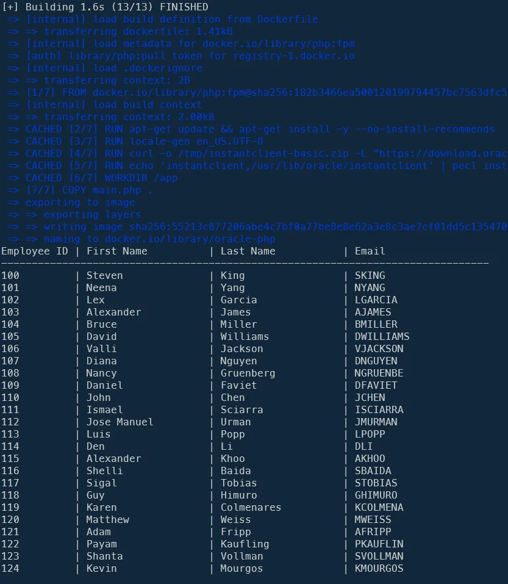

In a previous article (<Link to="/blog/docker-oracle-database-server">Running Oracle Database Server as a Docker container</Link>), we've created a Docker container called `oracle-db` where a Human Resources database is running.

This time, let's play with .Net, NodeJS, PHP and Python to access to it and display records.

For each language, we'll build a Docker image with all the required stuff like Oracle Instant Client then we'll create a small script to connect to the `employees` table and display records.

The idea is then to provide a very quick skeleton for starting a project in those languages and if you need to directly connect to an Oracle database.

<!-- truncate -->

In the <Link to="/blog/docker-oracle-database-server">Running Oracle Database Server as a Docker container</Link> article, we've created a Docker container called `oracle-db` where a Human Resources database is running.

Please read that article and follow steps so, before continuing here, you've a running Docker container like describe below.

## Some prerequisites

<StepsCard
  title="Before you begin make sure..."
  variant="prerequisites"
  steps={[
    "You've a running Docker container called `oracle-db`,",
    "The container is thus running on your `localhost`,",
    "The port number to access your database is `1521`,",
    "The credentials to use is `SYS` (or `SYSTEM`) and `admin` for the password,",
    "The container contains a database called `ORCLPDB1` (also called service name) which is the Human Resources sample of Oracle (refer to the mentioned article) and",
    "Our database `oracle-db` is running on a network called `oracle`.",
  ]}
/>

## The code samples were largely created using AI

Because it's fast to do and also because I don't know .Net and very few NodeJs, I've used Google Gemini for building my samples below. Sometimes like for .Net, it was almost ready-to-use. Sometimes for PHP, it was more difficult and it took a lot on fiddling on my part to find the right configuration.

Nevertheless the objective of this article was to provide the minimum set of files in order to connect to an Oracle DB, run a SELECT query and display results; not to have best-in-class codebase.

## Access our Oracle DB container using .Net

First language by alphabetical order; let's play with a .Net container:

<Terminal>
$ mkdir -p /tmp/oracle/dotnet && cd $_
</Terminal>

Also create this directory:

<Terminal>
$ mkdir -p /tmp/oracle/dotnet/OracleConnector
</Terminal>

Let's create a Dockerfile:

<Snippet filename="Dockerfile" source="./files/Dockerfile" />

Now, the DotNet part. We need two files: `OracleConnector/OracleConnector.csproj` and `OracleConnector.csproj/main.cs`.

<Snippet filename="OracleConnector/OracleConnector.csproj" source="./files/OracleConnector.csproj" />

<Snippet filename="OracleConnector/main.cs" source="./files/main.cs" />

This is how your project looks like in VSCode:



Still in the console, located in folder `/tmp/oracle/dotnet`, create the Docker image and run the container (and thus the script): `clear ; docker build -t oracle-dotnet . && docker run --rm -it --network oracle oracle-dotnet`.



Job done, our .Net code has accessed to the list.

## Access our Oracle DB container using NodeJS

Second in the alphabetical order, let's play with a NodeJS container:

<Terminal>
$ mkdir -p /tmp/oracle/nodejs && cd $_
</Terminal>

Let's create a Dockerfile:

<Snippet filename="Dockerfile" source="./files/Dockerfile.part2" />

We also need these files:

<Snippet filename="package.json" source="./files/package.json" />

<Snippet filename="main.js" variant="js">

<!-- cspell:disable -->

```js
// cspell:ignore orclpdb1, oracledb

const oracledb = require("oracledb");

async function run() {
  let connection;

  try {
    const dbHost = process.env.ORACLE_HOST || "oracle-db";
    const dbPort = process.env.ORACLE_PORT || "1521";
    const dbService = process.env.ORACLE_SERVICE || "orclpdb1";
    const dbUser = process.env.ORACLE_USER || "SYSTEM";
    const dbPassword = process.env.ORACLE_PASSWORD || "admin";

    const connectConfig = {
      user: dbUser,
      password: dbPassword,
      connectString: `${dbHost}:${dbPort}/${dbService}`,
    };

    connection = await oracledb.getConnection(connectConfig);

    const result = await connection.execute(
      `SELECT employee_id, first_name, last_name, email FROM employees WHERE ROWNUM <= 25`, // Assuming your table is named 'EMPLOYEES'
    );

    console.log(
      "\nEmployee ID | First Name           | Last Name             | Email",
    );
    console.log(
      "------------|----------------------|-----------------------|-------------------------",
    );

    for (const row of result.rows) {
      const employeeId = row[0];
      const firstName = row[1];
      const lastName = row[2];
      const email = row[3];
      console.log(
        `${employeeId.toString().padEnd(12)}| ${firstName.padEnd(21)}| ${lastName.padEnd(21)}| ${email}`,
      );
    }
  } catch (err) {
    console.error("Error connecting to or querying Oracle:", err);
  } finally {
    if (connection) {
      try {
        await connection.close();
      } catch (err) {
        console.error("Error closing connection:", err);
      }
    }
  }
}

run();
```

<!-- cspell:enable -->

</Snippet>

Still in the console, located in folder `/tmp/oracle/nodejs`, create the Docker image and run the container (and thus the script): `clear ; docker build -t oracle-nodejs . && docker run --rm -it --network oracle oracle-nodejs`.



Nice! As you can see, we can quite easily access to our Oracle database using NodeJS.

## Access our Oracle DB container using PHP

And, last in the alphabetical order; let's finish with a PHP container:

<Terminal>
$ mkdir -p /tmp/oracle/php && cd $_
</Terminal>

And there, let's create a Dockerfile:

<Snippet filename="Dockerfile" source="./files/Dockerfile.part3" />

Then let's create a PHP script (*generated using AI*)

<!-- cspell:disable -->

<Snippet filename="main.php" source="./files/main.php" />

Still in the console, located in folder `/tmp/oracle/php`, create the Docker image and run the container (and thus the script): `clear ; docker build -t oracle-php . && docker run --rm -it --network oracle oracle-php`.



## Access our Oracle DB container using Python

Let's create a Python script now:

<Terminal>
$ mkdir -p /tmp/oracle/python && cd $_
</Terminal>

And his Dockerfile; the only thing we need (except Python) is to install the `oracledb` dependency. Quite straightforward.

<Snippet filename="Dockerfile" source="./files/Dockerfile.part4" />

Then let's create a Python script (*generated using AI*)

<!-- cspell:disable -->

<Snippet filename="main.py" source="./files/main.py" />

Still in the console, located in folder `/tmp/oracle/python`, create the Docker image and run the container (and thus the script): `clear ; docker build -t oracle-python . && docker run --rm -it --network oracle oracle-python`.


Nice! As you can see, we can quite easily access to our Oracle database using Python.

## Conclusion

You know what? I've more than 15 years of experience with PHP and just 6 months using Python and, if we look at the Dockerfile of both languages, there is no doubt at all; the one for Python is so much easier to read and to configure. I had pain to make the one of PHP to works and just none for Python since it's just one dependency to install and that's all.

And if we look at PHP versus Python code, they are quite similar but, I should admit, the one for Python has my preference because we don't need to check for errors in multiple places, we can more easily define the data types of variables, the echo statement is more readable, ...
