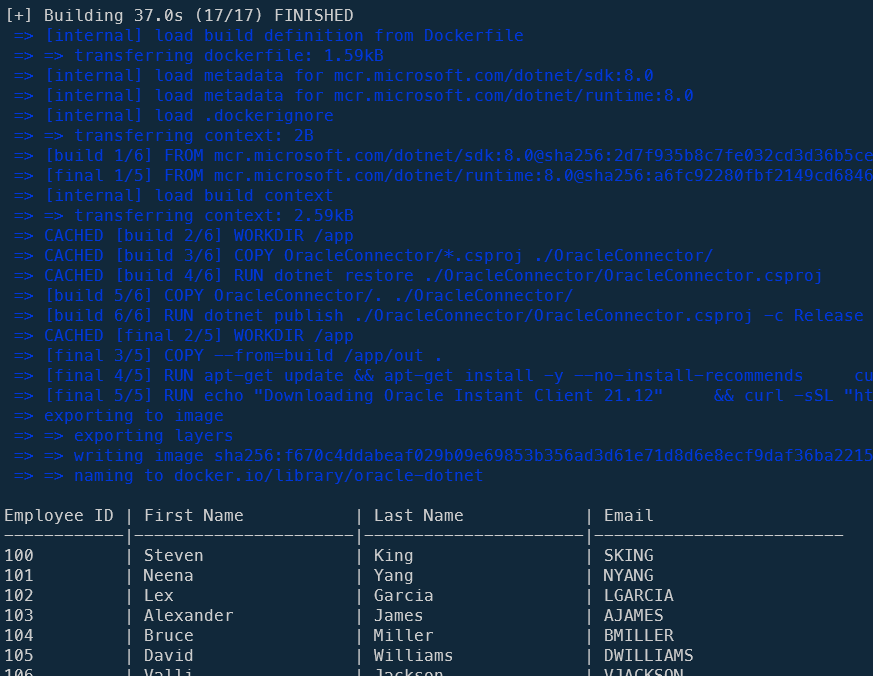
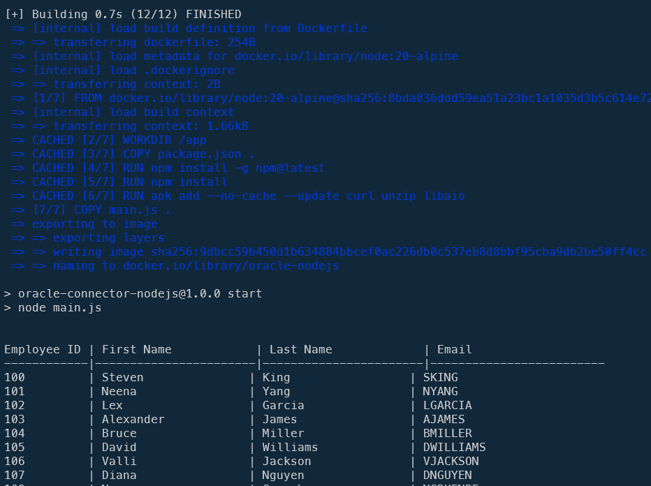
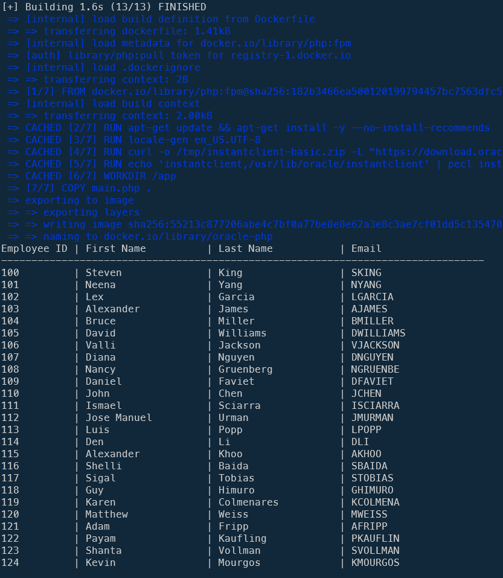
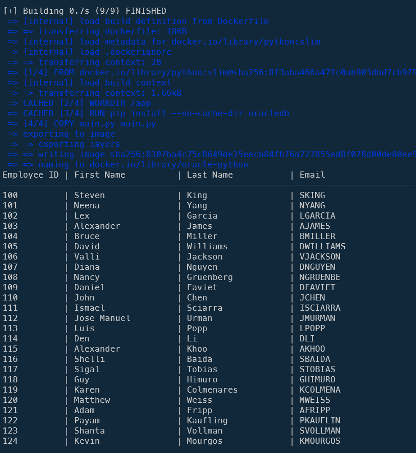

In a previous article ([Running Oracle Database Server as a Docker container](/blog/docker-oracle-database-server)), we've created a Docker container called `oracle-db` where a Human Resources database is running.

This time, let's play with .Net, NodeJS, PHP and Python to access to it and display records.

For each language, we'll build a Docker image with all the required stuff like Oracle Instant Client then we'll create a small script to connect to the `employees` table and display records.

The idea is then to provide a very quick skeleton for starting a project in those languages and if you need to directly connect to an Oracle database.

<!-- truncate -->

In the [Running Oracle Database Server as a Docker container](/blog/docker-oracle-database-server) article, we've created a Docker container called `oracle-db` where a Human Resources database is running.

Please read that article and follow steps so, before continuing here, you've a running Docker container like describe below.

## Some prerequisites

* You've a running Docker container called `oracle-db`,
* The container is thus running on your `localhost`,
* The port number to access your database is `1521`,
* The credentials to use is `SYS` (or `SYSTEM`) and `admin` for the password,
* The container contains a database called `ORCLPDB1` (also called service name) which is the Human Resources sample of Oracle (refer to the mentioned article) and
* Our database `oracle-db` is running on a network called `oracle`.

## The code samples were largely created using AI

Because it's fast to do and also because I don't know .Net and very few NodeJs, I've used Google Gemini for building my samples below. Sometimes like for .Net, it was almost ready-to-use. Sometimes for PHP, it was more difficult and it took a lot on fiddling on my part to find the right configuration.

Nevertheless the objective of this article was to provide the minimum set of files in order to connect to an Oracle DB, run a SELECT query and display results; not to have best-in-class codebase.

## Access our Oracle DB container using .Net

First language by alphabetical order; let's play with a .Net container:

```bash
mkdir -p /tmp/oracle/dotnet && cd $_
```

Also create this directory:

```bash
mkdir -p /tmp/oracle/dotnet/OracleConnector
```

Let's create a Dockerfile:

<details>

<summary>Dockerfile</summary>

```dockerfile
# cspell:ignore libaio1,instantclient,libclntsh,libocci,ldconfig

FROM mcr.microsoft.com/dotnet/sdk:8.0 AS build

WORKDIR /app

COPY OracleConnector/*.csproj ./OracleConnector/
RUN dotnet restore ./OracleConnector/OracleConnector.csproj

COPY OracleConnector/. ./OracleConnector/
RUN dotnet publish ./OracleConnector/OracleConnector.csproj -c Release -o out

FROM mcr.microsoft.com/dotnet/runtime:8.0 AS final

WORKDIR /app

COPY --from=build /app/out .

# Install necessary Oracle Instant Client libraries
ARG ORACLE_INSTANT_CLIENT_VERSION=21.12
ARG ORACLE_DOWNLOAD_URL=https://download.oracle.com/otn_software/linux/instantclient/instantclient-basic-linuxx64.zip

RUN apt-get update && apt-get install -y --no-install-recommends \
    curl \
    unzip \
    libaio1 \
    && rm -rf /var/lib/apt/lists/*

RUN curl -sSL "${ORACLE_DOWNLOAD_URL}" -o instantclient.zip \
    && mkdir -p /usr/lib/oracle/instantclient \
    && unzip -qq instantclient.zip -d /usr/lib/oracle/instantclient \
    && rm instantclient.zip \
    && ln -s /usr/lib/oracle/instantclient/libclntsh.so.${ORACLE_INSTANT_CLIENT_VERSION}.1 /usr/lib/oracle/instantclient/libclntsh.so \
    && ln -s /usr/lib/oracle/instantclient/libocci.so.${ORACLE_INSTANT_CLIENT_VERSION}.1 /usr/lib/oracle/instantclient/libocci.so \
    && echo "/usr/lib/oracle/instantclient" > /etc/ld.so.conf.d/oracle-instantclient.conf \
    && ldconfig

ENTRYPOINT ["dotnet", "OracleConnector.dll"]
```

</details>

Now, the DotNet part. We need two files: `OracleConnector/OracleConnector.csproj` and `OracleConnector.csproj/main.cs`.

<details>

<summary>OracleConnector/OracleConnector.csproj</summary>

<!-- cspell:disable -->

```xml
<Project Sdk="Microsoft.NET.Sdk">

  <PropertyGroup>
    <OutputType>Exe</OutputType>
    <TargetFramework>net8.0</TargetFramework>
    <ImplicitUsings>enable</ImplicitUsings>
    <Nullable>enable</Nullable>
  </PropertyGroup>

  <ItemGroup>
    <PackageReference Include="Oracle.ManagedDataAccess.Core" Version="3.21.121" />
  </ItemGroup>

</Project>
```

<!-- cspell:enable -->

</details>

<details>

<summary>OracleConnector/main.cs</summary>

<!-- cspell:disable -->

```dotnet
// cspell:ignore orclpdb1

using Oracle.ManagedDataAccess.Client;
using System;

namespace OracleConnector
{
    class Program
    {
        static void Main(string[] args)
        {
            string dbHost = Environment.GetEnvironmentVariable("ORACLE_HOST") ?? "oracle-db";
            string dbPort = Environment.GetEnvironmentVariable("ORACLE_PORT") ?? "1521";
            string dbService = Environment.GetEnvironmentVariable("ORACLE_SERVICE") ?? "orclpdb1";
            string dbUser = Environment.GetEnvironmentVariable("ORACLE_USER") ?? "system";
            string dbPassword = Environment.GetEnvironmentVariable("ORACLE_PASSWORD") ?? "admin";

            string connectionString = $"Data Source=(DESCRIPTION=(ADDRESS_LIST=(ADDRESS=(PROTOCOL=TCP)(HOST={dbHost})(PORT={dbPort})))(CONNECT_DATA=(SERVICE_NAME={dbService})));User ID={dbUser};Password={dbPassword};";

            try
            {
                using (OracleConnection connection = new OracleConnection(connectionString))
                {
                    connection.Open();

                    string sql = "SELECT employee_id, first_name, last_name, email FROM employees WHERE ROWNUM <= 25";

                    using (OracleCommand command = new OracleCommand(sql, connection))
                    using (OracleDataReader reader = command.ExecuteReader())
                    {
                        Console.WriteLine("\nEmployee ID | First Name           | Last Name            | Email");
                        Console.WriteLine("------------|----------------------|----------------------|-------------------------");

                        while (reader.Read())
                        {
                            int employeeId = reader.GetInt32(0);
                            string firstName = reader.GetString(1);
                            string lastName = reader.GetString(2);
                            string email = reader.GetString(3);

                            Console.WriteLine($"{employeeId,-12}| {firstName,-21}| {lastName,-21}| {email}");
                        }
                    }
                }
            }
            catch (OracleException ex)
            {
                Console.WriteLine($"Error connecting to or querying Oracle: {ex.Message}");
            }
            catch (Exception ex)
            {
                Console.WriteLine($"An unexpected error occurred: {ex.Message}");
            }
        }
    }
}
```

<!-- cspell:enable -->

</details>

This is how your project looks like in VSCode:


Still in the console, located in folder `/tmp/oracle/dotnet`, create the Docker image and run the container (and thus the script): `clear ; docker build -t oracle-dotnet . && docker run --rm -it --network oracle oracle-dotnet`.



Job done, our .Net code has accessed to the list.

## Access our Oracle DB container using NodeJS

Second in the alphabetical order, let's play with a NodeJS container:

```bash
mkdir -p /tmp/oracle/nodejs && cd $_
```

Let's create a Dockerfile:

<details>

<summary>Dockerfile</summary>

```dockerfile
# cspell:ignore libaio

FROM node:20-alpine

WORKDIR /app

COPY package.json .

RUN npm install -g npm@latest
RUN npm install

RUN apk add --no-cache --update curl unzip libaio

COPY main.js .

CMD ["npm", "start"]
```

</details>

We also need these files:

<details>

<summary>package.json</summary>

<!-- cspell:disable -->

```json
{
    "name": "oracle-connector-nodejs",
    "version": "1.0.0",
    "description": "Node.js script to connect to Oracle",
    "main": "app.js",
    "scripts": {
      "start": "node main.js"
    },
    "dependencies": {
      "oracledb": "^6.3.0"
    }
}
```

<!-- cspell:enable -->

</details>

<details>

<summary>main.js</summary>

<!-- cspell:disable -->

```javascript
// cspell:ignore orclpdb1, oracledb

const oracledb = require("oracledb");

async function run() {
  let connection;

  try {
    const dbHost = process.env.ORACLE_HOST || "oracle-db";
    const dbPort = process.env.ORACLE_PORT || "1521";
    const dbService = process.env.ORACLE_SERVICE || "orclpdb1";
    const dbUser = process.env.ORACLE_USER || "SYSTEM";
    const dbPassword = process.env.ORACLE_PASSWORD || "admin";

    const connectConfig = {
      user: dbUser,
      password: dbPassword,
      connectString: `${dbHost}:${dbPort}/${dbService}`,
    };

    connection = await oracledb.getConnection(connectConfig);

    const result = await connection.execute(
      `SELECT employee_id, first_name, last_name, email FROM employees WHERE ROWNUM <= 25`, // Assuming your table is named 'EMPLOYEES'
    );

    console.log(
      "\nEmployee ID | First Name           | Last Name             | Email",
    );
    console.log(
      "------------|----------------------|-----------------------|-------------------------",
    );

    for (const row of result.rows) {
      const employeeId = row[0];
      const firstName = row[1];
      const lastName = row[2];
      const email = row[3];
      console.log(
        `${employeeId.toString().padEnd(12)}| ${firstName.padEnd(21)}| ${lastName.padEnd(21)}| ${email}`,
      );
    }
  } catch (err) {
    console.error("Error connecting to or querying Oracle:", err);
  } finally {
    if (connection) {
      try {
        await connection.close();
      } catch (err) {
        console.error("Error closing connection:", err);
      }
    }
  }
}

run();
```

<!-- cspell:enable -->

</details>

Still in the console, located in folder `/tmp/oracle/nodejs`, create the Docker image and run the container (and thus the script): `clear ; docker build -t oracle-nodejs . && docker run --rm -it --network oracle oracle-nodejs`.



Nice! As you can see, we can quite easily access to our Oracle database using NodeJS.

## Access our Oracle DB container using PHP

And, last in the alphabetical order; let's finish with a PHP container:

```bash
mkdir -p /tmp/oracle/php && cd $_
```

And there, let's create a Dockerfile:

<details>

<summary>Dockerfile</summary>

```dockerfile
# cspell:ignore instantclient,libaio1,libncurses5,libreadline8,ldconfig,pecl

FROM php:fpm

RUN apt-get update && apt-get install -y --no-install-recommends \
    libaio1 \
    libncurses5 \
    libreadline8 \
    locales \
    unzip \
    && rm -rf /var/lib/apt/lists/*

RUN locale-gen en_US.UTF-8
ENV LANG=en_US.UTF-8
ENV LANGUAGE=en_US:en
ENV LC_ALL=en_US.UTF-8

ARG ORACLE_INSTANT_CLIENT_VERSION=21.12

# Downloading Oracle Instant Client
RUN curl -o /tmp/instantclient-basic.zip -L "https://download.oracle.com/otn_software/linux/instantclient/instantclient-basic-linuxx64.zip" \
    && curl -o /tmp/instantclient-sdk.zip -L "https://download.oracle.com/otn_software/linux/instantclient/instantclient-sdk-linuxx64.zip" \
    && mkdir -p /usr/lib/oracle \
    && unzip -o /tmp/instantclient-basic.zip -d /usr/lib/oracle \
    && unzip -o /tmp/instantclient-sdk.zip -d /usr/lib/oracle \
    && rm /tmp/*.zip \
    && ln -s /usr/lib/oracle/instantclient_* /usr/lib/oracle/instantclient \
    && sh -c "echo /usr/lib/oracle/instantclient > /etc/ld.so.conf.d/oracle-instantclient.conf" \
    && ldconfig

# Install OCI8 Extension
RUN echo 'instantclient,/usr/lib/oracle/instantclient' | pecl install oci8 \
    && docker-php-ext-enable oci8

WORKDIR /app

COPY main.php .

CMD [ "php", "main.php" ]
```

</details>

Then let's create a PHP script (*generated using IA*)

<!-- cspell:disable -->
<details>

<summary>main.php</summary>

```php
<?php

declare(strict_types=1);

// cspell:ignore orclpdb1,rownum,sqlt

$dbUser = "system";
$dbPassword = "admin";
$dbHost = "oracle-db";
$dbPort = "1521";
$dbServiceName = "orclpdb1";

$connection = null;
$statement = null;

try {
    $dsn = "(DESCRIPTION=(ADDRESS_LIST=(ADDRESS=(PROTOCOL=TCP)(HOST={$dbHost})(PORT={$dbPort})))(CONNECT_DATA=(SERVICE_NAME={$dbServiceName})))";

    /** @var resource|false $connection */
    $connection = oci_connect($dbUser, $dbPassword, $dsn, "");

    if (!$connection) {
        $e = oci_error();
        throw new Exception("Error connecting to Oracle: " . $e['message']);
    }

    $sql = "SELECT employee_id, first_name, last_name, email FROM system.employees WHERE ROWNUM <= :max_rows";

    /** @var resource|false $statement */
    $statement = oci_parse($connection, $sql);

    if (!$statement) {
        $e = oci_error($connection);
        throw new Exception("Error parsing SQL statement: " . $e['message']);
    }

    $numRows = 25;
    oci_bind_by_name($statement, ":max_rows", $numRows, SQLT_INT);

    $result = oci_execute($statement);

    if (!$result) {
        $e = oci_error($statement);
        throw new Exception("Error executing SQL statement: " . $e['message']);
    }

    echo "Employee ID | First Name          | Last Name           | Email\n";
    echo str_repeat("-", 80) . "\n";

    while (($row = oci_fetch_array($statement, OCI_ASSOC + OCI_RETURN_NULLS)) !== false) {
        $employeeId = (int) $row['EMPLOYEE_ID'];
        $firstName = $row['FIRST_NAME'];
        $lastName = $row['LAST_NAME'];
        $email = $row['EMAIL'];
        printf("%-12d| %-20s| %-20s| %-26s\n", $employeeId, $firstName, $lastName, $email);
    }

} catch (Exception $exception) {
    echo "Error: " . $exception->getMessage() . "\n";
} finally {
    if (is_resource($statement)) {
        oci_free_statement($statement);
    }
    if (is_resource($connection)) {
        oci_close($connection);
    }
}

?>

```
<!-- cspell:enable -->

</details>

Still in the console, located in folder `/tmp/oracle/php`, create the Docker image and run the container (and thus the script): `clear ; docker build -t oracle-php . && docker run --rm -it --network oracle oracle-php`.



## Access our Oracle DB container using Python

Let's create a Python script now:

```bash
mkdir -p /tmp/oracle/python && cd $_
```

And his Dockerfile; the only thing we need (except Python) is to install the `oracledb` dependency. Quite straightforward.

<details>

<summary>Dockerfile</summary>

```dockerfile
# cspell:ignore oracledb

FROM python:slim

WORKDIR /app

RUN pip install --no-cache-dir oracledb

COPY main.py main.py

CMD ["python", "main.py"]
```

</details>

Then let's create a Python script (*generated using IA*)

<!-- cspell:disable -->
<details>

<summary>main.py</summary>

```python
import oracledb
from typing import Optional, Tuple, List

# cspell:ignore oracledb,orclpdb1,sysdba,rownum

DB_USER: str = "SYS"
DB_PASSWORD: str = "admin"
DB_HOST: str = "oracle-db"
DB_PORT: int = 1521
DB_SERVICE_NAME: str = "orclpdb1"

connection: Optional[oracledb.Connection] = None
cursor: Optional[oracledb.Cursor] = None

try:
    dsn: str = f"{DB_HOST}:{DB_PORT}/{DB_SERVICE_NAME}"

    connection = oracledb.connect(
        user=DB_USER,
        password=DB_PASSWORD,
        dsn=dsn,
        mode=oracledb.AuthMode.SYSDBA,
    )

    cursor = connection.cursor()

    sql: str = (
        "SELECT employee_id, first_name, last_name, email "
        "FROM system.employees "
        "WHERE ROWNUM <= :max_rows"
    )

    num_rows: int = 25
    cursor.execute(sql, max_rows=num_rows)

    records: List[Tuple[int, str, str, str]] = cursor.fetchall()

    print("Employee ID | First Name          | Last Name           | Email")
    print("-" * 80)

    employee_id: int
    first_name: str
    last_name: str
    email: str

    for record in records:
        employee_id, first_name, last_name, email = record
        print(f"{employee_id:<12}| {first_name:<20}| {last_name:<20}| {email:<26}")

except oracledb.Error as exception:
    print(f"Error connecting to Oracle: {exception}")

finally:
    if cursor:
        try:
            cursor.close()
        except oracledb.Error as exception:
            print(f"Error closing cursor: {exception}")
    if connection:
        try:
            connection.close()
        except oracledb.Error as exception:
            print(f"Error closing connection: {exception}")
```
<!-- cspell:enable -->

</details>

Still in the console, located in folder `/tmp/oracle/python`, create the Docker image and run the container (and thus the script): `clear ; docker build -t oracle-python . && docker run --rm -it --network oracle oracle-python`.



Nice! As you can see, we can quite easily access to our Oracle database using Python.

## Conclusion

You know what? I've more than 15 years of experience with PHP and just 6 months using Python and, if we look at the Dockerfile of both languages, there is no doubt at all; the one for Python is so much easier to read and to configure. I had pain to make the one of PHP to works and just none for Python since it's just one dependency to install and that's all.

And if we look at PHP versus Python code, they are quite similar but, I should admit, the one for Python has my preference because we don't need to check for errors in multiple places, we can more easily define the data types of variables, the echo statement is more readable, ...
