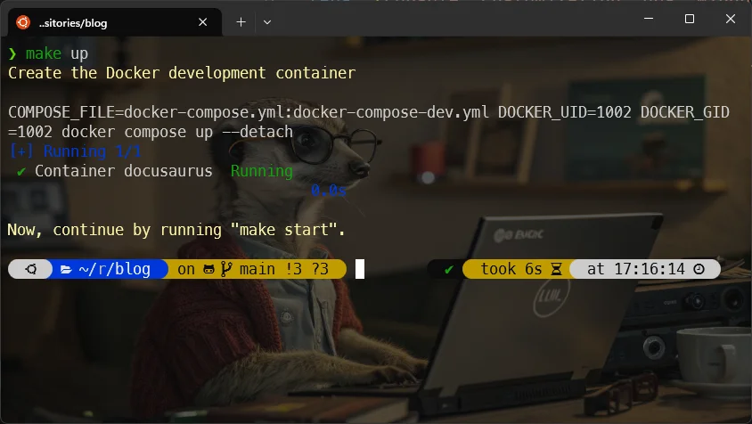
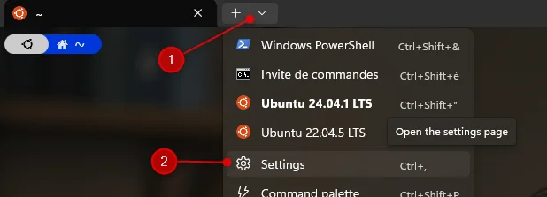
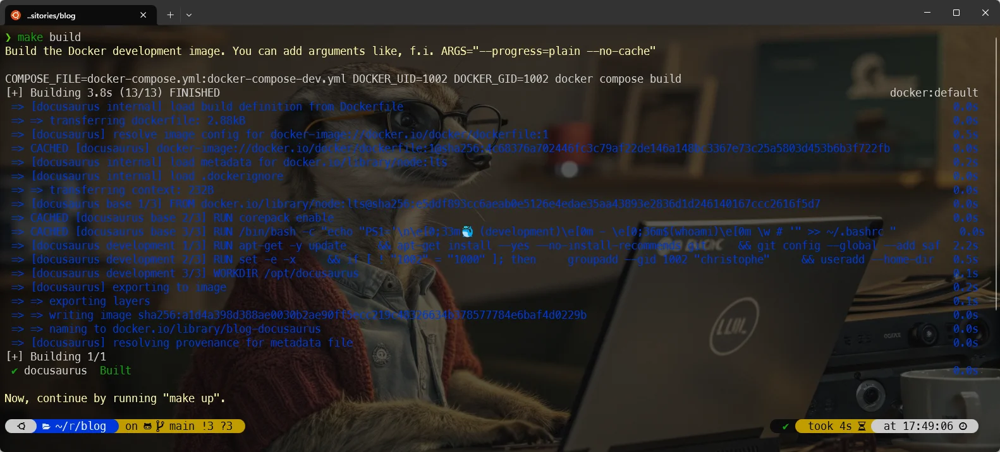

If we're talking about the MS DOS console, everyone has in mind a very austere black screen with a fixed-width font. The display was monochrome, white on black. Not very sexy neither exciting, isn't it.

Fortunately, we're no longer in the 1980s and 2000s, and since then, even under Windows, we've been able to do so much more cooooool!

Let's see how to easily do things like this:

<!-- truncate -->

I'm using [Windows Terminal](https://apps.microsoft.com/detail/9n0dx20hk701); a free tool coming from Microsoft.

I really like it because just like a web browser, I can work with tabs. One of the most powerful things is we can use it for the old Windows Command prompt (MS Dos), for Powershell, for Linux (Ubuntu, Debian, ...), for SSH terminal and much more.

But, for this article, let's concentrate to the appearance of the terminal.

First, let's generate (using [Recraft.ai](https://www.recraft.ai/) f.i.) a nice image or go to [unsplash.com](https://unsplash.com/) if you want to reuse an existing one. Click on this link to download the [JackJack background image](./images/wallpaper.webp), the meerkat.

Start an instance of Windows Terminal and, as illustrated on the image below, click on the down arrow and select `Settings`.

On the left side, select your desired profile then on the right side, scroll down until you see the `Appearance` accordion and click on it.

Scroll down until the background image area then click on `Background image path`. Click on the `Browse` button and retrieve your geeky background image.

Click on the `Save` button and voilà!

You can also, for sure, have two tabs: one with a console and the second one with the Settings page opened so, from now, by updating a setting like the `Background image -> Background image opacity` or the `Transparency -> Background opacity` you can see the changes immediately on your first tab.

That was for the background image. If you wish to learn how I did for the global look&feel, I'm using Powerlevel 10k: read my previous <Link to="/blog/powerlevel10k_sandbox">Customize your Linux prompt with Powerlevel 10k</Link> blog post.
