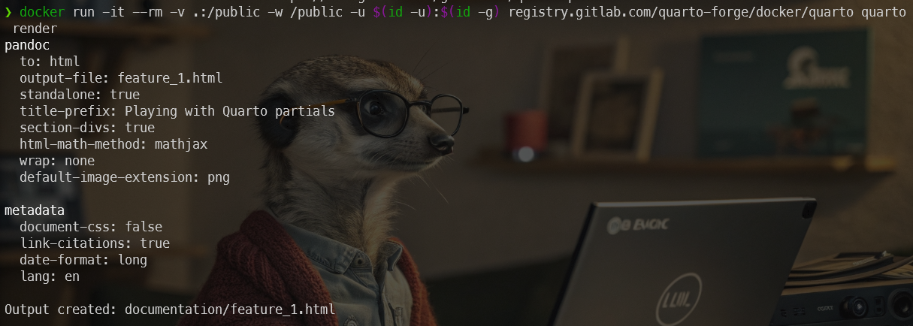
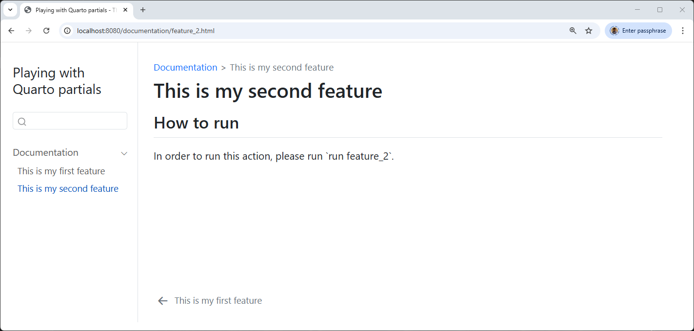

<!-- cspell:ignore buie,frontmatter,gadenbuie,htdocs -->


I use Quarto to generate documentation; until now I've mainly generated `.docx` and `.pdf` files.

Recently, I needed to generate a static website (HTML) that would allow my colleagues to consult the documentation for the latest software I've written. I had to describe nearly 80 functions: as many web pages to write, each with the same structure (a description chapter, a how to run chapter, a how to configure chapter, etc.).

And immediately, when you put it like that, you think of a CMS (content management system) such as Joomla for example, i.e. being able to define a standard page (a template) that will include the chapters and in each chapter, you could imagine injecting content that would be variables. Wouldn't it be silly to write each page by hand?

And this is where [Mustache](https://mustache.github.io/)'s idea comes in. Mustache defines himself as a *Logic-less templates* framework.

And, because I'm using Quarto for my documentation, I need an extension for using Mustache and it's [Quarto-partials](https://github.com/gadenbuie/quarto-partials/tree/main) from Garrick Aden-Buie.

<!-- truncate -->

## Create some files

Like always, let's create some files.

Please run `mkdir /tmp/partials && cd $_` to create a temporary folder and jump in it.

Create a file called `_quarto.yml` with this content:

<details>
<summary>_quarto.yml</summary>

```yaml
project:
  type: website
  output-dir: .

lang: en

website:
  title: "Playing with Quarto partials"
  page-navigation: true
  bread-crumbs: true
  sidebar:
    style: "docked"
    toc-depth: 4
    contents: auto
  
<!-- highlight-next-line -->
filters:
  <!-- highlight-next-line -->
  - partials
```

</details>

This file tells to Quarto that we're about to create a website i.e. by running `quarto render` later on, we'll convert our pages written in Markdown as HTML pages.

The two last lines should be present to load an external extension called `partials`; let's install it.

Because we'll use Docker, the command is quite long: `docker run -it --rm -v .:/public -w /public -u $(id -u):$(id -g) ghcr.io/quarto-dev/quarto:latest quarto add gadenbuie/quarto-partials`.

This will create a new folder called `_extensions` with partials in it.

## Let's discover the basics

The idea behind Quarto-partials is to allow to write a page like below i.e. I'll describe my first fictive functionality and, in the `How to run` chapter, I'll inject the content of another page:

<details>
<summary>documentation/canvas.md</summary>

```markdown
---
title: Contextual Canvas
---

## Description

Imagine you're working on a complex project – perhaps writing a research paper, designing a website, or planning a marketing campaign. You have various documents open, browser tabs scattered, and maybe even some handwritten notes nearby. It can feel like juggling multiple realities at once.

*Contextual Canvas* aims to streamline this by creating a dynamic, visual workspace directly within your primary application. Instead of just seeing a static file or interface, you can summon the Canvas, which intelligently pulls in relevant information based on what you're currently working on

## How to run


```

</details>

As you can see, I'm typing the description of my feature (called "Contextual Canvas" here) and then, I've a "How to run chapter". Instead of typing the how-to here, I'll include an external file (a *template*) called `../_partials/run.md`.

That one will use the Quarto-partials extension so, I can put in `../_partials/run.md` some Mustache's feature like injecting a variable.

Here is the template:

<details>
<summary>_partials/run.md</summary>

```markdown
In order to run this action, please run `{{ command }}`.

Existing flags:

  * `--debug`: output debug information's,
  * `--no-color`: disable ANSI colors and
  * `--verbose`: enable verbose mode; showing more information's on screen
```

</details>

Here comes Mustache in action: as you can see on the first line, the syntax `{{ command }}` will output the content of a variable called `command`. Of course, I need to declare it. Let's review my documentation and add what Quarto call a *frontmatter* YAML block:

<details>
<summary>documentation/canvas.md</summary>

```markdown
---
title: Contextual Canvas
<!-- highlight-next-line -->
partial-data:
  <!-- highlight-next-line -->
  command: "make canvas"
---

## Description

Imagine you're working on a complex project – perhaps writing a research paper, designing a website, or planning a marketing campaign. You have various documents open, browser tabs scattered, and maybe even some handwritten notes nearby. It can feel like juggling multiple realities at once.

*Contextual Canvas* aims to streamline this by creating a dynamic, visual workspace directly within your primary application. Instead of just seeing a static file or interface, you can summon the Canvas, which intelligently pulls in relevant information based on what you're currently working on

## How to run



```

</details>

Time to create our website. Please run `docker run -it --rm -v .:/public -w /public -u $(id -u):$(id -g) ghcr.io/quarto-dev/quarto:latest quarto render`.



This will call the `render` command of Quarto. Quarto will then process the `_quarto.yml` file, see we want to produce a website and start HTML rendering. It'll take just one or two seconds.

Now, by running `docker run -d --name partials -p 8080:80 -v .:/usr/local/apache2/htdocs/ httpd:alpine`, we'll create an Apache container accessible on port 8080.

Finally, surf to `http://localhost:8080/documentation/canvas.html` and we'll see our website.

And now, we're ready to copy/paste the file `documentation/canvas.md` to `documentation/feature_2.md` and just update the command variable. And do this again and again until we've documented all features.


### What have we just done

We've created a reusable template. Our document has two parts; a YAML section (the frontmatter) where we'll provide some variables. The second part, the Markdown one, is our basic template. We can copy that one for all our features f.i.

```markdown
---
partial-data:
  command: "run canvas"
---

## How to run


```

Let's prove it. We'll create a new feature:

<details>
<summary>documentation/builder.md</summary>

```markdown
---
title: Intent-Driven Interface Builder
partial-data:
  command: "make builder"
---

## Description

Imagine the process of building user interfaces. Developers and designers often spend significant time translating conceptual designs and user stories into the specific widgets, layouts, and interactions of a software application. *Intent-Driven Interface Builder* aims to revolutionize this by allowing users to describe the intent of a UI element or section, rather than manually configuring every pixel and property.

The *Intent-Driven Interface Builder* would then leverage AI and a vast library of pre-built, adaptable UI components and design patterns to automatically generate the corresponding interface elements. It would intelligently choose appropriate widgets, arrange them in a logical layout, and even suggest relevant styling based on the application's overall design language and best practices.

## How to run


```

</details>

and render our site again by running again `docker run -it --rm -v .:/public -w /public -u $(id -u):$(id -g) ghcr.io/quarto-dev/quarto:latest quarto render`.



## My use case

In my own case, my documentation looks like this:

<details>
<summary>/documentation/php_lint.md</summary>

```markdown
---
title: PHP linter
categories: [linting, php]
order: 1
partial-data:
  command: "lint-php"
  config_file: ".phplint.yml"
  config_url: "https://github.com/tengattack/phplint/blob/master/.phplint.yml"
  constant: "PHPLINT"
  type: "PHP"
---

<!-- cspell:ignore phplint -->

## Description

This is a brief description of the functionality. This text is hardcoded because it is different each time, from one feature to another.

## For what type of project



## How to run



## How to configure



## Attention points

None.

## Remarks

None.
```

</details>

## Testing if a variable is defined or not

Let's take a look to the `is_for.md` file.

<details>
<summary>/_partials/project_type.md</summary>

```markdown
<!-- #type means defined and thus has been set to something like "PHP" or "PYTHON" -->
{{#type}}

This job only for **{{ type }}** project.

{{/type}}

<!-- ^type means empty/missing so, in this case, the command is for all type of projects -->
{{^type}}

This stage is for **all** type of projects.

{{/type}}
```

</details>

There is two syntax used here: `{{#` and `{{^`.

The first one will check the presence of a variable called `type` and if that one is defined, the block will be processed. 

The second one is called *Inverted section* and will check the absence of the variable so if `type` is not defined, that block will be parsed.

If you look at my `php_lint.md` file, I've well a variable `type` defined in my `partial-data` section (the one used by Quarto-partials).

<details>
<summary>/documentation/php_lint.md</summary>

```markdown
---
title: PHP linter
categories: [linting, php]
order: 1
<!-- highlight-next-line -->
partial-data:
  command: "lint-php"
  config_file: ".phplint.yml"
  config_url: "https://github.com/tengattack/phplint/blob/master/.phplint.yml"
  name: "PHP Linter"
  <!-- highlight-next-line -->
  type: "PHP" 
---

<!-- cspell:ignore phplint -->

## Description

This is a brief description of the functionality. This text is hardcoded because it is different each time, from one feature to another.

## For what type of project



## How to run



## How to configure



## Attention points

None.

## Remarks

None.
```

</details>

If I render my file using the command line `quarto render`, I'll then see `This job only for **PHP** project.` in my documentation.

In case my feature was for all project types, I can just remove the `type: "PHP"` line from my frontmatter. In that case, I'll see `This stage is for **all** type of projects.`.

Let's take a look to the next included file:

<details>
<summary>../_partials/configure/file.md</summary>

```markdown
<!-- #config_file means defined and thus there is a configuration file -->
{{#config_file}}

{{ name }} uses a settings file named .config/{{ config_file }} ([learn more]({{ config_url }})).

{{/config_file}}

<!-- ^config_file means empty/missing so no configuration file -->
{{^config_file}}

There is no configuration file.

{{/config_file}}

```

</details>

Same idea. If a `config_file` key is defined in the documentation frontmatter, we'll obtain `PHP Linter uses a settings file named .config/.phplint.yml ([Learn more](https://github.com/tengattack/phplint/blob/master/.phplint.yml)).`. If we remove the `config_file` line, we'll then get `There is no configuration file.`.

## Raw contents

When displaying a variable, sometimes we need to disable the normal echo mode and use what Mustache call `raw content`.

In the example below, I've used a character `/` that will be escaped by Mustache.

```yaml
partial-data:
  output: ".output/coverage"
```

```markdown
{{#output}}

The report will be created into your project's directory in a folder called `{{ output }}`.

{{/output}}
```

The HTML rendering here will return `.output&#x2F;coverage` and not `.output/coverage` as expected. As we can see, Mustache has escape our slash. So, we've to use the raw content mode and use the `{{& output }}` syntax instead.

```markdown
{{#output}}

The report will be created into your project's directory in a folder called `{{& output }}`.

{{/output}}
```
