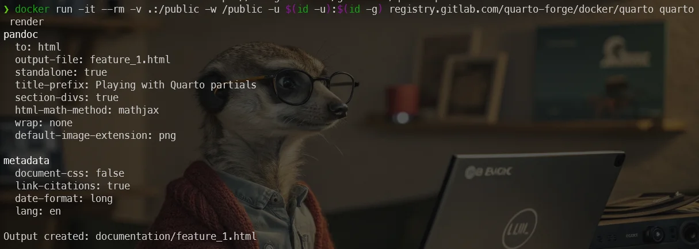
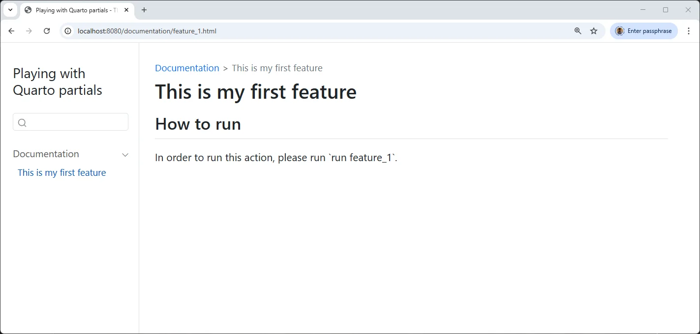
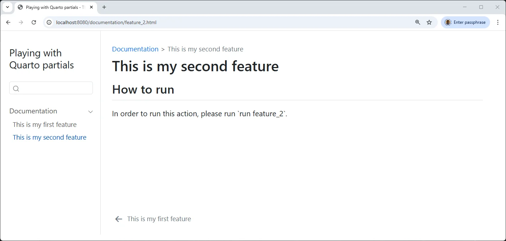

<!-- cspell:ignore buie,frontmatter,gadenbuie,htdocs -->


I use Quarto to generate documentation; until now I've mainly generated `.docx` and `.pdf` files.

Recently, I needed to generate a static website (HTML) that would allow my colleagues to consult the documentation for the latest software I've written. I had to describe nearly 80 functions: as many web pages to write, each with the same structure (a description chapter, a how to run chapter, a how to configure chapter, etc.).

And immediately, when you put it like that, you think of a CMS (content management system) such as Joomla for example, i.e. being able to define a standard page (a template) that will include the chapters and in each chapter, you could imagine injecting content that would be variables. Wouldn't it be silly to write each page by hand?

And this is where [Mustache](https://mustache.github.io/)'s idea comes in. Mustache defines himself as a *Logic-less templates* framework.

And, because I'm using Quarto for my documentation, I need an extension for using Mustache and, it's [Quarto-partials](https://github.com/gadenbuie/quarto-partials/tree/main) from Garrick Aden-Buie.

<!-- truncate -->

## Create some files

Like always, let's create some files.

Please run `mkdir /tmp/partials && cd $_` to create a temporary folder and jump in it.

Create a file called `_quarto.yml` with this content:

<Snippet filename="_quarto.yml" source="./files/_quarto.yml" />

This file tells to Quarto that we're about to create a website i.e. by running `quarto render` later on, we'll convert our pages written in Markdown as HTML pages.

The two last lines should be present to load an external extension called `partials`; let's install it.

Because we'll use Docker, the command is quite long: `docker run -it --rm -v .:/public -w /public -u $(id -u):$(id -g) ghcr.io/quarto-dev/quarto:latest quarto add gadenbuie/quarto-partials`.

This will create a new folder called `_extensions` with partials in it.

## Let's discover the basics

The idea behind Quarto-partials is to allow to write a page like below i.e. I'll describe my first fictive functionality and, in the `How to run` chapter, I'll inject the content of another page:

<Snippet filename="documentation/canvas.md" source="./files/canvas.txt" />

As you can see, I'm typing the description of my feature (called "Contextual Canvas" here) and then, I've a "How to run chapter". Instead of typing the how-to here, I'll include an external file (a *template*) called `../_partials/run.md`.

That one will use the Quarto-partials extension so, I can put in `../_partials/run.md` some Mustache's feature like injecting a variable.

Here is the template:

<Snippet filename="_partials/run.md" source="./files/run.txt" />

Here comes Mustache in action: as you can see on the first line, the syntax `{{ command }}` will output the content of a variable called `command`. Of course, I need to declare it. Let's review my documentation and add what Quarto call a *frontmatter* YAML block:

<Snippet filename="documentation/canvas.md" source="./files/canvas_2.txt" />

Time to create our website. Please run `docker run -it --rm -v .:/public -w /public -u $(id -u):$(id -g) ghcr.io/quarto-dev/quarto:latest quarto render`.



This will call the `render` command of Quarto. Quarto will then process the `_quarto.yml` file, see we want to produce a website and start HTML rendering. It'll take just one or two seconds.

Now, by running `docker run -d --name partials -p 8080:80 -v .:/usr/local/apache2/htdocs/ httpd:alpine`, we'll create an Apache container accessible on port 8080.

Finally, surf to `http://localhost:8080/documentation/canvas.html` and we'll see our website.

And now, we're ready to copy/paste the file `documentation/canvas.md` to `documentation/feature_2.md` and just update the command variable. And do this again and again until we've documented all features.



### What have we just done

We've created a reusable template. Our document has two parts; a YAML section (the frontmatter) where we'll provide some variables. The second part, the Markdown one, is our basic template. We can copy that one for all our features f.i.

```markdown
---
partial-data:
  command: "run canvas"
---

## How to run


```

Let's prove it. We'll create a new feature:

<Snippet filename="documentation/builder.md" source="./files/builder.txt" />

and render our site again by running again `docker run -it --rm -v .:/public -w /public -u $(id -u):$(id -g) ghcr.io/quarto-dev/quarto:latest quarto render`.



## My use case

In my own case, my documentation looks like this:

<Snippet filename="/documentation/php_lint.md" source="./files/php_lint.txt" />

## Testing if a variable is defined or not

Let's take a look to the `is_for.md` file.

<Snippet filename="/_partials/project_type.md" source="./files/project_type.txt" />

There is two syntax used here: `{{#` and `{{^`.

The first one will check the presence of a variable called `type` and if that one is defined, the block will be processed.

The second one is called *Inverted section* and will check the absence of the variable so if `type` is not defined, that block will be parsed.

If you look at my `php_lint.md` file, I've well a variable `type` defined in my `partial-data` section (the one used by Quarto-partials).

<Snippet filename="/documentation/php_lint.md" source="./files/php_lint_2.txt" />

If I render my file using the command line `quarto render`, I'll then see `This job only for **PHP** project.` in my documentation.

In case my feature was for all project types, I can just remove the `type: "PHP"` line from my frontmatter. In that case, I'll see `This stage is for **all** type of projects.`.

Let's take a look to the next included file:

<Snippet filename="../_partials/configure/file.md" source="./files/file.txt" />

Same idea. If a `config_file` key is defined in the documentation frontmatter, we'll obtain `PHP Linter uses a settings file named .config/.phplint.yml ([Learn more](https://github.com/tengattack/phplint/blob/master/.phplint.yml)).`. If we remove the `config_file` line, we'll then get `There is no configuration file.`.

## Raw contents

When displaying a variable, sometimes we need to disable the normal echo mode and use what Mustache call `raw content`.

In the example below, I've used a character `/` that will be escaped by Mustache.

```yaml
partial-data:
  output: ".output/coverage"
```

```markdown
{{#output}}

The report will be created into your project's directory in a folder called `{{ output }}`.

{{/output}}
```

The HTML rendering here will return `.output&#x2F;coverage` and not `.output/coverage` as expected. As we can see, Mustache has escape our slash. So, we've to use the raw content mode and use the `{{& output }}` syntax instead.

```markdown
{{#output}}

The report will be created into your project's directory in a folder called `{{& output }}`.

{{/output}}
```
