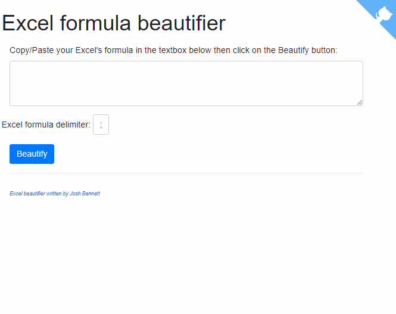

Can you read `=IF(AND(A1<100,B1<>"",ISNUMBER(SEARCH("abc",C1))),TEXT(D1,"dd-mm-yyyy")&" - "&ROUND(E1/F1,2),"N/A")` without thinking, ok, let's take a few seconds to analyze the formula and understand what it does? On my own, no, I have to stop for a moment and take the time to read before I understand.

Years ago, for fun, I've created [https://excel-formatter.avonture.be/](https://excel-formatter.avonture.be/).

Let's discover it.

<!-- truncate -->

## How to use

A picture is worth a thousand words...



So simply copy/paste your long formula in the first text area and click on the Beautify button.

:::info
The script will try to find if the used separator is `,` or `;` and, in case of trouble, just specify the good one.
:::

You'll get this type of result:

```none
=IF(
    AND(
        A1 < 100;
        B1 <> "";
        ISNUMBER(
            SEARCH(
                "abc";
                C1
            )
        )
    );
    TEXT(
        D1;
        "dd-mm-yyyy"
    ) & " - " &
    ROUND(
        E1 / F1;
        2
    );
    "N/A"
)
```

Which makes things clearer, no? If not, here this the transcript:

If:

* `A1` is less than `100`,
* `B1` is not empty and
* `C1` contains `abc`,

Then:

`D1` will be formatted as an european date and appends a rounded ratio of `E1`/`F1`.

Else:

Returns `N/A`.
